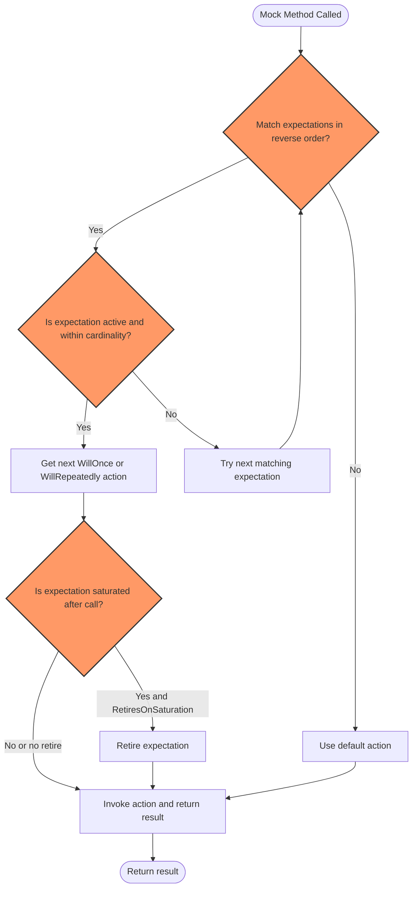

# Mocking Patterns and Strategies

Dive deeper into GoogleMock to explore advanced techniques for mocking behavior, controlling call expectations, and leveraging features like NiceMock, StrictMock, actions, and matchers for realistic, maintainable test doubles.

---

## 1. Understanding the Mocking Specification Builders

GoogleMock empowers you with two main macros to define mock behavior and call expectations:

- `ON_CALL` — defines **default actions** for mock methods without setting call expectations.
- `EXPECT_CALL` — defines **expectations** that also specify behavior with precise control.

Both macros support chaining additional clauses to extend control and specificity of matching, invocation counts, sequencing, and actions.

### ON_CALL Syntax

```cpp
ON_CALL(mock_object, Method(matchers...))
    .With(multi_argument_matcher)   // Optional, at most once
    .WillByDefault(action);         // Required exactly once
```

Use `ON_CALL` when you want to **define the default behavior** for your mock methods but don't want to assert that calls happen.

### EXPECT_CALL Syntax

```cpp
EXPECT_CALL(mock_object, Method(matchers...))
    .With(multi_argument_matcher)  // Optional, at most once
    .Times(cardinality)            // Optional, at most once
    .InSequence(sequences...)      // Optional, repeat as needed
    .After(expectations...)        // Optional, repeat as needed
    .WillOnce(action)              // Optional, repeat as needed
    .WillRepeatedly(action)        // Optional, at most once
    .RetiresOnSaturation();        // Optional, at most once, must be last
```

Use `EXPECT_CALL` to assert that calls matching the specified criteria occur, how many times, in what order, and with what behavior.

---

## 2. Fine-tuning Call Matching Using Clauses

### 2.1 `.With()` Clause

- Restricts to calls whose **entire argument tuple** matches a given multi-argument matcher.
- Useful when inter-argument relationships matter (e.g., first argument less than second).
- Must be the **first** modifier and used **at most once**.

**Example:**

```cpp
EXPECT_CALL(my_mock, SetPosition(_, _))
    .With(Lt());  // The first argument < second argument
```

### 2.2 `.Times()` Clause

Controls **how many times** the matching call is expected:

| Cardinality        | Meaning                                              |
|--------------------|------------------------------------------------------|
| `AnyNumber()`      | Called zero or more times.                           |
| `AtLeast(n)`       | Called at least `n` times.                           |
| `AtMost(n)`        | Called at most `n` times.                            |
| `Between(m, n)`    | Called between `m` and `n` times inclusive.         |
| `Exactly(n)` or `n`| Called exactly `n` times (0 means never).            |

- If omitted, it is **inferred** based on `WillOnce()`/`WillRepeatedly()` calls.

### 2.3 `.InSequence()` Clause

- Associates calls into one or more `Sequence` objects.
- Calls on expectations belonging to the same sequence must occur **in order** declared.

**Example:**

```cpp
Sequence s1, s2;
EXPECT_CALL(my_mock, Reset()).InSequence(s1, s2);
EXPECT_CALL(my_mock, GetSize()).InSequence(s1);
EXPECT_CALL(my_mock, Describe()).InSequence(s2);
```

### 2.4 `.After()` Clause

- Specifies that an expectation occurs **only after** one or more other expectations
- Can accept up to five `Expectation` or `ExpectationSet` objects.

**Example:**

```cpp
Expectation init_x = EXPECT_CALL(my_mock, InitX());
Expectation init_y = EXPECT_CALL(my_mock, InitY());
EXPECT_CALL(my_mock, Describe()).After(init_x, init_y);
```

### 2.5 `.WillOnce()` and `.WillRepeatedly()` Clauses

- `.WillOnce(action)` specifies behavior for a single call;
  multiple `.WillOnce()` calls chain behaviors for consecutive calls.
- `.WillRepeatedly(action)` specifies behavior for **all subsequent** calls after `.WillOnce()` clauses are exhausted.

**Example:**

```cpp
EXPECT_CALL(my_mock, GetNumber())
    .WillOnce(Return(1))
    .WillOnce(Return(2))
    .WillOnce(Return(3));

EXPECT_CALL(my_mock, GetName())
    .WillRepeatedly(Return("John Doe"));

EXPECT_CALL(my_mock, GetNumber())
    .WillOnce(Return(42))
    .WillRepeatedly(Return(7));
```

### 2.6 `.RetiresOnSaturation()` Clause

- Causes an expectation to **retire** (become inactive) after its call count reaches the upper limit.
- Useful when you want another expectation to match subsequent calls.

**Example:**

```cpp
EXPECT_CALL(my_mock, SetNumber(_)).Times(AnyNumber());
EXPECT_CALL(my_mock, SetNumber(7)).Times(2).RetiresOnSaturation();
```

Here, the first two calls to `SetNumber(7)` will match the second expectation,
which then retires. The third call will match the first expectation.

---

## 3. Leveraging NiceMock, StrictMock, and NaggyMock

GoogleMock provides template wrappers to control how **uninteresting calls** (calls to mock methods with no expectations) are handled:

| Wrapper                 | Behavior on Uninteresting Calls               |
|-------------------------|-----------------------------------------------|
| `NiceMock<T>`           | Suppresses warnings.
| `NaggyMock<T>` (default) | Prints warnings.
| `StrictMock<T>`         | Treats uninteresting calls as failures.

**How to use:**

```cpp
using ::testing::NiceMock;
NiceMock<MockClass> mock;
// or
using ::testing::StrictMock;
StrictMock<MockClass> mock;
```

**Important:**
- These wrappers only apply to **uninteresting** calls — calls to mock methods with no expectations.
- They do **not** affect unexpected calls — calls not matching any existing `EXPECT_CALL`.
- Only works on mock methods defined using `MOCK_METHOD` directly in `T`.

---

## 4. Best Practices for Mocking Behavior

### 4.1 Use `ON_CALL` for Defining Default Behavior

`ON_CALL` sets a default action without requiring the call to actually happen.
Ideal for setup in test fixtures or mock constructors.

### 4.2 Use `EXPECT_CALL` to Verify Interactions

Only specify `EXPECT_CALL` for calls you want to verify and constrain.
Avoid over-specifying — unpredictable or brittle tests stem from too many rigid expectations.

### 4.3 Order Specificity Matters

- **Later** `EXPECT_CALL`s override earlier ones for matching calls.
- Put broad expectations **before** more specific ones.
- Use `.InSequence()` or `.After()` to enforce ordering.

### 4.4 Retiring Expectations to Avoid Conflicts

When chaining multiple expectations on the same method with limited call counts, use `.RetiresOnSaturation()` to let a later expectation match after an earlier one is exhausted.

### 4.5 Use Matchers Intentionally

- Use `_` to match any argument when specifics are unimportant.
- Use `.With()` clause to express complex relation among arguments.

### 4.6 Suppress Warnings Strategically

If you get uninteresting call warnings for methods you're not verifying, prefer `NiceMock` over adding catch-all `EXPECT_CALL`s with `Times(AnyNumber())`.

---

## 5. Troubleshooting Common Issues

### Missing `WillByDefault` in `ON_CALL`

Every `ON_CALL` must include exactly one `WillByDefault` specifying the default action, otherwise runtime crashes occur.

### Multiple `.With()` Clauses

Only one `.With()` clause allowed per `ON_CALL` or `EXPECT_CALL`. Follow the exact order guidelines.

### Exceeding WillOnce Actions

If a call matches an expectation but exceeds the number of `.WillOnce()` actions without `.WillRepeatedly()`, a warning is emitted and the default action is used.

### Unmatched Calls

- If a call matches no `EXPECT_CALL`, it is an **unexpected call** and causes test failures.
- If a call matches no `EXPECT_CALL`, and no `ON_CALL` defines actions for it, it uses the built-in default action (0, false, or void return).

### Mock Method Name Ambiguity

- For overloaded methods, omit parameter list is forbidden as it causes ambiguity.
- Use full parameter lists or disambiguate with `Const()` wrapper or `SafeMatcherCast`.

### Verifying Expectations Early

If mocks are heap-allocated or managed externally, explicitly call `Mock::VerifyAndClearExpectations(&mock_object)` to verify expectations before destruction.

---

## 6. Example: Complex EXPECT_CALL Usage

```cpp
using ::testing::_;
using ::testing::Sequence;
using ::testing::Return;
using ::testing::Exactly;

Sequence seq1, seq2;
Expectation init = EXPECT_CALL(mock, Init()).Times(1);
EXPECT_CALL(mock, Step(1))
    .Times(Exactly(2))
    .InSequence(seq1)
    .After(init)
    .WillOnce(Return(true))
    .WillRepeatedly(Return(false))
    .RetiresOnSaturation();
EXPECT_CALL(mock, Step(2))
    .Times(AnyNumber())
    .InSequence(seq2)
    .WillRepeatedly(Return(true));
```

This example defines an expectation that `Init()` is called exactly once, then:
- `Step(1)` must be called exactly twice in sequence `seq1`, only after `Init()`, returns true once, then false repeatedly, and retires after saturation.
- `Step(2)` can be called any number of times in sequence `seq2`, always returns true.

---

## 7. Reference Links

- [Expectations and clauses (`EXPECT_CALL`, `ON_CALL`)](reference/mocking.md#macros)
- [NiceMock, StrictMock & NaggyMock](reference/mocking.md#NiceStrictNaggy)
- [Actions Reference](reference/actions.md)
- [Matchers Reference](reference/matchers.md)
- [gMock Cookbook for recipes](gmock_cook_book.md)

---

## Next Steps
- Explore examples under `googlemock/test` verifying interaction sequences.
- Use `Mock::VerifyAndClear` to verify mocks at test boundaries.
- Read the `gmock_for_dummies.md` for beginner-friendly mock creation.
- Learn to write custom actions and matchers for nuanced behaviors.

---

<Tip>
Remember: expect only what you need to verify using `EXPECT_CALL`, and set default behavior with `ON_CALL`. Use `NiceMock` to suppress unnecessary warnings and keep tests maintainable.
</Tip>

---

This page fits into the broader guides on [Creating and Using Mocks](/guides/getting-started/first-mock-guide) and complements the detailed [Mocking Reference](/docs/reference/mocking.md). It builds upon initial mock class definitions and focuses on getting fine-grained control on mock behaviors.

---

# Diagram: Mock Call and Expectation Matching Workflow


