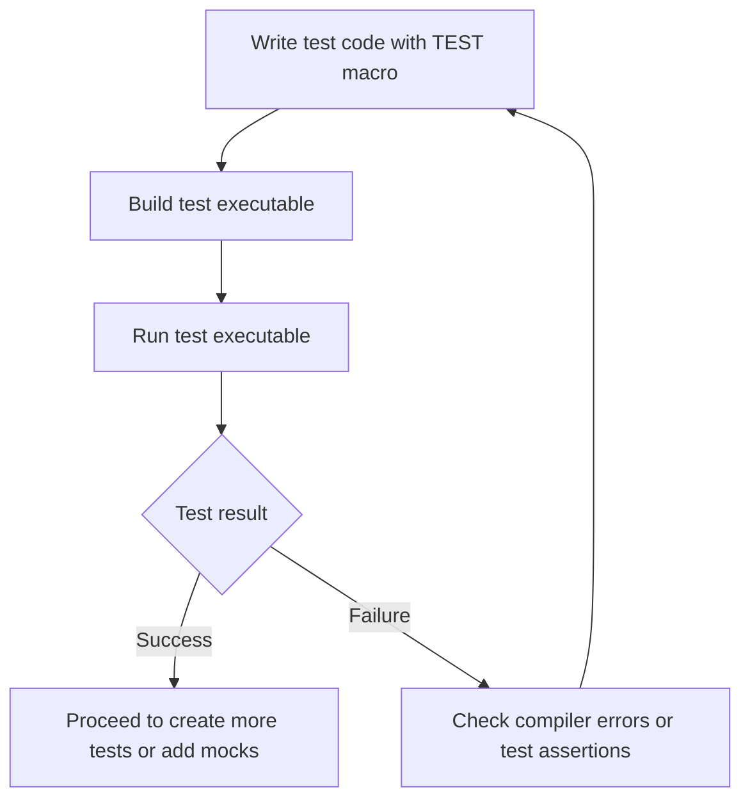

# Getting Started: Creating Your First Test

Welcome to your first step in writing tests with GoogleTest, Google's C++ testing framework. This guide walks you through creating, compiling, and running your very first test case, empowering you to validate your code confidently and reliably.

---

## 1. Workflow Overview

**What This Guide Helps You Accomplish:**

- Learn how to write a basic test case using GoogleTest.
- Compile and run your test to verify setup and correctness.
- Understand the minimal setup required to get started.

**Prerequisites:**

- GoogleTest and GoogleMock libraries installed and integrated with your build system.
- A basic C++ development environment with compiler supporting C++11 or later.
- Familiarity with basic C++ syntax.

**Expected Outcome:**

By following this guide, you will have a test source file defining a simple test case, build it successfully, run it, and observe the test results.

**Time Estimate:** 10-20 minutes

**Difficulty Level:** Beginner

---

## 2. Step-by-Step Instructions

### Step 1: Include GoogleTest and Google Mock Headers

In your test source file, ensure you include the GoogleTest header that also brings in Google Mock:

```cpp
#include <gtest/gtest.h>  // Also includes gmock internally
```

This gives you access to all testing macros and mock functionalities.

### Step 2: Write Your First Test Case

Use the `TEST` macro to define a test case. It takes two arguments: the test suite name and the test name. Inside the test body, use assertions like `EXPECT_TRUE`, `EXPECT_EQ`, or `ASSERT_TRUE`.

```cpp
TEST(ExampleTestSuite, FirstTest) {
  // Simple assertion: expect true to be true
  EXPECT_TRUE(true);
}
```

This defines a test named `FirstTest` inside the suite `ExampleTestSuite`.

### Step 3: Build Your Test Program

Use your build system or compile manually. For example, with g++ and assuming GoogleTest is properly installed:

```bash
g++ -std=c++11 -isystem /path/to/googletest/include \
    -pthread your_test.cc \
    /path/to/libgtest.a /path/to/libgmock.a \
    -o your_test_executable
```

Replace `/path/to/` with your actual installation paths.

### Step 4: Run Your Test

Run the compiled test executable:

```bash
./your_test_executable
```

Expected output shows test progress and a success message if all assertions pass:

```text
[==========] Running 1 test from 1 test suite.
[----------] Global test environment set-up.
[----------] 1 test from ExampleTestSuite
[ RUN      ] ExampleTestSuite.FirstTest
[       OK ] ExampleTestSuite.FirstTest (0 ms)
[----------] 1 test from ExampleTestSuite (0 ms total)

[----------] Global test environment tear-down
[==========] 1 test from 1 test suite ran. (0 ms total)
[  PASSED  ] 1 test.
```


### Verification

- If the test passes as shown above, your GoogleTest setup and test code are working.
- If the test fails or won't build, confirm Google's Test installation and include paths.

### Decision Point: Expanding Your Tests

Once your first test succeeds, you may:

- Add tests for your actual code.
- Explore writing mocks using GoogleMock for dependency simulation.
- Learn about assertions and test fixtures to manage common setup and cleanup.

---

## 3. Examples & Code Samples

Here is a minimal working example for a first test:

```cpp
#include <gtest/gtest.h>

// A basic test that just verifies true is true.
TEST(BasicTest, Truth) {
  EXPECT_TRUE(true);
}

int main(int argc, char **argv) {
  ::testing::InitGoogleTest(&argc, argv);
  return RUN_ALL_TESTS();
}
```

Compile and run this to see how GoogleTest discovers and executes your tests.

### Sample Output

```text
[==========] Running 1 test from 1 test suite.
[----------] Global test environment set-up.
[----------] 1 test from BasicTest
[ RUN      ] BasicTest.Truth
[       OK ] BasicTest.Truth (0 ms)
[----------] 1 test from BasicTest (0 ms total)

[----------] Global test environment tear-down
[==========] 1 test from 1 test suite ran. (0 ms total)
[  PASSED  ] 1 test.
```

---

## 4. Troubleshooting & Tips

### Common Issues

- **Cannot compile or link:** Verify include directories and linked libraries for GoogleTest and GoogleMock.
- **Test not found or runs zero tests:** Make sure you include the `main()` function that initializes and runs tests.
- **Test fails unexpectedly:** Check your assertions for correctness and syntactic correctness of the test.
- **Verbose output to debug:** Run your test binary with `--gtest_verbose=info` to see detailed logs.

### Best Practices

- Start with simple tests verifying very specific behavior.
- Use meaningful test suite and test names to clarify intent.
- Make sure your test environment initializes GoogleTest using `::testing::InitGoogleTest()`.
- Use test fixtures (`TEST_F`) once tests share setup code.
- Add mocks and expectations when testing interactions with other components.

### Performance Considerations

- Keep tests fast and focused.
- Avoid complex setup unless necessary; use mocks for dependencies.

### Alternative Routes

- Use GoogleMock to create mock objects and expectations after mastering basic tests.
- Explore `gmock_for_dummies.md` for beginner-level introduction to mocking.

---

## 5. Next Steps & Related Content

- [Writing & Running Your First Test](https://github.com/google/googletest/blob/main/docs/gmock_for_dummies.md)
- [Mocking for Dummies](https://github.com/google/googletest/blob/main/docs/gmock_for_dummies.md)
- [Mocking Reference](../api-reference/mocking-framework/mock-methods)
- [gMock Cookbook](../docs/gmock_cook_book.md) for more mocking recipes
- [Installing GoogleTest and GoogleMock](../getting-started/prerequisites-installation/installation-methods)
- [Troubleshooting Common Issues](../getting-started/troubleshooting-validation/troubleshooting-common-issues)

Consider exploring these guides next to enhance your test capabilities and incorporate mocks for more complex testing scenarios.

---

## Summary Diagram: Your First Test Workflow



---

# Final Notes

Creating your first test with GoogleTest is your gateway to a powerful ecosystem of C++ testing and mocking. Follow this practical path to ensure robust, maintainable, and efficient tests that will grow with your project sophistication.
