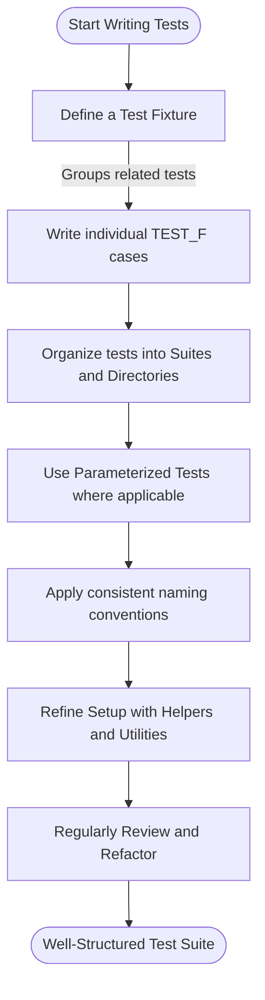

# Organizing Large Test Suites

Managing a growing test suite can quickly become complex and unwieldy without disciplined organization. This guide provides actionable patterns and best practices to help you structure and maintain large-scale test codebases effectively.

---

## Why Organize Your Test Suite?

As your project evolves, your tests multiply, covering more functionality and edge cases. A disorganized suite:

- Slows developer productivity
- Makes tests hard to find and understand
- Increases maintenance overhead
- Leads to brittle or redundant tests

Organizing your tests ensures they remain manageable, readable, and reliable.

---

## Core Patterns for Structuring Tests

### 1. Use Test Fixtures

Fixtures help group related tests by sharing setup and teardown logic. This avoids duplication and provides a clear context.

**Implementation:**

- Define a fixture class deriving from `testing::Test`.
- Place common variables and helper functions as members.
- Write individual tests using this fixture.

```cpp
class FooTest : public ::testing::Test {
protected:
  void SetUp() override {
    // Common init code
  }

  void TearDown() override {
    // Cleanup code
  }

  Foo foo_;
  // Additional members
};

TEST_F(FooTest, DoesThis) {
  EXPECT_TRUE(foo_.DoSomething());
}

TEST_F(FooTest, DoesThat) {
  EXPECT_FALSE(foo_.DoSomethingElse());
}
```

**Benefits:**
- Encapsulates setup without repeating in every test.
- Facilitates consistent test environments.

---

### 2. Organize Tests Into Logical Groups

Keep tests for different components or features separated.

**Strategies:**

- Create test suites or fixtures per module or feature.
- Use namespaces or directory structure to reflect project organization.
- Name suites and test cases clearly, indicating functionality and expected behavior.

Example directory layout:

```
tests/
  network/
    socket_test.cc
    protocol_test.cc
  database/
    connection_test.cc
    query_test.cc
```

Naming example:

```cpp
TEST(NetworkSocketTest, ConnectsSuccessfully);
TEST(DatabaseConnectionTest, HandlesTimeout);
```

---

### 3. Adopt Consistent Naming Conventions

Effective naming improves test discoverability and clarity.

**Recommendations:**

- Use descriptive test suite and test names that state what is tested and expected.
- Follow your project’s style guide consistently.
- Separate words using underscores or PascalCase depending on conventions.

Example:

```cpp
TEST(CalculatorAddTest, ReturnsSumOfPositiveNumbers);
TEST(FileReaderTest, FailsOnMissingFile);
```

---

### 4. Leverage Parameterized and Typed Tests

Reduce code duplication when testing similar behaviors with different data.

**How-to:**

- Use GoogleTest’s parameterized tests to run the same logic with varied inputs.
- Typed tests allow running the same tests over different types.

Example:

```cpp
class IsEvenTest : public ::testing::TestWithParam<int> {};

TEST_P(IsEvenTest, HandlesEvenNumbers) {
  int n = GetParam();
  EXPECT_EQ(n % 2, 0);
}

INSTANTIATE_TEST_SUITE_P(EvenNumbers,
                         IsEvenTest,
                         ::testing::Values(2, 4, 6, 8));
```

---

### 5. Group Related Tests with Test Suites

Use test suites to logically cluster tests.

- Suite names should be concise but precise.
- Suites help tools run targeted subsets.

---

### 6. Employ Setup Utilities and Custom Helpers

If setup logic grows complex, extract it into helper functions or utility classes to keep fixtures lean.

---

### 7. Consider Test File Size and Scope

Avoid bloated test files:

- If a test file grows beyond a few hundred lines, consider splitting it by feature or component.
- Keep individual test cases short and focused.

---

### 8. Handle Dependencies and Mocking Consistently

Use mocks or fakes deliberately to isolate tests.

- Group tests by mock usage pattern: pure unit tests vs. integration tests.
- Share mock setups inside fixtures when applicable.

Refer to [Building & Using Mocks](guides/mocking-advanced-usage/building-mocks.md) for detailed guidance.

---

### 9. Document Conventions and Structure

Maintain a README or similar documentation explaining your test organization, naming, and best practices. This helps new team members and enforces consistency.

---

## Practical Tips & Best Practices

- **Single Responsibility**: Each test should ideally verify one behavior.
- **Readable Assertions**: Use descriptive assertion messages and GoogleTest's expressive assertion macros.
- **Clear Test Boundaries**: Avoid side effects leaking between tests; reset shared state.
- **Automate Tests**: Use continuous integration to run tests frequently, catching regressions early.
- **Refactor Regularly**: As tests grow, revisit the organization to keep it manageable.

---

## Common Pitfalls to Avoid

- Overly broad fixtures coupling unrelated tests.
- Tests with ambiguous or unclear names.
- Mixing too many responsibilities in one test file.
- Neglecting teardown, causing state leakage.

---

## Summary Diagram: Test Suite Organization Flow



---

## Next Steps & Related Documentation

- **Building & Using Mocks** – Modularize dependencies for isolated testing.
- **Assertions & Best Practices** – Write clearer, expressive assertions.
- **Organizing Large Test Suites** – Maintain maintainability as your tests grow.
- **Setting Expectations & Behaviors** – Use EXPECT_CALL effectively.

Explore the [GoogleTest Primer](overview/product-introduction-and-value/what-is-googletest.md) and [Getting Started guides](getting-started/setup-requirements/prerequisites.md) if setting up your test environment.

---

## Additional Resources

- GoogleTest Official Documentation: https://google.github.io/googletest/
- GoogleMock Guide: https://google.github.io/googletest/gmock_for_dummies.html
- Matching and Actions Reference: https://google.github.io/googletest/reference/mocking.html

<Tip>
Consistently organizing your test suite is a cumulative investment paying off through easier maintenance, faster debugging, and more reliable quality assurance.
</Tip>

<Note>
Apply these patterns incrementally as your project grows. Start simple, progressively add structure.
</Note>

---

_End of Guide_
