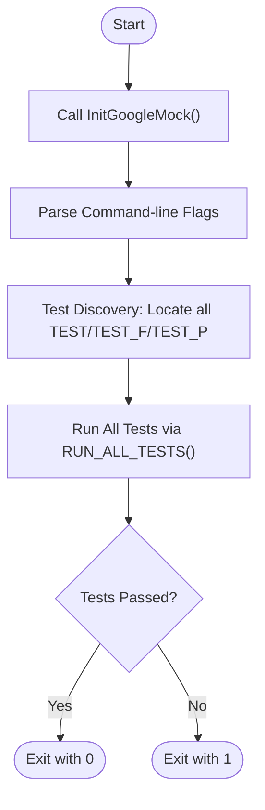

# Running and Configuring Tests in Different Environments

## Overview

GoogleTest is designed for flexible and scalable test execution across diverse platforms and environments. This guide shows you how to run your tests on various platforms, leverage command-line options for customization, and set up robust test discovery and filtering strategies. These capabilities enable you to automate tests efficiently in environments ranging from local development machines to large-scale continuous integration systems.

---

## Prerequisites

- GoogleTest and GoogleMock installed and properly linked in your project (see Installation Methods).
- Test binaries built and ready to run.
- Familiarity with basic GoogleTest test writing and execution (see GoogleTest Primer and Getting Started guides).

---

## Expected Outcome

By following the steps in this guide, you will be able to:

- Run tests seamlessly on multiple platforms with appropriate initialization.
- Use command-line flags to control test behavior, including selection, filtering, and output verbosity.
- Manage test discovery to efficiently scale automated testing.
- Integrate test runs into scripts or CI workflows with predictable and consistent results.

---

## Time Estimate

Expect to spend around 15–30 minutes to absorb this guide and try basic runs on your system.

---

## Difficulty Level

Intermediate – assumes familiarity with C++ and basic unit testing concepts.

---

## Running Tests Across Platforms

### 1. Automated Main Function

If you link with the `gmock_main` target or the equivalent GoogleTest main library, the test executable includes a built-in `main()` function that:

- Initializes GoogleMock and GoogleTest.
- Parses command-line arguments.
- Runs all registered tests.

Example output on invoking your test binary:

```shell
Running main() from gmock_main.cc
[==========] Running X tests from Y test suites.
...
[  PASSED  ] All tests passed.
```

### 2. Writing Your Own `main()`

If you choose or require a custom entry point, implement `main()` as follows:

```cpp
#include <gmock/gmock.h>

int main(int argc, char **argv) {
  testing::InitGoogleMock(&argc, argv);  // Initializes GoogleMock and GoogleTest
  return RUN_ALL_TESTS();                // Runs all tests and returns result
}
```

> **Tip:** Calling `testing::InitGoogleMock()` handles both GoogleMock and GoogleTest initialization and command-line flag parsing.


---

## Command-Line Options for Test Configuration

GoogleTest supports rich command-line flags for configuring test runs. You can pass these flags to any test binary to filter, list, or control test execution.

### Common Flags

| Flag                     | Description                                                                                   |
|--------------------------|-----------------------------------------------------------------------------------------------|
| `--gtest_filter=pattern` | Specifies which tests to run by matching test suite and test names (supports wildcards).       |
| `--gtest_repeat=N`       | Repeats the entire test suite N times. Useful for detecting flaky tests.                      |
| `--gtest_shuffle`        | Runs tests in random order to detect inter-test dependencies.                                |
| `--gtest_random_seed=SEED` | Specify the seed for test shuffling (default is random).                                     |
| `--gtest_output=xml[:path]` | Generates an XML report file for automated reporting. Defaults to `test_details.xml`.         |
| `--gtest_list_tests`     | Lists all available tests without running them.                                              |
| `--gmock_verbose=LEVEL`  | Controls the verbosity of gMock output: `info`, `warning` (default), or `error`.              |

### Filtering Tests

To run only selected tests, use `--gtest_filter` with the pattern:

```
--gtest_filter=TestSuiteName.TestName
--gtest_filter=TestSuiteName.*
--gtest_filter=-TestSuiteName.UnwantedTest
```

You can use multiple patterns separated by `:` to include multiple tests.


---

## Test Discovery

GoogleTest automatically discovers all tests defined using the `TEST()`, `TEST_F()`, and `TEST_P()` macros in the linked binary.

Key points:

- No manual test registration is necessary.
- `RUN_ALL_TESTS()` runs all discovered tests.
- Use `--gtest_list_tests` to preview all discovered tests.

---

## Running Tests in Different Environments

### Local Development

Run tests interactively or via scripts:

```bash
./my_tests --gtest_filter=MySuite.*
```

Use debugger integration (e.g., with IDEs) by setting breakpoints in tests and running under the debugger.

---

### Continuous Integration

- Use test filtering with `--gtest_filter` to selectively run tests.
- Generate XML output with `--gtest_output=xml` for CI reporting.
- Combine with `--gtest_repeat` and `--gtest_shuffle` for robustness.

---

### Embedded Systems / Special Platforms

- If your platform lacks CLI support (e.g., Arduino), use appropriate `InitGoogleMock()` function without arguments and adapt running tests in the platform's main loop.

Example for some embedded platforms:

```cpp
void setup() {
  testing::InitGoogleMock();
}

void loop() {
  RUN_ALL_TESTS();
}
```

---

## Troubleshooting Common Issues

### Tests Not Running or Skipping

- Ensure `RUN_ALL_TESTS()` is called after initialization.
- Verify test definitions are linked into the binary.

### No Output or Unexpected Output

- Use `--gtest_verbose=info` or `--gmock_verbose=info` to get detailed logs.
- Confirm no conflicting flag is suppressing output.

### Unrecognized Test Filters

- Check syntax of `--gtest_filter` patterns.
- Use `--gtest_list_tests` to verify test names.

### Tests Failing Due to Environment

- Confirm environment matches build platform.
- Make sure dependencies (database, file system) are set up or mocked.

---

## Best Practices and Tips

- **Use Filtering:** Run only relevant tests locally to save time.
- **Enable Repeat and Shuffle:** To uncover flaky tests.
- **Generate XML Reports:** For integration with CI tools and dashboards.
- **Keep Initialization Consistent:** Always use `testing::InitGoogleMock()` for consistent setup.
- **Leverage Verbose Logging:** When diagnosing failing or unexpected tests.

---

## Next Steps & Related Content

- **Writing & Running Your First Test:** Guide to create tests from scratch.
- **Mocking for Dummies & Cookbook:** Learn how to use mocks effectively.
- **Test Discovery & Execution Flow:** Understand detailed test execution lifecycle.
- **Troubleshooting Common Issues:** Detailed help with errors and warnings.

## References

- [GoogleTest Primer](../getting-started/primer.md)
- [Mocking with gMock](../guides/mocking-best-practices/creating-mocks.md)
- [gMock for Dummies](../docs/gmock_for_dummies.md)
- [Mocking Reference](../docs/reference/mocking.md)

---

## Summary Diagram of Test Execution Flow



Use this flow to understand how your test binary processes inputs and executes tests.

---

## Additional Notes

- GoogleTest supports a broad range of environments and platforms, including Linux, Windows, macOS, embedded systems, and more.
- GoogleMock integrates seamlessly, allowing complex mocking and expectation management while running tests.
- The rich set of command-line options and filters ensures you can customize runs to suit your development and CI needs.

<Tip>
For maximum productivity, automate your test runs with scripts that take advantage of filtering, repetition, and output options to reduce manual overhead and catch issues early.
</Tip>


---

## Example Command to Run Selected Tests Repeatedly and Shuffle

```bash
./my_test_binary --gtest_filter=MyTestSuite.* --gtest_repeat=10 --gtest_shuffle --gtest_random_seed=12345 --gtest_output=xml:report.xml
```

This command runs all tests in `MyTestSuite` 10 times each, shuffles test order with a fixed seed for reproducibility, and outputs results in XML format.
