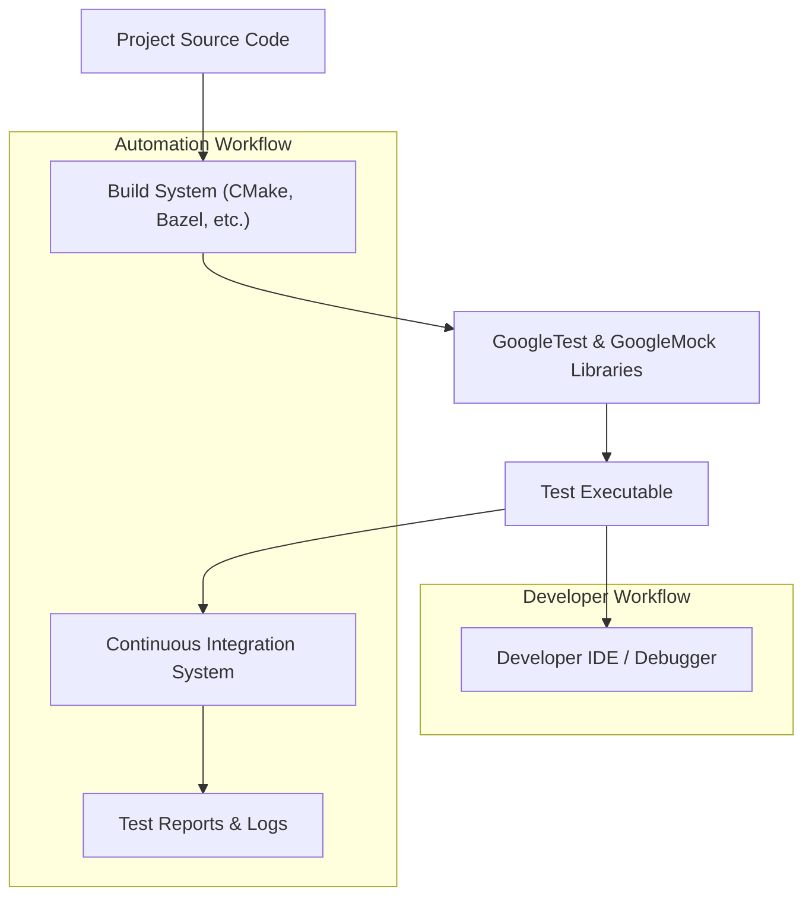

# Integration with Build & Dev Toolchains

Discover how GoogleTest integrates seamlessly with popular C++ build systems, continuous integration pipelines, and various developer tools. This guide provides practical instructions to add GoogleTest and GoogleMock to your projects, facilitating efficient and scalable testing workflows.

---

## Overview

GoogleTest and GoogleMock are designed to fit effortlessly into modern C++ development environments. Whether you use CMake, Bazel, or another build system, this integration helps you automate test compilation, execution, and reporting. Additionally, GoogleTest supports numerous CI systems and IDEs, enabling smooth developer experiences.

---

## Supported Build Systems

### CMake Integration

CMake is one of the most widely used cross-platform build systems for C++. To integrate GoogleTest into your CMake project:

1. **Download and Add GoogleTest:**
   - Use `FetchContent` to fetch GoogleTest automatically during build:

   ```cmake
   include(FetchContent)
   FetchContent_Declare(
     googletest
     URL https://github.com/google/googletest/archive/refs/tags/release-1.13.0.zip
   )
   FetchContent_MakeAvailable(googletest)
   ```

2. **Link GoogleTest Libraries:**
   
   When defining your test executable, link against `gtest` and `gmock` (bundled together):

   ```cmake
   add_executable(my_tests test_main.cpp other_tests.cpp)
   target_link_libraries(my_tests PRIVATE gtest_main gmock)
   ```

3. **Enable Testing and Discover Tests:**

   Use CTest with GoogleTest integration:

   ```cmake
   include(CTest)
   include(GoogleTest)
   gtest_discover_tests(my_tests)
   ```

This provides automatic discovery and execution of tests during your build process.

#### Tips & Best Practices

- Prefer the `gtest_main` library, which provides a main() function.
- Separate test code into a dedicated target to avoid bloating production builds.
- Use `add_test()` or `gtest_discover_tests()` for smoother CI integration.

### Bazel Integration

GoogleTest and GoogleMock are fully supported by Bazel, Google's high-performance build system.

1. **Add `googletest` as a dependency:**
   
   In your `WORKSPACE` file, add the googletest repository:

   ```python
   http_archive(
       name = "com_google_googletest",
       urls = ["https://github.com/google/googletest/archive/release-1.13.0.zip"],
       strip_prefix = "googletest-release-1.13.0",
   )
   ```

2. **Include `gmock` and `gtest` in your `BUILD` file:**

   Define your test target with the googletest libraries:

   ```python
   cc_test(
       name = "my_tests",
       srcs = ["test_main.cc", "my_code_test.cc"],
       deps = [
           "@com_google_googletest//:gmock",
           "@com_google_googletest//:gtest_main",
       ],
   )
   ```

3. **Running Tests:**

   Use `bazel test //path/to:my_tests` to build and run tests.

#### Tips & Best Practices

- Utilize `testonly = True` for all test-only targets.
- Organize mocks and test helpers in dedicated directories with Bazel's `testonly` attribute.

---

## Continuous Integration (CI) Workflows

GoogleTest integrates smoothly with popular CI systems like Jenkins, GitHub Actions, GitLab CI, Travis CI, and others.

### Key Points

- Test executables can be invoked directly within CI scripts.
- GoogleTest supports XML output formats with the `--gtest_output=xml:filename.xml` flag, which is useful for CI reporting.

Example command in CI pipeline:

```bash
./my_tests --gtest_output=xml:test_results.xml
```

CI systems can parse these test reports to display detailed results.

### Recommended Practices

- Keep test executables small and focused to speed up test runs.
- Use parallel execution capabilities of your CI system to speed testing.
- Collect and archive test results and logs for failed runs.

---

## Integration with Development Tools and IDEs

GoogleTest and GoogleMock can be used with many IDEs and code editors, enabling in-editor test discovery, execution, and debugging.

### Popular IDEs with GoogleTest Support

- **Visual Studio:** Supports native GoogleTest integration including test discovery.
- **CLion (JetBrains):** Provides built-in support for GoogleTest and GoogleMock.
- **Eclipse CDT:** Supports GoogleTest with plugins.
- **VS Code:** Extensions like "Test Explorer UI" and "GoogleTest Adapter" facilitate integration.

### Debugging Tests

You can debug GoogleTest tests just like other executables within your IDE by:

- Setting breakpoints in test or source code.
- Running the test executable under the debugger.
- Using IDE features to run individual tests or suites.

### Practical Tips

- Configure your IDE to recognize GoogleTest's test outputs and formats.
- Use filters in test explorers for better navigation.

---

## Extending and Integrating with Third-party Tools

GoogleTest provides hooks and extensions to enable integration with additional tools:

- **Custom Listeners:** Implement `::testing::TestEventListener` to customize test logging or reporting.
- **Build System Adapters:** Plugins and wrappers exist to simplify integration with other build tools like Make, Ninja, or proprietary systems.
- **Code Coverage and Profilers:** Easily combine with tools such as gcov, lcov, or Visual Studio Profiler.

Leverage community tools on platforms like GitHub to enhance your workflow.

---

## Adding GoogleTest to an Existing Project

When incorporating GoogleTest or GoogleMock into a legacy project:

1. Add GoogleTest dependencies carefully to avoid conflicts.
2. Isolate test code and dependencies from production code.
3. Gradually introduce mocks to improve test speed and reliability.
4. Consider using Bazel or CMake features for modular builds.

<Callout type="tip">
If your existing project's build system is custom or less conventional, consider adding a small shim or wrapper to build GoogleTest tests, allowing staged adoption.
</Callout>

---

## Troubleshooting and Tips

- **Linker Errors:** Ensure all GoogleTest and GoogleMock libraries are correctly linked.
- **Slow Builds:** Consider compiling mocks separately and reusing the binaries.
- **Test Discoverability:** Use supported CTest or Bazel query commands to verify registered tests.
- **Updating GoogleTest:** Keeping GoogleTest updated helps avoid bugs and gain new features.

---

## Summary Diagram: GoogleTest Integration Flow



This diagram illustrates how your source code compiles with GoogleTest libraries into test binaries that are then executed within CI or IDE environments.

---

## Next Steps

- See [System Requirements](../getting-started/requirements-installation/system-requirements) for prerequisite software.
- Follow the [Getting Started Guides](../getting-started/) to set up and run your first tests.
- Dive into the [gMock Cookbook](../docs/gmock_cook_book.md) for advanced mocking techniques.

---

## Additional Resources

- Official GoogleTest GitHub: [https://github.com/google/googletest](https://github.com/google/googletest)
- [GoogleTest Primer](../guides/getting-started/setup-project)
- [Mocking and Test Doubles Primer](../guides/mocking-and-test-doubles/mock-basics)


---

<Note>
If you need help integrating with a specific tool not covered here, consult community forums or existing extensions listed in our [Community-Created Documentation](docs/community_created_documentation.md).
</Note>

---

*End of Integration with Build & Dev Toolchains Guide*
