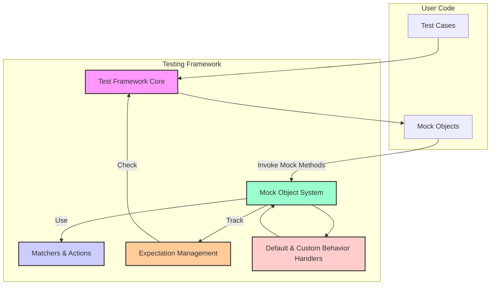

# Architecture Overview

## High-Level Architecture of GoogleTest and GoogleMock

Welcome to the Architecture Overview—the place to gain a clear, high-level understanding of how GoogleTest and GoogleMock work together. This page illustrates the main components, their interactions, the overall data flow, and how the framework integrates test writing and mocking capabilities into a seamless developer experience.

### Why This Architecture Matters to You

Understanding the architecture helps you grasp why GoogleTest is both powerful and intuitive. You’ll see how test execution, mock management, and expectation verification fit into an integrated system designed to help you write clean, maintainable, and reliable tests faster.

---

## Core Components and Their Roles

Below is an outline of the main components and their responsibilities within the GoogleTest and GoogleMock architecture:

- **Test Framework Core**: Handles test discovery, execution, and reporting. This is where your test cases, defined using GoogleTest, live and run.

- **Mock Object System**: Central to GoogleMock, this subsystem lets you define mock classes and methods, set behavioral expectations, and verify those expectations automatically.

- **Matchers and Actions**: Reusable constructs to specify flexible argument matching and define actions for mock methods (such as returning values or invoking callbacks).

- **Expectation Management**: Tracks expectations set by your code and automatically verifies them during test execution and object destruction.

- **Default and Custom Behavior Handlers**: Facilitate default responses to uninteresting calls and support for custom user-defined matchers and actions.

---

## System Interaction and Data Flow

The following scenario demonstrates a typical user workflow within this architecture:

1. **Test Initialization**: Your test program initializes GoogleTest and GoogleMock via the combined framework entry point.

2. **Test and Mock Instantiation**: Both GoogleTest test cases and GoogleMock mock objects are created.

3. **Setting Expectations**: Using constructs such as `EXPECT_CALL()`, you define expectations on mock methods—specifying how methods should be called and what they should return.

4. **Test Execution**: Your test code calls methods on mock objects and regular test fixtures.

5. **Expectation Evaluation**: The mock system intercepts the method calls, matches them to expectations using matchers, executes predefined actions, and tracks invocation counts.

6. **Verification and Cleanup**: After test execution, GoogleMock automatically verifies that all expectations were met and reports failures if any discrepancies occur.

---

## Visual Overview of the Architecture

This diagram illustrates:

- Test Cases trigger the Test Framework Core to run tests.
- The Test Framework creates and interacts with Mock Objects.
- Mock Objects delegate method invocations to the Mock Object System.
- The Mock Object System leverages Matchers and Actions to handle call argument matching and behavior.
- Expectation Management keeps track of calls against expectations.
- Default and Custom Behavior Handlers provide fallback behaviors and user extensions.

---

## Integration of GoogleTest and GoogleMock

GoogleMock is tightly integrated with GoogleTest, enabling you to write tests that seamlessly combine state verification and interaction verification. This integration means:

- **Unified Test Execution**: Calling `RUN_ALL_TESTS()` executes both ordinary tests and mocks’ expectation verifications.

- **Automatic Verification**: When a mock object is destroyed, GoogleMock automatically verifies expectations and reports failures via the GoogleTest mechanism.

- **Consistent Reporting**: All test results, including mock expectation failures, appear consistently in GoogleTest output.

- **Shared Setup and Teardown**: You can set up mocks and tests in fixtures that GoogleTest manages, ensuring smooth lifecycle handling.

---

## Practical Example Use Case

Imagine you have a service that depends on a database interaction. Using GoogleTest combined with GoogleMock:

- You write a test case that sets expectations on a mock database interface for specific queries and transactions.

- When your service code calls the mock, GoogleMock matches calls to expectations, returns predefined results, and counts call frequency.

- After the test finishes, the framework verifies all interactions happened as expected, instantly alerting you to any missed or unexpected calls.

This architecture guarantees that test failures pinpoint interaction mismatches, not just state inconsistencies.

---

## Tips and Best Practices

- **Set Expectations Before Exercising Code**: Always establish your mock expectations before calling the code under test to avoid undefined behavior.

- **Use Nice or Strict Mocks Thoughtfully**: `NiceMock` suppresses warnings about uninteresting calls, while `StrictMock` treats them as errors. Use according to testing needs.

- **Leverage Default Actions**: Use `ON_CALL` to set default behavior for mocks to avoid verbose expectations.

- **Manage Expectation Order**: Use sequences and `InSequence` objects to enforce call order where necessary.

- **Delegate to Real or Fake Objects**: When useful, delegate default actions to real or fake implementations to combine behavior with interaction verification.

- **Avoid Over-Specification**: Overly strict expectations can make tests brittle and harder to maintain.

- **Inspect Verbose Output for Debugging**: Enable `--gmock_verbose=info` for detailed logs on mock invocation and expectation matching.

---

## Getting Started with Architecture in Mind

To begin working within this architecture, refer to the Quickstart and Integration guides:

- Start by understanding test project configuration and how to write your first test.
- Learn how to define mock classes using `MOCK_METHOD` macros.
- Explore how to set expectations and specify behaviors with `EXPECT_CALL`.
- Familiarize yourself with the life-cycle of mocks and test cases.

For complete setup and usage steps, visit the Getting Started section.

---

<Note>
This architecture overview complements the detailed product introduction, value proposition, and feature description chapters available elsewhere in the documentation.
</Note>