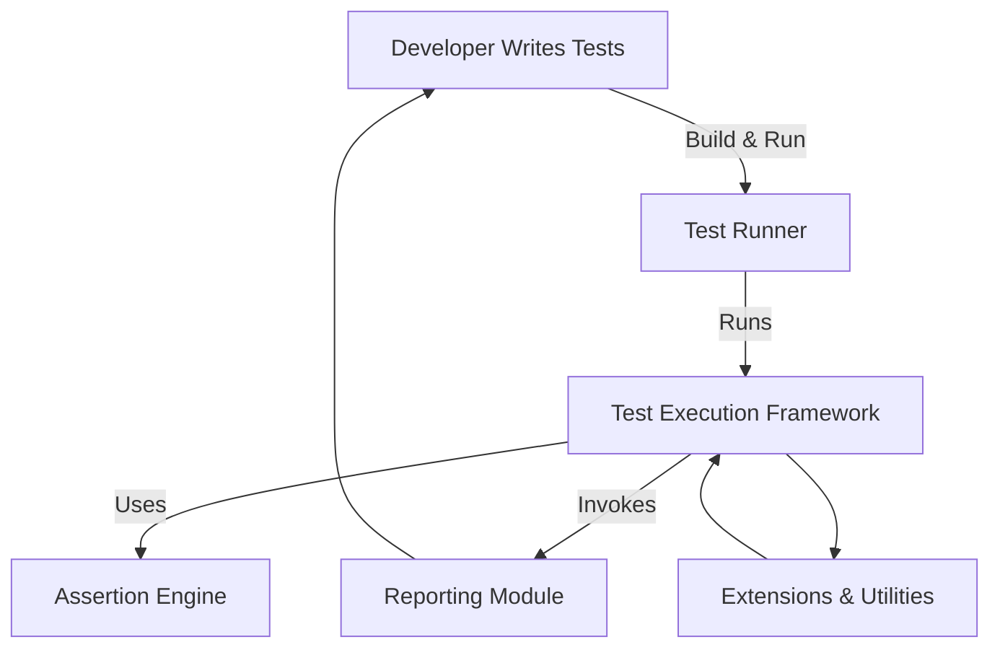

# System Architecture Diagram

## Overview

GoogleTest is a comprehensive C++ testing framework designed to integrate seamlessly into your software development lifecycle. The System Architecture Diagram page offers a visual guide to the primary components that constitute GoogleTest, illustrating how they interact to support test execution, assertion handling, and result reporting.

Understanding this architecture will provide you with insight into how GoogleTest operates behind the scenes, fostering confidence in the framework's robustness and guiding advanced users interested in extending or troubleshooting their test environment.

---

## Core Components of GoogleTest Architecture

This section breaks down the main building blocks of the GoogleTest system, highlighting their roles and how they collaborate during a typical test run.

### 1. Test Runners

The Test Runner is the entry point of the testing process. It is responsible for:

- Discovering and loading test cases within your codebase.
- Handling command line arguments related to test execution.
- Initiating the execution of individual tests or test suites.

The test runner manages the overall orchestration and lifecycle of tests, including setup and teardown procedures.

### 2. Assertion Engine

Assertions are the core mechanism for verifying test conditions. The Assertion Engine:

- Provides a rich set of assertion macros for common comparisons and checks.
- Tracks assertion results, including successes, failures, and fatal errors.
- Supports detailed output and diagnostic information on failures to facilitate debugging.

By integrating assertions tightly with test execution, the engine enables immediate and informative feedback whenever expectations are unmet.

### 3. Test Execution Framework

This component manages the execution flow within tests:

- Runs individual test methods.
- Supports fixture setup and teardown routines.
- Manages parameterized tests and typed tests.

It ensures tests are isolated and run consistently, handling exceptions and errors gracefully.

### 4. Reporting Modules

Result reporting is vital for understanding test outcomes. GoogleTest's Reporting Modules:

- Collect and format test outcomes, including passing tests, failures, and skips.
- Support various output formats (such as XML, JSON, or plain text).
- Integrate with Continuous Integration systems or external reporting tools.

These modules provide clear and comprehensive summaries of test results, making it easier to assess software quality quickly.

### 5. Extensions and Utilities

GoogleTest architecture supports extensibility:

- Plugins and user-defined event listeners can hook into the test lifecycle.
- Utilities for test filtering, sharding, and retry mechanisms.
- Facilities to integrate with mock objects (via gMock) for advanced testing strategies.

This modular design allows users to tailor the test framework to complex and evolving testing needs.

---

## How It Fits Into Your Testing Workflow

The System Architecture Diagram situates GoogleTest within the typical developer and CI environment:

- Developers write tests that are discovered and run by the Test Runner.
- The Test Execution Framework runs each test, interleaving fixture management and invoking assertions.
- Assertions validate the expected behavior.
- Reporting Modules collect and relay results back to developers in real-time or via CI systems.

---

## Practical Implications

Understanding the architecture aids users in:

- Diagnosing test failures and performance bottlenecks.
- Extending GoogleTest by creating custom listeners or reporters.
- Integrating GoogleTest smoothly with build systems and CI/CD workflows.
- Utilizing gMock effectively to mock dependencies during test execution.

Knowledge of this layered structure empowers teams to leverage GoogleTest’s full potential and troubleshoot issues with clarity.

---

## Tips and Best Practices

- **Structure your tests** thoughtfully to take full advantage of the fixture lifecycle.
- **Leverage built-in reporters** or customize them to fit your project’s reporting needs.
- **Use event listeners** to hook into the testing process for advanced logging or integration.
- **Combine with gMock** to mock complex dependencies and verify interactions.

Synchronization between these components ensures robust test execution and reliable feedback.

---

## Troubleshooting Common Issues

| Issue                              | Possible Cause                             | Suggested Action                              |
|----------------------------------|-------------------------------------------|-----------------------------------------------|
| Tests not discovered             | Improper naming or missing test macros     | Check test naming conventions and includes    |
| Assertions do not report details | Verbosity level too low                     | Increase logging verbosity (`--gtest_verbose`) |
| Slow test runs                   | Heavy fixture setup/teardown, or nested mocks | Optimize fixture usage, profile tests          |
| Test reports not generated       | Reporting module misconfiguration           | Ensure output paths and formats are correctly set |

---

## Getting Started Preview

Ready to explore GoogleTest? Begin by:

- Installing GoogleTest and integrating it into your build system.
- Writing your first test case to observe the assertion and reporting flow.
- Reviewing the [Writing Your First Test](https://google.github.io/googletest/primer.html) and [Feature Summary](../overview/feature-overview/feature-summary) pages next.

By mastering the architecture, you position yourself to write efficient, maintainable, and extensible tests.

---

## Further Reading

- [GoogleTest: What is GoogleTest?](../overview/product-intro-and-value/what-is-googletest)
- [GoogleTest Feature Summary](../overview/feature-overview/feature-summary)
- [Using Mocks in C++ Tests](../guides/core-workflows/using-mocks-in-tests)
- [gMock Cheat Sheet](../docs/gmock_cheat_sheet.md)

---

<Source url="https://github.com/google/googletest" branch="main" paths={[{"path": "googlemock/include/gmock/gmock-spec-builders.h", "range": "1-594"},{"path": "googlemock/src/gmock-spec-builders.cc", "range": "1-277"}]} />
