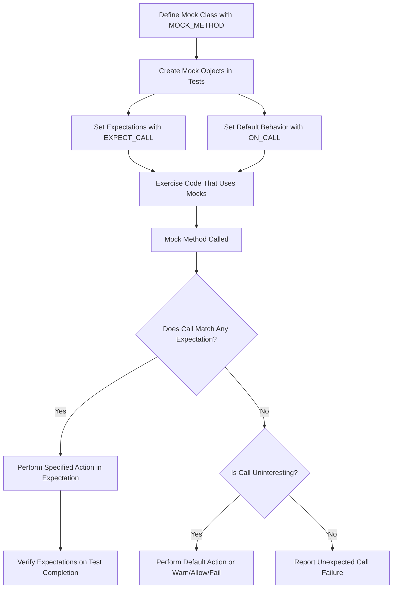

# Core Concepts & Terminology

Understanding GoogleTest and GoogleMock begins with mastering the fundamental concepts, terms, and mental models that shape how you write, organize, and reason about your tests and mocks. This page clarifies key ideas such as tests, test cases, fixtures, assertions, matchers, mocks, and actions, as well as the underlying philosophy of GoogleTest and GoogleMock.

---

## What Is a Test?

A **test** is a program or piece of code that verifies that a part of your software behaves as expected. In GoogleTest,

- A **test** corresponds to a test function, typically written using the `TEST` macro.
- Tests are grouped into **test cases** (or test suites), which provide a logical grouping for related tests.

A well-written test isolates one behavior or property and checks it rigorously, allowing quick identification when things go wrong.

## Test Cases and Test Fixtures

- A **test case** (or test suite) is a collection of related tests grouped under a common name.
- A **test fixture** lets you set up common objects and configurations shared by multiple tests in the test case.

Example:

```cpp
class MyTestFixture : public ::testing::Test {
 protected:
  void SetUp() override {
    // Common setup for each test
  }

  void TearDown() override {
    // Cleanup after each test
  }

  // Shared data members
  MyClass obj_;
};

TEST_F(MyTestFixture, TestBehavior1) {
  EXPECT_TRUE(obj_.DoSomething());
}

TEST_F(MyTestFixture, TestBehavior2) {
  EXPECT_EQ(obj_.GetValue(), 42);
}
```

Using fixtures promotes test code reuse and clarity while isolating test-specific logic.

## Assertions: How Do I Verify Behavior?

An **assertion** is a statement that verifies whether a condition holds true.

GoogleTest provides macros such as `EXPECT_*` and `ASSERT_*` for assertions:

- **EXPECT_*** assertions report failure but allow the test to continue.
- **ASSERT_*** assertions abort the current test body upon failure.

Common assertion types include:

- `EXPECT_EQ(expected, actual)` — compares equality.
- `EXPECT_TRUE(condition)`, `EXPECT_FALSE(condition)` — boolean checks.
- `EXPECT_THROW(statement, ExceptionType)` — exception verification.

You can also use matcher-based assertions, e.g., `EXPECT_THAT(value, matcher)`, to write expressive checks with flexible matching criteria.

## Matchers: Flexible Argument and Value Matching

**Matchers** are predicates used in mocks and assertions to specify expected argument values or check results. They enable flexible and readable tests.

Examples of built-in matchers include:

- `_` (wildcard matcher) — matches any value.
- `Eq(value)` — exact equality.
- `Ge(n)` — value greater than or equal to `n`.
- `Not(matcher)` — negates a matcher.
- `ElementsAre(...)` — matches container elements with specified matchers in order.

Matchers support composition, parametrization, and you can write custom matchers to tailor the checking logic precisely.

```cpp
using ::testing::_;
using ::testing::Ge;
using ::testing::ElementsAre;
EXPECT_CALL(mock_obj, Method(Ge(10), _));
EXPECT_THAT(container, ElementsAre(1, _, 3));
```

## Mocks: Simulating Collaborators

A **mock** is an object that simulates a collaborator’s behavior in a controlled way. It allows you to:

- Set expectations on what methods should be called, how many times, with what arguments.
- Specify the behavior of mocked methods (what they return, side effects, etc).
- Verify that the code under test interacts correctly with its dependencies.

GoogleMock lets you define mock classes via the `MOCK_METHOD` macro inside your mock class, automatically generating all the machinery needed.

Example mock class:

```cpp
class MockFoo {
 public:
  MOCK_METHOD(int, GetValue, (), ());
  MOCK_METHOD(void, SetValue, (int val), ());
};
```

By setting expectations with `EXPECT_CALL` and default behaviors with `ON_CALL`, you gain fine-grained control over how the mock behaves.

## Actions: What Happens When Mocks Are Called?

An **action** defines what a mock method does when it is invoked. It can:

- Return a specific value.
- Invoke a user-defined function or lambda.
- Save arguments for later inspection.
- Throw an exception.
- Perform side effects (e.g., modifying output parameters).

Example:

```cpp
EXPECT_CALL(mock, GetValue())
    .WillOnce(Return(42))
    .WillRepeatedly(Return(0));

EXPECT_CALL(mock, SetValue(_))
    .WillOnce(Invoke([](int val) { std::cout << "SetValue called with " << val << std::endl; }));
```

Actions work seamlessly with expectations, allowing your tests to simulate realistic behaviors while capturing interactions.

## Philosophical Foundations

At its core, GoogleTest provides a framework for writing **state-based** tests: verifying observable outputs and states.

GoogleMock extends this to **interaction-based** testing, focusing on verifying interactions between objects.

Together, they let you write tests that are both comprehensive and maintainable, catching regressions early and making the design explicit and testable.

## Terminology Summary

| Term           | Description                                                           |
|----------------|-----------------------------------------------------------------------|
| Test           | A function verifying specific software behavior.                     |
| Test Case (Suite) | A grouping of related tests sharing setup/teardown.                |
| Test Fixture   | An environment where tests share common setup and data.              |
| Assertion     | A statement verifying a condition in a test.                         |
| Matcher       | A predicate that evaluates function arguments or values.             |
| Mock          | A test double that simulates the behavior of a collaborator.         |
| Expectation  | A specification of how a mock method should be called.                |
| Action       | Defines what a mock method does when invoked.                         |


---

## Practical Workflow

Consider this typical user flow:

1. Define mocks with `MOCK_METHOD` in mock classes representing your dependencies.
2. Use `EXPECT_CALL` to set expectations (how mocks should be called).
3. Use `ON_CALL` to define default behavior for mocked methods.
4. Write tests that exercise the code under test, which uses mocks.
5. Let GoogleMock verify the expectations automatically after test execution.

This structured approach makes tests easier to write, reduces brittleness, and improves clarity of test intent.

## Additional Tips

- Use `_` matcher when the exact argument value is not critical.
- Use sequences (`InSequence` or explicit `Sequence` objects) to enforce call order.
- Prefer `ON_CALL` to specify default behaviors and `EXPECT_CALL` only to specify calls you want to verify.
- Utilize matcher combinators (`AllOf`, `AnyOf`, `Not`, etc.) for complex conditions.
- Consider using `NiceMock` to suppress warnings for uninteresting calls, and `StrictMock` to enforce stricter behavior.

---

For a deeper dive, see related guides on [Mocking Basics](https://github.com/google/googletest/blob/main/docs/gmock_for_dummies.md), the [Mocking Reference](https://github.com/google/googletest/blob/main/docs/reference/mocking.md), and the [gMock Cookbook](https://github.com/google/googletest/blob/main/docs/gmock_cook_book.md).


---

### Diagram: Basic Flow of Mocking in GoogleMock



---

### Code Example: Expectation with Matchers and Actions

```cpp
using ::testing::_;
using ::testing::Return;
using ::testing::AtLeast;

class MockCalculator {
 public:
  MOCK_METHOD(int, Add, (int a, int b), ());
};

TEST(CalculatorTest, AddsPositiveNumbers) {
  MockCalculator mock_calc;

  // Expect Add to be called at least once with first argument positive, second any.
  EXPECT_CALL(mock_calc, Add(::testing::Gt(0), _))
      .Times(AtLeast(1))
      .WillRepeatedly(Return(42));

  int sum = mock_calc.Add(10, 1);  // returns 42
  EXPECT_EQ(sum, 42);
}
```

---

### Summary
This page arms you with a solid grasp of the foundational concepts underlying GoogleTest and GoogleMock. By understanding these core terms and usage patterns, you’re positioned to write effective, maintainable, and expressive C++ tests that leverage the full power of the framework.
