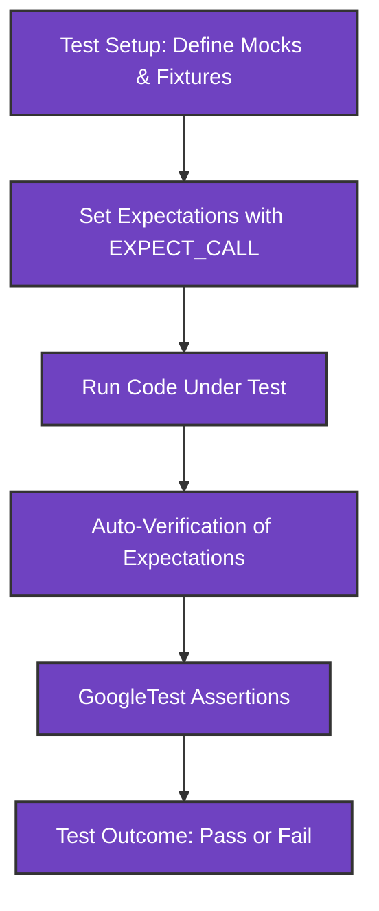

# Core Concepts & Terminology

Get up to speed on essential GoogleTest and GoogleMock concepts—assertions, expectations, test fixtures, matchers, actions, cardinalities, and test discovery. This glossary enables you to read, write, and reason about tests with confidence.

---

## Why Understanding Core Concepts Matters

Before diving into writing tests using GoogleTest and GoogleMock, it's critical to grasp the foundational concepts and terminology these frameworks use. Knowing these will empower you to write tests that are precise, maintainable, and effective at validating your C++ code.

This page bridges the gap between knowing how to use macros like `EXPECT_CALL` and `MOCK_METHOD` and truly understanding what happens behind the scenes, what user intents drive these constructs, and how they fit together in crafting robust unit tests.

---

## Key Terminology in GoogleTest and GoogleMock

### Assertions

Assertions are statements in your tests that verify if a condition holds true. When an assertion fails, the test reports an error. GoogleTest provides a rich set of assertions:

- **EXPECT_** assertions: Non-fatal failures, allowing the test to continue.
- **ASSERT_** assertions: Fatal failures, aborting the test immediately.

Example:

```cpp
EXPECT_EQ(expected_value, actual_value);  // Checks equality, continues on failure
ASSERT_TRUE(condition);                   // Aborts test on failure
```

### Expectations

In GoogleMock, expectations specify how and when mock methods should be called. They govern the interactions between a mock object and the code under test, including:

- How many times a method should be called.
- What arguments it should be called with.
- The order in which calls should occur.

You set expectations using the `EXPECT_CALL()` macro on mock objects before exercising your code.

Example:

```cpp
EXPECT_CALL(mock_obj, MethodName(arg_matchers))
    .Times(2)                         // Expect exactly two calls
    .WillOnce(Return(value))          // Return on first call
    .WillRepeatedly(Return(other_value));  // Return subsequently
```

### Test Fixtures

Test fixtures provide a way to share common setup and teardown code across multiple tests. Defining a test fixture involves inheriting from `::testing::Test` and placing shared state within it.

Example:

```cpp
class MyTest : public ::testing::Test {
 protected:
  void SetUp() override {
    // Common setup code
  }

  void TearDown() override {
    // Common cleanup code
  }

  MockClass mock_obj;
};

TEST_F(MyTest, TestCase1) {
  // Your test here can use mock_obj
}
```

Using fixtures enhances test readability and maintenance by avoiding repeated boilerplate.

### Matchers

Matchers are predicates used to specify constraints on arguments passed to mock methods. Instead of checking exact values, you can describe properties the arguments must satisfy.

Common matchers:

- `_` — Matches any value (wildcard).
- `Eq(val)` — Equal to a specific value.
- `Ge(val)`, `Le(val)`, `Gt(val)`, `Lt(val)` — Inequality comparisons.
- `Not(matcher)` — Negation.
- `AllOf(m1, m2, ...)` — All matchers must match.
- `AnyOf(m1, m2, ...)` — Any matcher can match.

Example:

```cpp
EXPECT_CALL(mock_obj, Foo(Ge(5), _));  // Argument 0 must be >= 5, argument 1 any value
```

Matchers can be combined, customized, and even user-defined for highly expressive tests.

### Actions

Actions define what a mocked method actually does when called. By default, mock methods return default values. With actions, you can specify behaviors like returning specific values, invoking callbacks, throwing exceptions, setting output parameters, or delegating calls.

Examples of actions:

- `Return(value)` — Returns a value.
- `Invoke(func)` — Invokes a function or functor.
- `DoAll(action1, action2, ...)` — Performs multiple actions in sequence.
- `SetArgPointee<N>(value)` — Sets the Nth pointer argument’s pointee.

Example:

```cpp
EXPECT_CALL(mock_obj, GetSize()).WillOnce(Return(42));
```

### Cardinalities

Cardinality specifies how many times a mock method is expected to be called. It is provided as an argument to `.Times()` in `EXPECT_CALL()`.

Common cardinalities:

- `Exactly(n)` — Exactly `n` calls.
- `AtLeast(n)` — At least `n` calls.
- `AtMost(n)` — At most `n` calls.
- `Between(m, n)` — Between `m` and `n` calls.
- `AnyNumber()` — Any number of calls.

Example:

```cpp
EXPECT_CALL(mock_obj, MethodName()).Times(AtLeast(1));  // Method called one or more times
```

### Test Discovery

GoogleTest automatically discovers tests defined with `TEST` or `TEST_F` macros based on naming conventions and registration at runtime. This eliminates the need for manual test registration and supports running subsets of tests easily.

### Expectations Ordering and Sequences

You can control the order of expected calls using:

- **Sequences**: Objects of type `Sequence` can define call order.
- **InSequence**: A handy RAII object that places all expectations in its scope into a sequence.
- **After()**: Specifies that one expectation should only occur after another.

Example of sequencing:

```cpp
Sequence s;
EXPECT_CALL(mock_obj, FirstMethod()).InSequence(s);
EXPECT_CALL(mock_obj, SecondMethod()).InSequence(s);
```

This enforces that `FirstMethod` is called before `SecondMethod`.

---

## Practical Examples

### Using Assertions

```cpp
TEST(MathTest, BasicAssertions) {
  EXPECT_EQ(4, 2 + 2);
  ASSERT_TRUE((1 < 2));
}
```

### Mocking a Class and Setting Expectations

```cpp
class MockCalculator {
 public:
  MOCK_METHOD(int, Add, (int a, int b), (const));
};

TEST(CalculatorTest, AddTest) {
  MockCalculator mock_calc;
  EXPECT_CALL(mock_calc, Add(3, 4))
      .Times(1)
      .WillOnce(Return(7));

  int result = mock_calc.Add(3, 4);
  EXPECT_EQ(result, 7);
}
```

### Using Matchers

```cpp
EXPECT_CALL(mock_calc, Add(_, 5))  // First argument can be anything, second must be 5
    .WillOnce(Return(10));
```

### Setting Default Actions with ON_CALL

```cpp
ON_CALL(mock_calc, Add(_, _)).WillByDefault(Return(0));
```

This sets the default return value when no explicit expectation is matched.

---

## Common Pitfalls and Best Practices

- **Set expectations before calling the mock methods.**
  - `EXPECT_CALL` must precede any calls to the mock method.

- **Use `ON_CALL` for setting default behaviors but avoid overusing `EXPECT_CALL` which enforce strict constraints.**
  - Overly strict expectations can make your tests brittle.

- **Avoid mixing return values that require move semantics without proper support.**
  - Returning move-only types requires use of lambdas or custom actions.

- **Suppress false warnings using `NiceMock` when uninteresting call warnings are excessive.**

- **Retire expectations using `.RetiresOnSaturation()` to avoid sticky expectations causing test failures when calls exceed limits.**

- **Use sequences or `.After()` clauses to control call order explicitly when it's important.**

- **Avoid mocking non-virtual methods unless using advanced dependency injection techniques.**

---

## How These Concepts Work Together

The process of writing tests with GoogleTest and GoogleMock follows this logical flow:

1. **Setup:** Define mocks and test fixtures containing mocks.
2. **Expectation:** Use `EXPECT_CALL` to specify expected interactions on mocks.
3. **Exercise:** Run the code under test that depends on mocks.
4. **Verification:** GoogleMock automatically verifies that expectations are met.
5. **Assertions:** Use GoogleTest assertions to check results or state.

Understanding assertions, expectations, fixtures, matchers, and actions is essential for mastering this flow.

---

## Visual Overview



---

## Troubleshooting Tips

<AccordionGroup title="Troubleshooting Common Issues">
<Accordion title="Why does my mock method call the real method?">
Mocked methods need to be declared as `virtual`. Without `virtual`, GoogleMock cannot intercept calls, so the real method executes.
</Accordion>
<Accordion title="How do I suppress unwanted warnings about uninteresting calls?">
Use `NiceMock` to suppress warnings about mock methods that are called without explicit expectations.
</Accordion>
<Accordion title="What if my test fails due to call order?">
Use `Sequence` objects or `InSequence` blocks to explicitly specify the expected order of calls.
</Accordion>
<Accordion title="How do I mock overloaded methods?">
Use the full signature in `MOCK_METHOD` and be sure to disambiguate calls with specific matchers or the `Const()` wrapper for const overloads.
</Accordion>
</AccordionGroup>

---

## Next Steps

- Start by reading the [Product Introduction](/overview/introduction-and-value/product-introduction) to see how GoogleTest addresses testing needs.
- Explore the [Feature Highlights](/overview/feature-overview-integration/feature-highlights) to understand core capabilities.
- Learn about [Writing and Using Assertions](/guides/core-testing-workflows/writing-assertions) for mastering validation in tests.
- Dive deeper into mocking with the [gMock Cookbook](https://github.com/google/googletest/blob/main/docs/gmock_cook_book.md).

---

## Helpful Resources

- [GoogleMock Cheatsheet](https://github.com/google/googletest/blob/main/docs/gmock_cheat_sheet.md)
- [Matchers Reference](../concepts/data-models-parameterization/matchers-and-expressive-assertions)
- [Writing Mock Methods](https://github.com/google/googletest/blob/main/docs/gmock_cook_book.md#creating-mock-classes)
- [Understanding Uninteresting vs Unexpected Calls](https://github.com/google/googletest/blob/main/docs/gmock_cook_book.md#uninteresting-vs-unexpected)

---

This overview equips you with the language and understanding to confidently design tests with GoogleTest and GoogleMock, yielding robust and maintainable test suites.