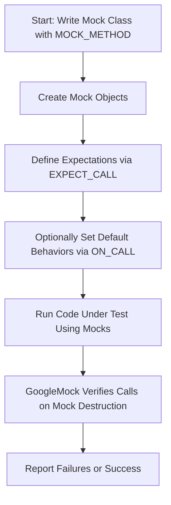

# Core Concepts & Terminology

Understanding the foundational language and key ideas of GoogleTest lays the groundwork for productive, effective use of this powerful C++ testing and mocking framework. This documentation introduces core concepts such as tests, test suites, fixtures, assertions, matchers, and mocks, mapping each term to its role within common testing workflows. Whether you’re new to unit testing or deepening your expertise, this page makes GoogleTest’s terminology accessible and clear.

---

## What Are Tests and Test Suites?

At the heart of GoogleTest is the concept of a **test case**: a single test that verifies a specific behavior or condition in your code. Tests are grouped logically into **test suites**, which allow you to organize related tests together—aiding readability, maintenance, and execution.

- **Test**: A function that exercises part of your code and verifies an expectation.
- **Test Suite**: A named grouping of tests sharing common setup, such as the same fixture or related functionality.

This arrangement forms a hierarchy that reflects the structure of your tested code, enabling you to run individual tests or entire suites with ease.

## What Is a Test Fixture?

A **test fixture** is a programmable context that prepares and cleans up the environment in which tests run. Think of it as a shared setup and teardown routine that multiple tests can reuse to reduce duplication.

- Initializes objects, sets up known states, or allocates resources.
- Cleans up after tests to avoid side effects leaking between tests.
- Declared via a C++ class you derive from `testing::Test`.

Fixtures enable systematic, reliable, and maintainable test creation—a cornerstone of robust unit testing.

## What Are Assertions?

**Assertions** are the fundamental statements that verify a condition during a test’s execution. They check expected outcomes and report failures immediately when conditions are not met.

GoogleTest provides a rich set of assertion macros to fit all common testing needs:

- Basic truth checks: `EXPECT_TRUE(condition)`, `ASSERT_FALSE(condition)` — to validate boolean conditions.
- Equality and relational checks: `EXPECT_EQ(val1, val2)`, `EXPECT_LT(val1, val2)` — to compare values.
- Exception checks: `EXPECT_THROW(statement, ExceptionType)` — to verify proper error handling.

Assertions come in two important kinds:

- `EXPECT_` variants report failures but continue test execution.
- `ASSERT_` variants report failures and immediately abort the current test.

Select appropriately based on the criticality of the check.

## Understanding Matchers

**Matchers** decide whether the actual arguments passed to mocked functions satisfy the expected conditions. They form logical predicates used within mock expectations.

- Basic matcher: `_` matches any argument.
- Value matchers: e.g., `Eq(5)` matches if the argument equals 5.
- Complex matchers: combined with logical operators (`AllOf`, `AnyOf`) or custom-defined by users.

Matchers elevate the expressiveness of tests by enabling precise yet flexible argument validation.

## What Are Mocks and Mock Objects?

**Mock objects** simulate real objects and verify the interactions your code has with its dependencies. They implement the same interface as production code classes but allow you to specify:

- Which methods will be called.
- With what arguments.
- How many times.
- In what order.
- What the methods return or do.

Mocks play a crucial role in isolating your code under test, reducing dependencies, and enabling interaction-based testing.

## Key Terms in Mocking Workflow

| Concept          | Description                                                                                      |
|------------------|------------------------------------------------------------------------------------------------|
| MOCK_METHOD      | Macro to declare a mocked method in a mock class.                                               |
| EXPECT_CALL      | Macro to set an expectation that a mock method will be called with specific arguments.          |
| ON_CALL          | Macro to set default behavior of mock method calls without an expectation of invocation.         |
| Cardinality      | Defines how many times an expectation is allowed or required to be fulfilled (`Times()`).         |
| Actions          | Define what happens when a mock method is called (`WillOnce`, `WillRepeatedly`).                  |
| Sequences        | Specify ordering constraints among multiple expectations (`InSequence`).                         |
| Matchers         | Describe argument patterns that will satisfy an expectation.                                    |
| RetiresOnSaturation | An expectation that becomes inactive after its call count limit is reached.                     |

## Typical User Flow with Mocks

1. Define a mock class by subclassing the interface and using `MOCK_METHOD` macros.
2. Create mock object instances in your tests.
3. Use `EXPECT_CALL` to specify expected method calls with argument matchers, call counts, order, and actions.
4. Use `ON_CALL` to specify default behavior for calls that may occur but are not explicitly expected.
5. Exercise your code under test which interacts with the mocks.
6. When mocks are destructed, GoogleTest automatically verifies that all expectations were met, reporting failures if any expectation was not satisfied.

## Practical Example: Mocking a Turtle Interface

Here is a concrete example summarizing the workflow:

```cpp
class Turtle {
 public:
  virtual ~Turtle() {}
  virtual void PenUp() = 0;
  virtual void PenDown() = 0;
  virtual void Forward(int distance) = 0;
  virtual void Turn(int degrees) = 0;
  virtual int GetX() const = 0;
  virtual int GetY() const = 0;
};

// Mock class definition
class MockTurtle : public Turtle {
 public:
  MOCK_METHOD(void, PenUp, (), (override));
  MOCK_METHOD(void, PenDown, (), (override));
  MOCK_METHOD(void, Forward, (int distance), (override));
  MOCK_METHOD(void, Turn, (int degrees), (override));
  MOCK_METHOD(int, GetX, (), (const, override));
  MOCK_METHOD(int, GetY, (), (const, override));
};

// Test example
TEST(PainterTest, CanDrawCircle) {
  MockTurtle turtle;
  EXPECT_CALL(turtle, PenDown()).Times(AtLeast(1));

  Painter painter(&turtle);
  EXPECT_TRUE(painter.DrawCircle(0, 0, 10));
}
```

This example shows how expectations are set on mock methods, allowing you to write tests that verify precise interactions rather than brittle side effects.

## Best Practices & Common Pitfalls

- **Set expectations before exercising code:** `EXPECT_CALL` statements must appear before calls to the mock methods, or the behavior is undefined.
- **Avoid overly strict expectations:** Over-specifying expectations can make tests brittle and hard to maintain.
- **Use `ON_CALL` for default behavior:** When you care about methods being called but not the exact count or arguments.
- **Understand uninteresting vs unexpected calls:** Calls without expectations are “uninteresting” and cause warnings; calls with unmatched expectations are errors.
- **Retirement of expectations:** Use `.RetiresOnSaturation()` to allow expectations to be disabled once satisfied, especially when multiple expectations may match.
- **Use sequences judiciously:** For strict call order, but avoid excessive ordering requirements.

## Troubleshooting Common Issues

- If a mock method calls the real method unexpectedly, check if the method is virtual.
- Be mindful of const correctness when mocking and setting expectations.
- Use `--gmock_verbose=info` flag to get detailed logs of which expectations match each call.
- Ensure you override all versions of overloaded methods that your tests exercise.
- Use `NiceMock` to suppress warnings about uninteresting calls, or `StrictMock` to make them failures.

## How This Page Fits into the GoogleTest Documentation

This documentation complements the overall architecture overview and core features descriptions:

- See [GoogleTest Architecture](product-architecture) for how core components interact.
- See [Key Features of GoogleTest](core-features) for the main capabilities.

This core concepts page lays the foundation that supports deeper understanding required for integration, mocking best practices, and advanced usage.

---

<AccordionGroup title="Additional Resources">
<Accordion title="Mocking Tutorial: gMock for Dummies">
Explore step-by-step beginner-friendly mock creation and usage guidance: [gMock for Dummies](gmock_for_dummies.md)
</Accordion>
<Accordion title="Reference: Mocking API and Macros">
Detailed reference to macros like `MOCK_METHOD`, `EXPECT_CALL`, `ON_CALL`: [Mocking Reference](reference/mocking.md)
</Accordion>
<Accordion title="Advanced Mocking Patterns">
Recipes and best practices for complex mocking scenarios: [gMock Cookbook](gmock_cook_book.md)
</Accordion>
</AccordionGroup>

<Note>
Remember: GoogleMock is an extension of GoogleTest specialized in mocking. This page focuses on foundational terms to get you started and comfortable in understanding GoogleTest’s testing language.
</Note>

---

## Summary

At its core, GoogleTest organizes verification into tests and suites with reusable fixtures, allowing you to assert expected results through expressive assertions. In mocking, GoogleMock introduces mocks, expectations, matchers, and actions to control and verify how your code interacts with its dependencies. Mastering these terms empowers you to write clear, maintainable, and powerful tests that both confirm correctness and drastically ease debugging.

---



---

## Where to Go Next

- Start testing with [Writing Your First Test](writing-first-test)
- Learn core [GoogleTest Features](core-features)
- Dive deeper into [Mocking with GoogleMock](mocking-basics)


---

*This documentation is current as of release 1.13.0 of GoogleTest/GoogleMock.*

---

<Source url="https://github.com/google/googletest" paths={[{"path": "docs/overview/architecture-and-concepts/core-concepts.mdx", "range": "0-120"}]} />
