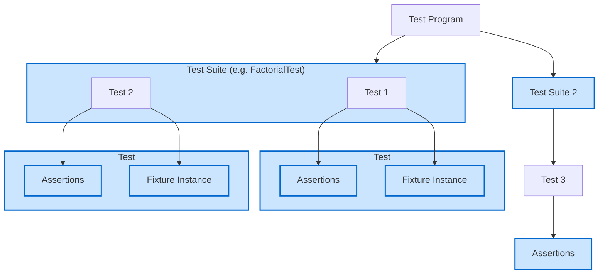

# Core Concepts & Terminology

Unlocking effective testing with GoogleTest begins with establishing a solid understanding of its fundamental terms and abstractions. This page introduces the core vocabulary that every user needs to master to write, organize, and reason about their tests efficiently. Armed with these concepts, you will be well-prepared to dive deeper into advanced GoogleTest features and patterns.

---

## Understanding the Language of GoogleTest

GoogleTest’s terminology has evolved to reduce ambiguity and align more closely with industry standards, yet certain terms have historical nuance. Establishing a shared vocabulary ensures clarity when writing tests, collaborating, or navigating documentation.

| Concept           | GoogleTest Term     | ISTQB & Industry Term | Explanation
|-------------------|--------------------|----------------------|-----------------------------------------------------------------------------------------------
| A single verification of system behavior with specific inputs | *Test*             | *Test Case*          | Represents an individual test function verifying a specific aspect of code.
| A group of logically related tests sharing naming and context | *Test Suite* (formerly *Test Case*) | *Test Suite*          | Collection of related tests, often grouped by the feature or class under test.
| Code structure supporting shared setup and teardown for multiple tests | *Test Fixture*     | Test Fixture         | A class providing common data and subroutines to tests within a test suite.

> **Note:** Though GoogleTest historically used "Test Case" for grouping tests, the term is now deprecated in favor of "Test Suite," which aligns with the ISTQB standard.

---

## Key Abstractions Explained

### 1. Test

A *Test* is the atomic unit of verification. It checks that a particular piece of code behaves as expected under certain conditions.

- Tests are defined using the `TEST()` macro.
- Each test runs independently and reports success or failure based on assertions.

```cpp
TEST(FactorialTest, HandlesZeroInput) {
  EXPECT_EQ(Factorial(0), 1);
}
```

### 2. Test Suite

A *Test Suite* groups related tests together, promoting organized and maintainable testing structures.

- Tests within the same suite share a name prefix.
- Suites usually correspond to a class or module under test.

Example: `FactorialTest` contains tests named `HandlesZeroInput` and `HandlesPositiveInput`.

### 3. Test Fixture

When multiple tests require the same setup or shared resources, a *Test Fixture* provides that reusable context.

- Write a subclass of `testing::Test` to declare common data and setup methods.
- Use the `TEST_F()` macro to write tests that use the fixture.

```cpp
class QueueTest : public testing::Test {
 protected:
  QueueTest() {
    q1_.Enqueue(1);
    q2_.Enqueue(2);
    q2_.Enqueue(3);
  }

  Queue<int> q0_;
  Queue<int> q1_;
  Queue<int> q2_;
};

TEST_F(QueueTest, IsEmptyInitially) {
  EXPECT_EQ(q0_.size(), 0);
}
```

Each test runs with a fresh fixture instance, preventing inter-test side effects.

### 4. Assertions

Assertions are the checks inside tests verifying expected outcomes.

- `ASSERT_` macros cause a fatal failure and abort the current function.
- `EXPECT_` macros report a nonfatal failure allowing the test to continue.

Example with custom messages:

```cpp
ASSERT_EQ(x.size(), y.size()) << "Vectors differ in length";
EXPECT_EQ(x[0], y[0]) << "First elements differ";
```

### 5. Matchers

Matchers express conditions for verifying values more expressively (covered in detail on the Matchers page).

### 6. Mocks

Mocks simulate dependencies, enabling verification of interactions (covered in the GoogleMock & Advanced Testing section).

### 7. Parameterized Tests

Parameterizing tests lets you run the same test logic with different inputs for broader coverage.

- Use `TEST_P` macros in combination with fixtures derived from `TestWithParam`.

### 8. Death Tests

Death tests verify that your code safely handles fatal failures by asserting the program terminates under error conditions.

---

## How These Concepts Fit Together

GoogleTest structures your test program as a hierarchy:

- **Test Program**
  - Contains multiple **Test Suites**
    - Each contains several **Tests**
      - Tests include **Assertions** checking correctness
      - Tests can use **Fixtures** for setup/teardown
      - Advanced tests can include **Mocks**, **Parameterized** inputs, or **Death Tests**

This organization supports scalable, readable, and efficient testing workflows.

---

## Practical User Flow: From Basic to Advanced Testing

Here's how these core concepts guide your testing journey:

1. **Write Basic Tests**
   - Define tests with `TEST()` and write assertions.
2. **Group Related Tests**
   - Organize tests into suites via the first `TEST()` argument.
3. **Create Fixtures**
   - For shared setup or teardown, define fixture classes and write `TEST_F()` tests.
4. **Use Parameterized Tests**
   - When testing multiple input variations, leverage parameterized test features.
5. **Integrate Mocks and Matchers**
   - Simulate external components and write precise assertions.
6. **Apply Death Tests**
   - Verify your code handles critical failures safely.

---

## Best Practices & Tips

- Always group logically related tests in the same test suite to reflect your code structure.
- Use `EXPECT_*` assertions to gather all failures in one run unless a failure should stop the test immediately.
- With fixtures, remember GoogleTest creates a fresh instance for each test to prevent contamination.
- Avoid naming test suites or test names with underscores to stay consistent with GoogleStyle.
- When using parameterized tests, use the framework's instantiation macros to keep test expansions clear.

---

## Troubleshooting Common Issues

<AccordionGroup title="Common Confusions">
<Accordion title="Why does my test continue after failure?">
`EXPECT_*` assertions report failures but do not halt the test. Use `ASSERT_*` to abort immediately on critical failures.
</Accordion>
<Accordion title="My `TEST_F()` test fails to compile: `virtual outside class declaration`.">
Verify your fixture class is properly defined before writing `TEST_F()` tests that depend on it.
</Accordion>
<Accordion title="Tests interfere with each other when sharing state.">
Remember GoogleTest creates a new fixture instance per test; shared global state must be managed carefully or avoided.
</Accordion>
</AccordionGroup>

---

## Additional Resources & Next Steps

- Dive into the [Simple Tests Guide](/guides/getting-started/create-first-test) to start coding tests.
- Learn about [Test Declarations & Test Cases](/api-reference/core-apis/test-declarations) for API details.
- Explore [Assertions and Failure Handling](/api-reference/core-apis/assertions) to master verification.
- Advance with [GoogleMock & Advanced Testing](/overview/features-at-a-glance/mocking-and-advanced-testing).

---

## Summary Diagram




---

This shared terminology unlocks the power of GoogleTest and lays the foundation for confident, efficient testing.


<Source url="https://github.com/google/googletest" branch="main" paths={[{"path": "docs/primer.md", "range": "1-400"}]} />


