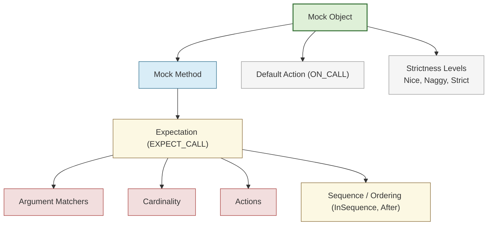

# Key Concepts and Terminology

Understanding the foundational vocabulary of GoogleMock (gMock) is essential to effectively writing and maintaining robust tests for your C++ code. This page introduces and explains the core domain-specific terms used throughout the framework, anchoring users who are unfamiliar with mocking concepts or looking to deepen their comprehension.

---

## What Are Key Mocking Terms?

GoogleMock extends the googletest framework by enabling mock object creation and interaction-based testing. Here are the core concepts you will encounter when using gMock:

### Mock Object
A mock object is a simulated version of a real object that implements the same interface but allows runtime specification of expected method calls, their arguments, and outcomes. Mock objects form the backbone of interaction verification in gMock.

### Mock Method
A mock method is a method declared inside a mock class using the `MOCK_METHOD` macro. These provide hooks to specify expectations and behaviors for method calls.

### Expectation
An expectation binds a mock method call with specific argument matchers and expected call count. It is set using the `EXPECT_CALL` macro and controls what calls are allowed, how often, in which order, and what they return or do.

### Matchers
Matchers are predicates used to specify which arguments of a mock method call satisfy an expectation. The wildcard matcher `_` matches anything; others allow fine-grained constraints—for example, `Ge(5)` matches arguments greater or equal to 5.

### Default Action
Defined using `ON_CALL`, a default action specifies what happens when a mock method is called without an `EXPECT_CALL` specification or when calls do not match any expectation. It defines the baseline behavior without enforcing call count or order.

### Cardinality
Specifies how many times a call matching an expectation is expected to happen. Common cardinalities include `Times(AnyNumber())`, `Times(Exactly(n))`, `Times(AtLeast(n))`, and `Times(AtMost(n))`.

### Sequences and Ordering
Using `InSequence` and the `.After()` clause, gMock allows specifying that certain calls must occur in a strict order or after other calls. This can be a complete order or a partial order (DAG).

### Nice, Naggy, and Strict Mocks
These define the strictness level in handling uninteresting calls (calls to mock methods without expectations).

- **NiceMock**: suppresses warnings on uninteresting calls.
- **NaggyMock** (default): warns on uninteresting calls.
- **StrictMock**: treats uninteresting calls as failures.

---

## Illustrative Examples

### Defining a Mock Method

```cpp
class MockFoo {
 public:
  MOCK_METHOD(int, GetValue, (int x), (override));
  MOCK_METHOD(void, SetValue, (int x), (override));
};
```

Here, `GetValue` and `SetValue` are mock methods that can be controlled and verified using gMock.

### Setting Expectations

```cpp
using ::testing::_;  // Wildcard matcher
using ::testing::Return;

MockFoo mock;
EXPECT_CALL(mock, GetValue(_))
    .Times(2)
    .WillOnce(Return(42))
    .WillOnce(Return(43));

int val1 = mock.GetValue(5);  // returns 42
int val2 = mock.GetValue(10); // returns 43
```

This expectation states that `GetValue` is expected to be called twice with any argument, returning 42 then 43.

### Using Sequences

```cpp
using ::testing::InSequence;

{
  InSequence s;
  EXPECT_CALL(mock, FirstCall());
  EXPECT_CALL(mock, SecondCall());
}

// Calls to mock.FirstCall() must occur before mock.SecondCall()
```

### Controlling Strictness

```cpp
using ::testing::NiceMock;
NiceMock<MockFoo> nice_mock;
// Uninteresting calls won't generate warnings.
```


---

## Best Practices & Tips

- Always specify expectations on mock methods before exercising the mock to avoid undefined behavior.
- Use `ON_CALL` to specify default actions when you do not care if a method is called or not.
- Prefer `MATCHERS` like `_` for argument flexibility to avoid overly brittle tests.
- For calls expected in a specific order, leverage `InSequence` or `.After()` for partial order constraints.
- Choose the appropriate mock strictness to balance between useful warnings and test resilience.
- Use descriptive argument matchers and expectation names to make test failures easy to diagnose.

---

## Troubleshooting Common Terms

**Uninteresting Calls**: Calls to mock methods without an explicit expectation (`EXPECT_CALL`) set. They trigger default actions but may generate warnings or errors depending on mock strictness.

**Unexpected Calls**: Calls that have expectations but the arguments do not match any. These always cause test failures.

**Saturation**: When the expected number of calls for an expectation is reached (the upper bound), further matching calls may cause errors unless `RetiresOnSaturation()` is specified.

---

## Related Documentation

- [gMock Cookbook](../docs/gmock_cook_book.md) — For recipes using key concepts
- [GoogleMock for Dummies](../docs/gmock_for_dummies.md) — Beginner-friendly intro
- [Mocking Reference](../docs/reference/mocking.md) — Detailed API reference
- [Nice, Naggy, and Strict Mocks](../api-reference/mocking/controlling-mock-strictness.md) — How to control mock strictness

For a deeper understanding of the system architecture and user workflows, see [System Architecture (with Diagram)](/overview/architecture-and-concepts/architecture-overview) and [Typical Workflows](/overview/feature-glance/typical-workflows).

---

## Summary Diagram: Key Concept Relationships



---

## Next Steps

To put these concepts into practice, explore:

- [Getting Started with Writing Your First Test](/getting-started/configuration-first-run/write-first-test)
- [Mocking Basics Guide](/guides/core-workflows/mocking-basics)
- [Feature Highlights](/overview/feature-glance/feature-highlights)

These will provide you hands-on experience and solidify your grasp on the vocabulary introduced here.

---

_Last updated based on GoogleMock source and official documentation._
