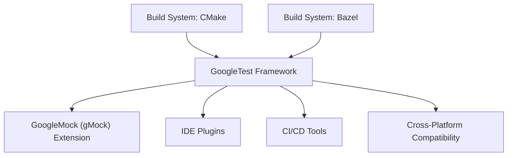

# Integration & Ecosystem Compatibility

GoogleTest doesn't just excel as a standalone C++ testing framework; it integrates seamlessly into a wide range of development workflows thanks to strong support for popular build systems, cross-platform operability, and rich extensions. This page offers an overview of GoogleTest's compatibility within diverse build and integration environments, highlighting key tools and extensions that enhance usability and streamline test automation.

---

## Integration with Common Build Systems

GoogleTest embraces modern build systems, ensuring hassle-free inclusion in your C++ projects regardless of scale or complexity.

### CMake Integration

- **First-Class Support:** GoogleTest is designed with CMake in mind, making it straightforward to add as a dependency or submodule.
- **Convenient Targets:** Predefined targets like `gtest` and `gtest_main` are available for linking into your tests.
- **Simple Configuration:** CMake’s `FetchContent` feature can dynamically download and integrate GoogleTest during the build.

#### Example snippet using FetchContent:
```cmake
include(FetchContent)

FetchContent_Declare(
  googletest
  URL https://github.com/google/googletest/archive/refs/tags/release-1.12.1.zip
)

FetchContent_MakeAvailable(googletest)

add_executable(my_tests test_main.cc test_foo.cc)
target_link_libraries(my_tests gtest_main)
```

This example demonstrates how you can quickly fetch and use GoogleTest without manual setup.

### Bazel Integration

- **Native Rules:** GoogleTest includes Bazel rules (`cc_test`, `cc_binary`) that simplify target definition.
- **Testability:** Bazel’s built-in test lifecycle complements GoogleTest’s test discovery and reporting.
- **Shared Repositories:** `@com_google_googletest` is a common external dependency in Bazel WORKSPACE files.

Example snippet in `WORKSPACE`:
```bazel
http_archive(
    name = "com_google_googletest",
    url = "https://github.com/google/googletest/archive/release-1.12.1.zip",
    strip_prefix = "googletest-release-1.12.1",
)
```

Then in `BUILD`:
```bazel
cc_test(
    name = "my_test",
    srcs = ["my_test.cc"],
    deps = ["@com_google_googletest//:gtest_main"],
)
```

This tight integration enables seamless test builds and execution inside Bazel.

---

## Cross-Platform Capabilities

GoogleTest runs out-of-the-box on major operating systems, providing versatile test capabilities across diverse environments:

- **Supported Platforms:** Linux, Windows, macOS, FreeBSD, Android, iOS, and more.
- **Native Language Compatibility:** Works with native GNU, MSVC, Clang compilers and supports diverse CPU architectures.
- **Consistent Behavior:** Maintains stable results and consistent reporting across platforms.
- **Platform Abstractions:** Internally manages platform-specific differences to simplify developer experience.

---

## Extensions and Related Tools

GoogleTest's modular ecosystem extends its core capabilities, connecting with essential tools to boost productivity.

### GoogleMock (gMock) Integration

- **Seamless Mocking Framework:** GoogleMock ships bundled with GoogleTest, offering powerful C++ mocking capabilities.
- **Declarative Mock Definition:** Use macros like `MOCK_METHOD` to define mock methods quickly.
- **Expectation & Behavior Control:** Configure detailed call expectations, argument matching, and behaviors.

Explore the detailed [gMock for Dummies Guide](https://google.github.io/googletest/gmock_for_dummies.html) to start leveraging mocks in your tests.

### IDE Plugins

- Many popular IDEs (Visual Studio, CLion, VS Code) provide plugins or built-in integrations that:
  - Discover and run GoogleTest tests directly inside the IDE.
  - Provide debugging support with enhanced test navigation.
  - Show detailed test results without leaving the editor.

### Continuous Integration (CI) Compatibility

- GoogleTest outputs in formats compatible with many CI systems.
- Supports test filtering, sharding, and XML reporting for tools like Jenkins, GitHub Actions, GitLab CI, and others.

### Abseil Compatibility

- GoogleTest integrates smoothly with Abseil, Google’s open-source C++ common libraries.
- You'll find complementary utilities for string handling, synchronization, and time abstractions that pair well with GoogleTest.

These synergy points enable robust, maintainable, and scalable testing architectures.

---

## Why This Matters to You

Integrating GoogleTest efficiently into your project reduces friction, speeds up development, and enhances test reliability. Whether using CMake or Bazel, targeting multiple platforms, or extending testing with mocks and tooling support, GoogleTest fits transparently. Combined with ecosystem tools and continuous integration workflows, you'll benefit from:

- Faster test run cycles integrated into your build system.
- Reliable, portable test code that works everywhere.
- Advanced mocking and interaction-based testing with gMock.
- Developer-friendly workflows via IDE and CI tool support.

---

## Getting Started

To start integrating GoogleTest into your build system:

1. Choose your build system:
   - For CMake: Use the provided CMake targets or `FetchContent`.
   - For Bazel: Add `googletest` as an external dependency.
2. Set up your test executable and link against GoogleTest and possibly GoogleMock depending on your needs.
3. Explore extensions and IDE plugins to enhance your workflow.

For detailed guides, visit:

- [Building and Integrating with CMake and Bazel](/guides/integration-scenarios/building-and-integrating-with-cmake-bazel)
- [Cross-Platform and Environment Considerations](/guides/integration-scenarios/cross-platform-considerations)
- [Using Mocks in C++ Tests](/guides/core-workflows/using-mocks-in-tests)

Deploy GoogleTest and unlock a robust, adaptable testing foundation for your C++ projects.

---

### Example Mermaid diagram illustrating the integration flow:



---

Explore the documentation deeper to tailor GoogleTest integration precisely to your project needs.