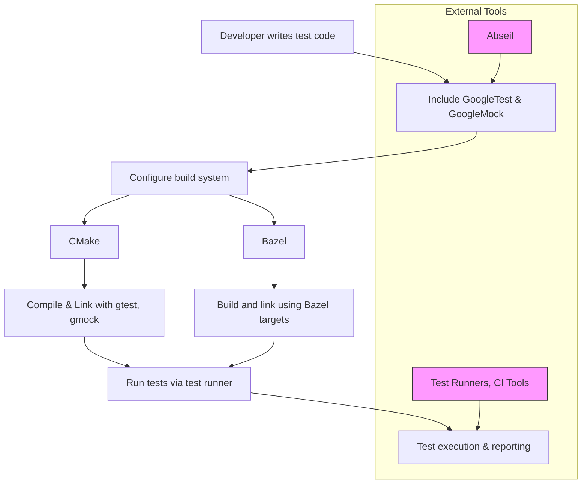

# Integration & Platform Support

## Seamless Integration with Build Systems

GoogleTest is designed for smooth integration with major build systems, empowering you to effortlessly incorporate robust testing into your development process.

### CMake Integration

- **Native Support**: GoogleTest provides well-maintained CMake scripts, allowing you to easily add GoogleTest and GoogleMock as dependencies.
- **Configurable Options**: Customize settings like shared/static library builds and test inclusion.
- **Sample Usage**:
  
```cmake
find_package(GTest REQUIRED)
include(GoogleTest)

target_link_libraries(your_test_target PRIVATE GTest::gtest GTest::gmock)
gtest_discover_tests(your_test_target)
```

### Bazel Integration

- **Official Rules**: GoogleTest and GoogleMock include Bazel build definitions for straightforward setup.
- **Test Automation**: Run tests with native Bazel test commands, including parallel execution.

```bazel
cc_test(
  name = "your_test",
  srcs = ["your_test.cc"],
  deps = ["@com_google_googletest//:gmock_main"],
)
```

## Supported Platforms and Compilers

GoogleTest supports a wide array of operating systems and compilers, making it versatile for both desktop and embedded environments.

- **Operating Systems**:
  - Linux
  - Windows (including Windows Mobile)
  - macOS and iOS
  - Embedded platforms (e.g., Arduino, ESP8266, ESP32)
- **Compiler Compatibility**:
  - GCC
  - Clang
  - MSVC
  - Other standard-compliant C++ compilers

Extensive conditional support ensures platform-specific features and compiler idiosyncrasies are appropriately handled.

## Collaboration with External Libraries and Tools

### Integration with Abseil

- GoogleTest optionally leverages Abseil for enhanced utilities such as:
  - Advanced container support
  - Flags and command-line parsing
  - Failure signal handling and stack tracing

This collaboration boosts reliability and debugging capabilities if Abseil is available.

### Open-Source Test Runners

GoogleTest integrates seamlessly with various test runners, supporting common workflows in open-source and enterprise environments:

- **Test event listeners** let you plug in custom reporting and IDE integration.
- **Output formats** include XML, JSON, and streaming support enabling CI/CD tools compatibility.

## Extensibility and Platform Compatibility

- **Custom Environments**: Easily define global setup/teardown logic for complex test scenarios.
- **Cross-compilation**: Support for cross-platform builds by abstracting platform details.
- **Mocking Architecture**: GoogleMock integrates tightly, providing powerful mock classes across all supported environments.

## Developer Experience Enhancements

- **Command Line Flags**: Fine-tune testing behavior (verbosity, filter patterns, retries) easily.
- **Integration Points**: Hooks to extend and customize test execution and reporting.
- **Thread Safety**: Supports multi-threaded test scenarios under controlled rules.

<AccordionGroup title="Common Troubleshooting and Tips">
<Accordion title="Building on Unsupported Platforms">
If you encounter build issues:
- Ensure your compiler is C++11 compliant or newer.
- Review platform-specific configuration flags.
- Consider consulting the community for patches or workarounds.
</Accordion>
<Accordion title="Extending with Custom Test Listeners">
Implement the `TestEventListener` interface to customize test reporting and integrate with IDEs or CI systems.
</Accordion>
<Accordion title="Integration Best Practices">
- Keep your test dependencies minimal.
- Use the provided CMake/Bazel targets to avoid manual configuration.
- Leverage GoogleMock for interaction testing to simplify dependencies in tests.
</Accordion>
</AccordionGroup>

---

For a practical overview of the complete system architecture featuring GoogleTest and GoogleMock together, see the [Architecture Overview (with Diagram)](/overview/architecture-and-concepts/system-architecture).

For understanding how to write effective tests that integrate with your build and test environment, explore the [Creating Your First Test Case](/guides/getting-started/create-first-test) and [Writing Effective Test Assertions](/guides/getting-started/writing-assertions).

To go deeper into mocking and advanced test patterns alongside build integration, see the [GoogleMock & Advanced Testing](/overview/features-at-a-glance/mocking-and-advanced-testing) page.

---

### Diagram: Simplified Integration Flow



---

## Next Steps

- Review the [Requirements and Supported Platforms](/getting-started/prerequisites-installation/requirements-supported-platforms) for detailed environment setup.
- Follow the [Installing with CMake](/getting-started/prerequisites-installation/installation-cmake) or [Installing with Bazel](/getting-started/prerequisites-installation/installation-bazel) guide for setup.
- Explore [Integration with Build Systems and External Tools](/concepts/extensibility-integration/integration-build-systems) for custom extension.

---

## Additional Resources

- [gMock for Dummies (User-Friendly Introduction)](https://google.github.io/googletest/gmock_for_dummies.html)
- [GoogleMock Cookbook (Advanced Mocking Recipes)](https://google.github.io/googletest/gmock_cook_book.html)
- [GoogleTest & GoogleMock GitHub Repository](https://github.com/google/googletest)

---

<Tip>
For successful integration, always keep your build tools and dependencies updated to the latest supported versions of GoogleTest and GoogleMock.
</Tip>

<Note>
Leverage the test event listener interface to tailor test output and integrate with IDEs or automated pipelines seamlessly.
</Note>

<Warning>
Avoid mocking classes you do not own unless necessary; instead, use adapters to simplify maintenance and minimize test breakages.
</Warning>
