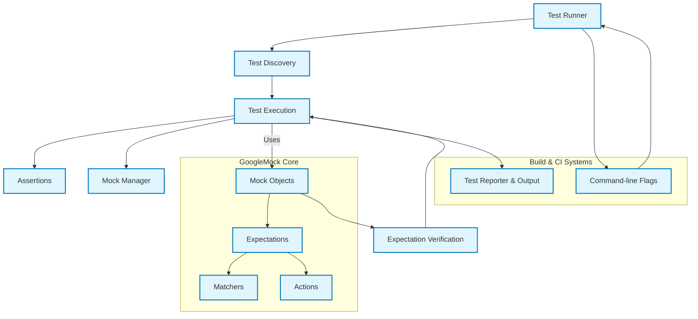
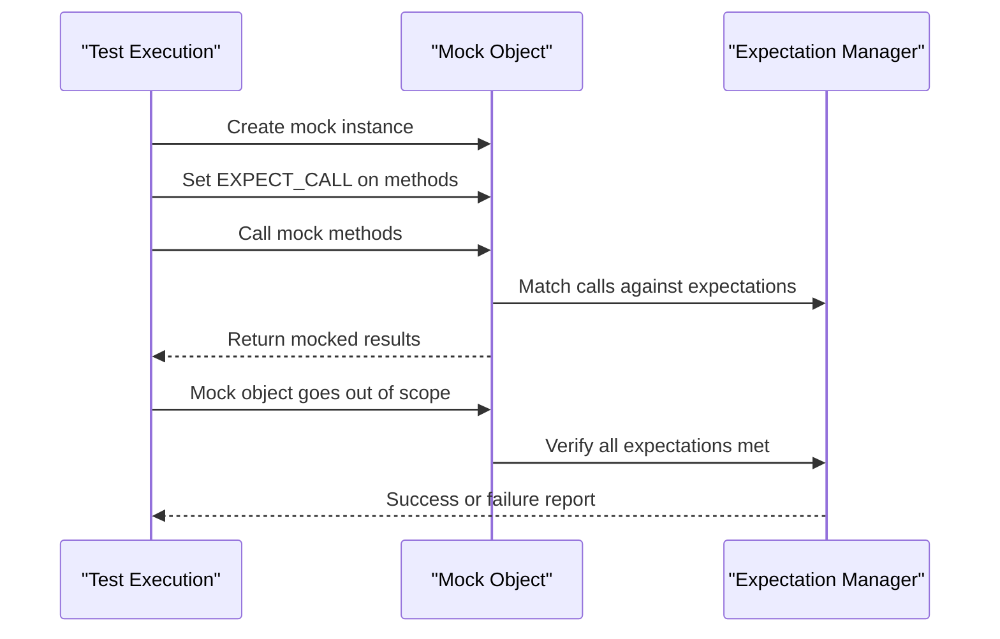

# How GoogleTest Works: System Architecture

## Understanding the Collaboration of Core Components

GoogleTest and GoogleMock work together seamlessly to provide a comprehensive testing solution for C++ projects. This page visualizes the architecture and interactions between the primary components responsible for test discovery, execution, assertion checks, mock management, and integration points.

Whether you're a test engineer trying to understand the flow of test execution or a developer troubleshooting test failures, this architectural overview will clarify how GoogleTest coordinates with GoogleMock to enable expressive and reliable tests.

---

## Primary Components and Their Roles

### Test Discovery

GoogleTest automatically discovers tests defined using its macros by scanning test suites and test cases registered during program initialization. This discovery layer orchestrates which tests will run and when.

### Test Execution

Test execution runs the discovered tests individually or as a group, managing setup and teardown phases, catching exceptions, and reporting outcomes. It drives assertion checks and triggers verification of mock expectations.

### Assertions and Reporting

Assertions validate conditions in tests. GoogleTest provides rich assertions that integrate tightly with the execution model, presenting clear results and failure diagnostics.

### Mock Objects and Expectations (GoogleMock)

GoogleMock extends GoogleTest by allowing the creation of mock classes to simulate and verify interactions with dependencies. Its core components include:

- Mock object creation and lifecycle management
- Setting and checking expectations
- Actions and matchers for controlling mock behaviors

GoogleMock integrates into the testing lifecycle to automatically verify expectations when mocks are destructed.

### Integration Layers

GoogleTest provides integration points to customize test runners, output formats, and flag parsing to adapt to varied build environments and continuous integration workflows.

---

## Visual Architecture Diagram

---

## How These Components Work Together: A User Flow

1. **Startup**: When you launch your test program, GoogleTest parses any test-related command-line flags to configure execution.
2. **Discovery Phase**: The Test Discovery module collects all test cases defined with `TEST()` or `TEST_F()` macros.
3. **Execution Phase**: Tests are executed one by one:
   - The expected setup and teardown methods run.
   - Assertions are checked to verify test conditions.
   - Mock objects monitor interactions and validate expectations.
4. **Verification Phase**: When mock objects go out of scope, GoogleMock verifies if all defined expectations have been met.
5. **Reporting Phase**: Results are compiled and sent to the reporter, formatted for console output or other report formats.
6. **Exit**: The test program exits, returning a status code indicating success or failure.

---

## Practical Example: Mock Verification Lifecycle

This scenario shows how a test exercise uses mocks and GoogleMock manages their lifecycle and verification without manual intervention.

---

## Tips for Using GoogleTest and GoogleMock Architecture Effectively

- **Set expectations before exercising mocks:** This ensures GoogleMock can verify interactions accurately and report errors immediately when they occur.
- **Use `ON_CALL` for default behaviors:** Differentiate between default mock behaviors and verifiable expectations.
- **Take advantage of verbose flags:** Run tests with `--gmock_verbose=info` to trace mock calls, helping diagnose why expectations aren't met.
- **Integrate with build systems:** Customize output using GoogleTest's flags and reporters to fit the CI/CD pipelines.

---

## Troubleshooting Common Architectural Issues

- Mock expectations not verified: Ensure mocks are destroyed (go out of scope) within the test scope.
- Unexpected calls warnings: Use `NiceMock<T>` to suppress or define catch-all expectations with `EXPECT_CALL(...).Times(AnyNumber())`.
- Test discovery issues: Verify test registration by proper macro usage and avoid `main()` overrides.

---

For detailed information about GoogleMock’s mocking specifics, visit our [Mocking Reference](../api-reference/core-mocking-api/mock-method-definition.md) and [gMock Cookbook](../docs/gmock_cook_book.md).

---

Last updated: main branch
