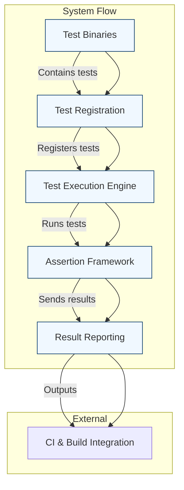

# System Architecture Overview

## Visualizing GoogleTest's Core System Components and Workflow

Welcome to the System Architecture Overview of GoogleTest, the robust C++ testing framework by Google. This page provides you with a clear visualization and explanation of the major system components and the data flow that powers GoogleTest. Understanding this architecture will help you grasp how test binaries register, execute, and report results, all within your build and test execution lifecycle.

---

## Why This Matters

When you're integrating GoogleTest into your development workflow, knowing how it fits into your build system and runtime environment empowers you to troubleshoot faster, optimize your test execution, and ultimately get more reliable feedback from your tests. This overview connects the dots between your code, test binaries, and the framework’s orchestration.

---

## Core Components of the GoogleTest System

At its essence, GoogleTest orchestrates the lifecycle of test binaries through several co-operating components. Here are the key parts:

- **Test Binaries**: Your compiled test executables, containing sets of test cases.

- **Test Registration**: Mechanisms by which tests register themselves with GoogleTest at startup.

- **Test Execution Engine**: The orchestrator that discovers registered tests and runs them in proper order.

- **Assertion Framework**: Executes conditions to validate test outcomes.

- **Result Reporting**: Collects and presents test outcomes to users or CI viewers.

- **Integration Interfaces**: How GoogleTest hooks into your build system and Continuous Integration pipelines.

*Diagram: High-Level Data and Control Flow in GoogleTest System Architecture*

---

## How Test Binaries Register and Execute Tests

1. **Test Registration:** When your test binary starts, it runs global constructors that register all test cases and test suites with GoogleTest’s internal registry.

2. **Test Execution:** Upon entry (`main()`), GoogleTest initializes the test environment, queries the registry for all tests, and executes them either sequentially or in parallel if configured.

3. **Assertion Management:** Each test case uses assertions to check correctness, which integrate tightly with GoogleTest’s failure handling mechanisms.

4. **Result Collection:** GoogleTest collects success, failure, and skip results efficiently.

5. **Reporting:** Results get reported both on the console and via XML/JSON outputs for CI systems.

---

## Leveraging GoogleTest in Your Build and Execution Pipeline

GoogleTest plays well with popular build systems (e.g., CMake, Bazel) and Continuous Integration tools:

- **Build Tools Integration:** Your build system compiles and links GoogleTest into test binaries.

- **Test Discovery:** GoogleTest automatically discovers all tests registered in the binary — no manual listing required.

- **Execution:** Tests run consistently across platforms.

- **Reporting:** Easily connect to your CI system’s test report parsing features.

<Info>
Ensure your test runner is configured to invoke the test binaries produced by your build system. GoogleTest’s automatic test registration guarantees an up-to-date test list every time you build.
</Info>

---

## Practical User Workflow

1. **Develop Tests:** Write tests that GoogleTest will discover automatically.
2. **Build Tests:** Compile your test source files into binaries linked with GoogleTest.
3. **Run Tests:** Execute test binaries; GoogleTest discovers and runs all registered tests.
4. **View Reports:** Use console output or CI-integrated reports to review test outcomes.
5. **Iterate:** Modify and expand test suites as your project grows.

---

## Tips and Best Practices

- **Order Matters:** Leverage the test registration order or explicitly control with sequences if you require specific execution orders.

- **Parallel Execution:** Explore parallel test execution in continuous integration for faster results.

- **Test Filtering:** Use GoogleTest’s powerful command-line flags to filter tests dynamically.

- **Custom Test Event Listeners:** Extend result reporting with your own listeners if default outputs do not suffice.

- **Careful Resource Management:** Remember that test registration happens before `main()`. Avoid side effects in global/static initialization when possible.

---

## Troubleshooting Common Issues

<Tip>
If some tests don’t appear to be running, check that test registration functions haven’t been omitted by the linker. Using the recommended build system options ensures proper linking.
</Tip>

<Warning>
Unexpected test execution order or missing tests usually trace back to test registration problems or build misconfiguration.
</Warning>

---

## Further Exploration

To deepen your understanding, explore these related topics freely accessible in the documentation:

- [What is GoogleTest?](/overview/introduction-and-value/product-overview)
- [Product Value and Use Cases](/overview/introduction-and-value/value-and-use-cases)
- [Supported Platforms & Integrations](/overview/introduction-and-value/supported-platforms-integrations)

These sections connect architecture concepts with practical usage and integration guidance.

---

Explore hands-on guides on writing your first test, configuring environments, and integrating GoogleTest flows under the [Getting Started tab](../getting-started), or dive into [Core Testing APIs](../api-reference/core-apis/assertions).

---

For a detailed technical view of test registration and execution internals, consult the source code with this link:

<Source url="https://github.com/google/googletest" branch="main" paths={[{"path": "googlemock/src/gmock-spec-builders.cc"}]} />

---

By mastering the system architecture, you'll position yourself to extract maximum value from GoogleTest throughout your software development lifecycle, turning tests into reliable safeguards and rapid feedback mechanisms.

---

*End of System Architecture Overview.*