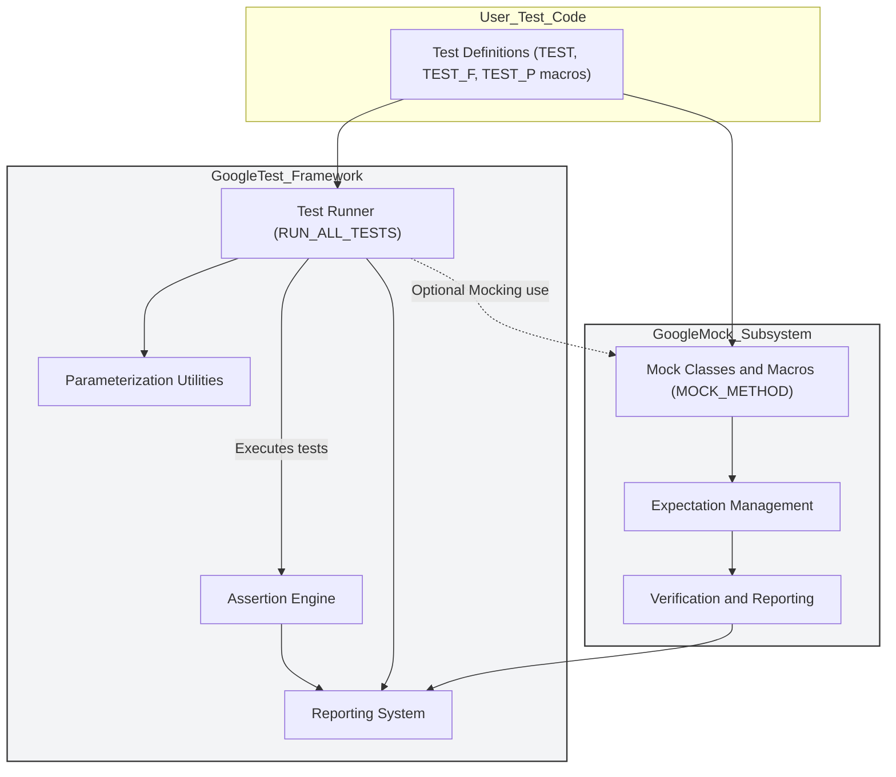

# System Architecture Overview

Welcome to the System Architecture Overview for GoogleTest, the foundation of a powerful, portable, and extensible C++ testing and mocking framework. This page offers a visual and descriptive guide to GoogleTest’s internal architecture — illuminating how its essential components collaborate to deliver efficient, expressive, and reliable testing experiences.

---

## Understanding GoogleTest’s Architecture

At its core, GoogleTest is designed for simplicity and extensibility, enabling users to define, run, and analyze C++ tests with confidence. This overview walks you through the key building blocks: the **Test Runner**, the **Assertion Engine**, **Parameterization Utilities**, and the integrated **GoogleMock** subsystem.

### Why This Matters to You

Whether you’re a developer implementing tests or a team lead integrating testing into your build pipeline, grasping GoogleTest’s structure helps you:

- Understand the flow from writing your test cases to receiving results.
- Leverage parameterized tests fluently for broader coverage.
- Effectively incorporate mocks to simulate complex behaviors.
- Diagnose issues by seeing how components interact beneath the surface.

## Visualizing the Architecture

This diagram captures the relationship between the core GoogleTest framework and the GoogleMock subsystem:

- **User Test Code** is where you write your tests — using the TEST suite macros and optionally mock classes.
- **Test Runner** orchestrates the execution, manages lifecycle including test fixtures and parameter sets.
- **Assertion Engine** evaluates expectations and assertions inside the test cases.
- **Parameterization Utilities** manage parameterized tests to run tests over different input sets.
- **Reporting System** consolidates test outcomes and failure details.
- **GoogleMock Subsystem** integrates seamlessly when mocking is needed, managing mock objects, setting expectations, verifying calls, and reporting errors.

---

## Main Flows Explained

### 1. Test Definition

You start by defining tests with macros such as `TEST()`, `TEST_F()`, and `TEST_P()`. These macros register your tests inside GoogleTest's internal registry.

### 2. Test Execution

Invoking `RUN_ALL_TESTS()` triggers the **Test Runner** to:

- Discover all registered tests.
- Initialize test fixtures by calling `SetUp()`.
- Execute each test, delegating assertion checks to the **Assertion Engine**.
- Handle parameterized tests by iterating over parameter sets.

### 3. Assertion Processing

The Assertion Engine evaluates conditions inside the tests via `EXPECT_*` and `ASSERT_*` macros, distinguishing fatal and non-fatal failures. It collects detailed failure diagnostics, allowing multiple issues to be reported in a single run.

### 4. Reporting Results

After each test, the **Reporting System** summarizes pass/fail status and detailed error messages, enabling easy debugging and test status tracking.

### 5. Optional Mocking Integration

If mocks are used:

- The GoogleMock subsystem activates to create and manage mock objects.
- `EXPECT_CALL()` macros specify mock method expectations.
- Calls to mock methods are tracked and verified.
- Failures on unmet expectations surface as test failures during reporting.

---

## Practical Insights

### Real-World Example: Using the Architecture

Imagine building a complex module that interacts with external services. You write unit tests focusing on your module's logic:

- Tests are grouped logically with fixtures (`TEST_F`), sharing state initialization.
- Parameterized tests (`TEST_P`) help check behavior across multiple input variations.
- Mock objects replace external dependencies, asserting correct interaction sequences using GoogleMock.

Thanks to the cohesive architecture, your test suite runs efficiently, isolates failures clearly, and verifies both state and interaction behaviors.

### Tips for Mastering This Page

- **Focus first on the test flow**: Understand how GoogleTest discovers and executes tests.
- **Gradually explore mocks** when you need to simulate dependencies or enforce interaction constraints.
- **Refer to the diagrams** while writing tests to visualize how your test code connects to the framework.

### Common Pitfalls

- Expecting your test definitions to execute before registering - all tests are registered at compile/link time.
- Misunderstanding parameterized tests flow - the system generates multiple test instances for each parameter set.
- Forgetting to initialize mocks or wrongly ordering expectations and usage.

---

## Next Steps

To build on this conceptual foundation, explore these related documents:

- [What is GoogleTest?](/overview/product-intro-and-value/what-is-googletest)
- [Why Use GoogleTest?](/overview/product-intro-and-value/value-proposition)
- [gMock for Dummies](https://google.github.io/googletest/gmock_for_dummies.html) for an introduction to mocking

Click through the navigation tree under “Architecture & Core Concepts” for deeper dives into core testing concepts, mock object models, and test fixture lifecycles.

---

<Note>
GoogleTest’s architecture ensures that the complexity of running tests, managing fixtures and mocks, and reporting is seamless and user-friendly — freeing you to focus on writing effective, maintainable tests.
</Note>
