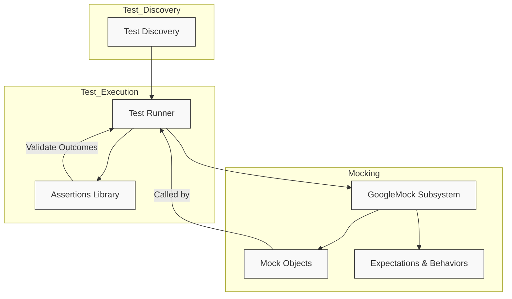

# System Architecture

GoogleTest is a powerful C++ testing framework designed with modularity and scalability at its core. The System Architecture page offers an insightful view into how GoogleTest integrates several distinct components—including xUnit-style test runners, test discovery mechanisms, assertion libraries, and the GoogleMock subsystem—to provide a seamless unit testing and mocking experience. This page empowers users to visualize the structure and interaction of these elements, helping them understand GoogleTest’s design principles and how it supports maintainable, scalable tests.

---

## Overview of GoogleTest’s Modular Architecture

At its heart, GoogleTest embraces a modular architecture that separates concerns into specialized components. This design ensures flexibility, extensibility, and clarity for developers writing and running tests. Key components include:

- **xUnit-style Test Runners**: Facilitate identification and execution of test cases following a widely adopted unit testing pattern, ensuring familiarity and ease of use.
- **Test Discovery**: Automatically detects and organizes test units within the codebase, minimizing manual setup and reducing errors.
- **Assertion Libraries**: Provide a rich and expressive set of mechanisms for verifying expected outcomes within tests.
- **GoogleMock Subsystem**: Integrates mock object creation and management based on xUnit principles, enabling interaction-based testing.

Understanding these modules and their interplay lays the foundation for creating robust and maintainable tests.

---

## How the Components Interact

### 1. Test Discovery & Execution Flow

GoogleTest automatically discovers all tests registered via its macros and organizes them into a test suite.

- The **Test Runner** orchestrates running these discovered tests, manages setup and teardown, and reports outcomes.
- Test discovery is seamless, allowing users to add tests without additional configuration.

### 2. Assertion Handling

Within each test, **assertions** verify that the code behaves as expected. If an assertion fails, GoogleTest records the failure and provides detailed diagnostics to aid debugging.

### 3. Mocking with GoogleMock

Integrated tightly, the **GoogleMock** subsystem offers mock objects that mimic interfaces of real objects. This allows users to:

- Specify expectations on mock methods (e.g., which methods should be called, with what arguments, and how often).
- Define mock behaviors, including return values and side effects.
- Verify interactions accurately, ensuring the unit under test behaves correctly with dependencies.

This approach shifts testing from state-based verification to interaction-based, increasing test precision and expressiveness.

---

## Visual Architecture Diagram

This simplified flowchart represents the key architectural elements and how they communicate to support test automation via GoogleTest and GoogleMock.

---

## Practical User Scenarios Enabled by the Architecture

- **Seamless Test Development**: Automatically discovered and executed tests reduce setup time.
- **High-Fidelity Interaction Verification**: GoogleMock enables precise control of dependencies with expectations on calls and return behaviors, leading to robust tests.
- **Maintainable Test Suites**: Modular components let users customize or extend testing without breaking existing tests.

---

## Tips for Navigating This Architecture

- When writing tests, focus on defining clear test cases with well-scoped assertions.
- Leverage GoogleMock for any external dependencies or collaborators by defining mock classes with clear expectations.
- Explore the `EXPECT_CALL` and `ON_CALL` macros to set precise behavior for mocks.
- Use sequences and ordering features in GoogleMock to impose strict interaction order as needed.

---

## Common Pitfalls to Avoid

- Mixing test logic and mocking logic in the same place can cause confusion; keep them organized.
- Overly strict expectations on mocks might cause brittle tests; use flexibility and partial matchers when appropriate.
- Forgetting to set expectations before exercising the code results in undefined mock behavior.

---

## Next Steps

To advance your understanding and application of GoogleTest’s modular architecture:

- Dive into the **Feature Highlights** page to see how components enable specific capabilities.
- Review the **Mocking Reference** and **gMock Cookbook** for mastery over mock behaviors and expectations.
- Consult the **Getting Started Guides** for step-by-step workflows combining these components effectively.

---

For detailed code examples and internals of GoogleMock's mocking capabilities, refer to the `gmock-spec-builders_test.cc` test file which rigorously tests GoogleMock’s specification builder syntax, mock method behaviors, expectation sequences, and complex interaction scenarios.

---

### Additional Resources

- [GoogleMock for Dummies](https://google.github.io/googletest/gmock_for_dummies.html)
- [gMock Cookbook](https://google.github.io/googletest/gmock_cook_book.html)
- [Mocking Reference](https://google.github.io/googletest/reference/mocking.html)
- [GoogleTest Product Introduction](/overview/introduction-and-value/product-introduction)

<Source url="https://github.com/google/googletest" branch="main" paths={[{"path": "googlemock/test/gmock-spec-builders_test.cc", "range": "1-586"}]} />
