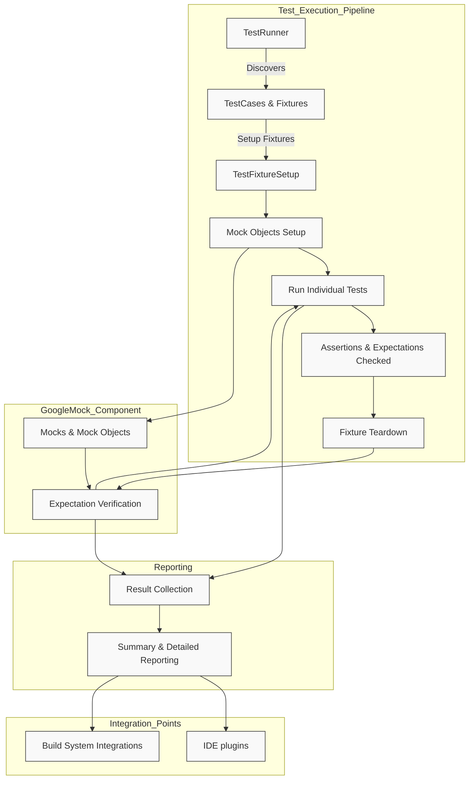

# Architecture Overview (with Diagram)

## Understand How GoogleTest and GoogleMock Work Together

This page guides you through the high-level flow of how GoogleTest and GoogleMock operate inside your C++ build system—from discovering and running tests, to managing mocks, executing assertions, and reporting results. To make the overview concrete, a detailed Mermaid diagram illustrates the key components and their relationships within the framework.

Whether you are new or experienced with GoogleTest and GoogleMock, this architectural perspective helps you grasp the testing lifecycle and how these tools seamlessly integrate, empowering you to write effective, maintainable tests.

---

## Why This Matters to You

As a developer, understanding the architecture behind your testing tools clarifies how to write and organize tests effectively, troubleshoot issues, and leverage advanced features responsibly. This knowledge helps you maximize GoogleTest and GoogleMock’s capabilities to automate reliable tests, speed up development, and maintain code quality.

This page focuses specifically on the interactions and flow within the combined GoogleTest and GoogleMock ecosystem—not the individual API details or installation guides—which are covered elsewhere.


## High-Level Overview of Components

At its core, the GoogleTest/GoogleMock architecture involves several distinct parts collaborating to deliver comprehensive test execution and validation:

- **Test Runner:** The executable that discovers tests inside your compiled code, orchestrates their execution, and handles reporting.

- **Test Cases and Fixtures:** Organized groups of tests that encapsulate setup, execution context, and teardown logic.

- **Mocks and Mock Objects:** Test doubles created using GoogleMock to simulate dependencies, with customizable expectations and behaviors.

- **Assertions:** Statements within tests that verify conditions and produce detailed feedback on failures.

- **Integration Points:** Hooks and mechanisms to build and run tests under different platforms, build systems, and IDEs.


## The Testing Flow: From Discovery to Reporting

1. **Test Discovery:**
   The test runner inspects the linked binaries for registered test cases and test suites, including those defined with mock objects.

2. **Test Setup:**
   For each test, fixture setup routines prepare the test environment.

3. **Mock Setup:**
   Mock objects are instantiated and configured with default behaviors (`ON_CALL`) and expectations (`EXPECT_CALL`).

4. **Test Execution:**
   Tests run, exercising production and mock code paths. Each mock interaction is checked against expectations.

5. **Assertions Evaluation:**
   Any `EXPECT_` or `ASSERT_` statements validate conditions, logging pass/fail details.

6. **Test Teardown:**
   TearDown methods clean up resources. Mocks automatically verify expectations have been met.

7. **Result Reporting:**
   Summaries of passed, failed, and skipped tests are output in human-readable and machine-consumable formats.


## Visual Architecture Diagram




## Detailed Descriptions of Components

### Test Runner

The test runner is the central orchestrator. During test execution, it automatically discovers all test cases compiled into the program by scanning registration macros internally generated when you define tests. It sequentially or selectively runs tests, manages their lifecycle, and aggregates results.

**What You Should Know:**
- You don’t need to explicitly register tests yourself.
- The runner supports filtering tests by name or other criteria.
- It manages platform-specific integration, including multi-threading considerations.


### Test Cases and Fixtures

Tests are grouped into suites called test cases. Fixtures provide structured setup and teardown scaffolding common to tests sharing context.

**Key Points:**
- Fixtures enable shared resource management.
- Each test runs isolated to prevent state leakage.
- Test lifecycle hooks like `SetUp()` and `TearDown()` control preparation and cleanup.


### GoogleMock and Mock Objects

Mocks simulate interfaces or classes to isolate the system under test from external dependencies.

**Core ideas:**
- Mock classes are generated using `MOCK_METHOD` macros to define mocked functions.
- Expectations (`EXPECT_CALL`) specify which methods are expected to be called, number of calls, order, and arguments.
- Behavior can be customized via default (`ON_CALL`) and explicit actions (`WillOnce`, `WillRepeatedly`).
- Mock verification automatically runs at the end of a test to ensure expectations were met.


### Assertions and Expectations

Assertions are the fundamental building blocks for validating expected outcomes.

- GoogleTest provides rich assertion types such as `EXPECT_EQ`, `ASSERT_TRUE`, `EXPECT_THROW`, etc.
- GoogleMock uses expectations to verify mock method calls.

Failures provide detailed diagnostics, including argument mismatches and call count violations, aiding rapid debugging.


### Integration Points

GoogleTest and GoogleMock can be integrated with a variety of build systems (CMake, Bazel), IDEs, and Continuous Integration systems. The architecture is designed for seamless integration without manual intervention.


## Practical Example: A Typical User Test Flow

```cpp
#include <gtest/gtest.h>
#include <gmock/gmock.h>

using ::testing::Return;
using ::testing::AtLeast;

class FooInterface {
 public:
  virtual ~FooInterface() {}
  virtual int GetValue() = 0;
};

class MockFoo : public FooInterface {
 public:
  MOCK_METHOD(int, GetValue, (), (override));
};

TEST(FooTest, ReturnsMockedValue) {
  MockFoo mock_foo;
  ON_CALL(mock_foo, GetValue()).WillByDefault(Return(42));
  EXPECT_CALL(mock_foo, GetValue()).Times(AtLeast(1));

  int val = mock_foo.GetValue();
  EXPECT_EQ(val, 42);
}
```

Steps involved correspond to the architecture:
- The test runner runs `FooTest.ReturnsMockedValue`.
- The fixture sets up the mock.
- The `ON_CALL` and `EXPECT_CALL` configure behavior and expectations.
- The mock method is invoked and returns `42`.
- Assertions check the returned value.
- Upon test completion, GoogleMock verifies that `GetValue()` was called at least once.


## Troubleshooting Common Issues

<AccordionGroup title="Common Pitfalls and Troubleshooting">
<Accordion title="Test Discovery Fails">
Check that tests are compiled and linked correctly with GoogleTest and GoogleMock libraries. Ensure that test macros are correctly used and that your build system is invoking the test runner executable.
</Accordion>
<Accordion title="Mock Expectations Not Met">
Review the order and number of `EXPECT_CALL` statements. Remember that expectations should be set before calls. Use `RetiresOnSaturation()` if expecting repeated calls. Use verbose mode (`--gmock_verbose=info`) to trace calls.
</Accordion>
<Accordion title="Mock Method Signature Mismatch">
Verify `MOCK_METHOD` declarations match the base class virtual method signatures exactly, including `const`, `noexcept`, and calling conventions.
</Accordion>
<Accordion title="Uninteresting Mock Calls Warning">
Use `NiceMock<T>` to suppress warnings about method calls with no expectations. To ensure enforcement, use `StrictMock<T>`.
</Accordion>
</AccordionGroup>


## Tips for Success

- **Set expectations before code execution:** Failure to do so results in undefined behavior.
- **Use fixtures to manage setup/teardown:** This guarantees test isolation.
- **Prefer `NiceMock` for general usage:** Avoids noisy logs when not testing mock interactions.
- **Group related expectations into sequences:** Use `InSequence` to enforce call order when necessary.
- **Run tests with `--gmock_verbose=info` for deep debugging:** This outputs the matching of calls to expectations.


## Next Steps

Explore more detailed guides and references:

- [Core Test Declarations & Test Cases](/api-reference/core-apis/test-declarations)
- [GoogleMock & Advanced Testing](/overview/features-at-a-glance/mocking-and-advanced-testing)
- [Writing and Running Your First Test](/getting-started/first-test-configuration/writing-first-test)

You can also dive deeper into the component-level architecture [here](/overview/architecture-and-concepts/core-terminology) or examine integration points for your build system.


---

## Summary

This page presents a high-level flow and architecture of how GoogleTest and GoogleMock combine to run C++ tests efficiently. From test discovery, fixture setup, mock configuration, test execution to final reporting, the architecture orchestrates components to provide robust, predictable, and scalable testing. The included diagram illustrates essential components and their relationships, providing a clear mental model to guide users in writing, debugging, and maintaining tests.

---

## References

- [Mocking Reference](../reference/mocking.md)
- [gMock Cookbook](../gmock_cook_book.md)
- [GoogleTest Primer](../primer.md)
- [Core Test Declarations & Test Cases](../api-reference/core-apis/test-declarations)
- [Writing Your First Test](../getting-started/first-test-configuration/writing-first-test)

---