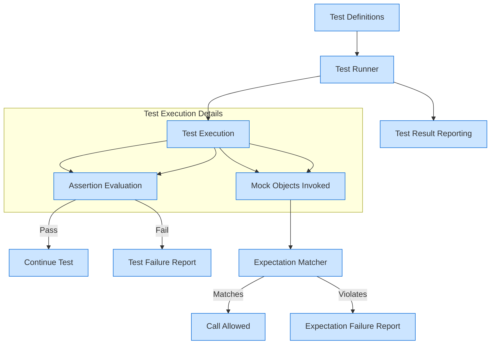

# Architecture and Data Flow

## High-Level Architectural Overview

Understanding the architecture and data flow of GoogleTest, particularly its mocking extension GoogleMock (gMock), is key to effectively leveraging its powerful testing capabilities. This page offers a concise yet comprehensive visualization of how Google's C++ testing framework orchestrates test execution, assertion evaluation, and mock interactions.

Visualized through a detailed Mermaid.js flowchart, the diagram uncovers the dynamic collaboration between core modules such as the test runner, assertion system, and the mocking framework. It traces the journey from user-defined test cases through the inner workings of the test runner, continuing into expectation management and culminating in test result reporting.

---

## Understanding the Components

**Test Definitions:** You start by defining your test cases using GoogleTest's macros. These test cases encapsulate the behavior you want to verify.

**Test Runner:** When you run tests, the test runner orchestrates test execution. It discovers your tests, manages the lifecycle, and schedules their execution.

**Assertion System:** Inside each test, assertions verify expected conditions. Failed assertions halt the current test and report detailed diagnostics.

**Mocking Framework (gMock):** For tests involving dependencies, gMock lets you create mock objects with defined expectations and behaviors. These mocks intercept calls, check parameters, and simulate return values.

**Expectation Matching & Verification:** As your test code invokes mock methods, gMock checks if the calls match your expectations, if they occur in the right order, and the right number of times. Mismatches lead to immediate test failures.

**Test Result Reporting:** After all tests complete, GoogleTest summarizes the outcome, highlighting passed tests, failed assertions, and unmet expectations.

---

## Data Flow in Action

The following Mermaid diagram illustrates the data flow starting from test definition through execution and verification steps.

This flowchart clarifies how test cases transition through execution stages, how assertions and mocks interplay during test runs, and how success or failure information is channeled back to reporting.

---

## Why This Matters to You

By understanding this architecture and data flow, you can:

- **Better design your tests**, knowing how your test definitions interact with run-time components.
- **Efficiently leverage mocking capabilities** to audit complex code interactions.
- **Diagnose test failures swiftly**, tracing if issues stem from assertion failures or mock expectation mismatches.
- **Optimize test structure and flow**, using features like sequences and cardinalities with clear expectations of how they impact the running test.

---

## Practical Tips

- Start by focusing on writing clean test definitions; the runner and assertion system handle execution orchestration.
- Use gMock for dependencies where you need controlled and verifiable interactions.
- Use sequences or ordering constraints in gMock to specify expected call order clearly.
- If tests fail, consult the call flow and verify if mock calls meet your expectations as per the diagram.

---

## Getting Started Preview

To dive into implementation:

- Check out [gMock Cheat Sheet](/docs/gmock_cheat_sheet.md) for quick mocking syntax.
- Refer to [gMock Cookbook](/docs/gmock_cook_book.md) for common testing patterns.
- Explore [Mocking Reference](/docs/reference/mocking.md) for macro and class details.

Start by defining simple tests and gradually add mocks and expectations as your needs grow.

---

## Additional Resources

- [What is GoogleTest?](https://google.github.io/googletest/overview/product-intro-core-value/what-is-googletest)
- [Who Should Use GoogleTest?](https://google.github.io/googletest/overview/product-intro-core-value/target-audience-and-use-cases)
- [gMock for Dummies](https://google.github.io/googletest/gmock_for_dummies.html)

---

By mastering the architectural flow outlined above, you will be better equipped to harness the full power of GoogleTest's testing and mocking infrastructure.

---

*This document corresponds to [the GoogleTest repository](https://github.com/google/googletest) on the `main` branch.*
