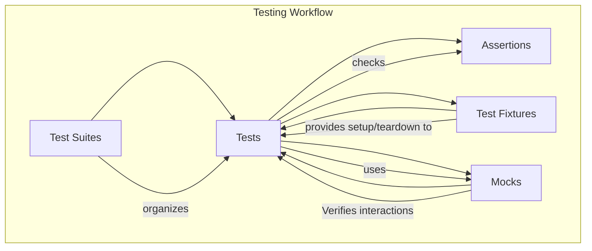

# GoogleTest Core Concepts

Understanding the foundational elements of GoogleTest is critical for writing robust and maintainable C++ tests. This section defines key terminology such as tests, test suites, assertions, fixtures, and mock objects, explaining their roles and relationships within the GoogleTest ecosystem. By grasping these core concepts, users can navigate the testing workflow with confidence, ensuring clarity and correctness from test creation to execution and verification.

## Tests and Test Suites

- **Test:** The smallest unit of testing, a *test* consists of a function that exercises specific code and verifies its behavior using assertions.

- **Test Suite:** Groups related tests for organization and collective execution.

Together, tests and test suites form the structure of your automated testing strategy, offering a hierarchical and logical grouping that simplifies management and reporting.

## Assertions

Assertions are the core means for verifying conditions within tests. They check whether specific conditions hold true and report failures if not. GoogleTest offers rich, expressive assertion macros to check values, exceptions, and predicates.

### Key Points about Assertions:
- Assertions are used within test functions to validate the outcomes of operations.
- They provide immediate feedback on test failure points.
- GoogleTest supports both fatal and non-fatal assertions, controlling test flow after a failure.

Example:
```cpp
TEST(MyTestSuite, CanAddNumbers) {
  int result = Add(2, 3);
  EXPECT_EQ(result, 5);  // Verifies that Add works as expected
}
```

## Test Fixtures

Fixtures provide a way to share common setup and teardown code among multiple related tests. A test fixture:
- Defines a class derived from `testing::Test`.
- Implements `SetUp()` and `TearDown()` methods.
- Contains test data and helper methods.

Using fixtures promotes DRY (Don't Repeat Yourself) principles and helps maintain test code. Here's an example:

```cpp
class DatabaseTest : public testing::Test {
 protected:
  void SetUp() override {
    db.Connect();
    db.InitializeSchema();
  }
  void TearDown() override {
    db.Disconnect();
  }

  Database db;
};

TEST_F(DatabaseTest, CanInsertRecord) {
  EXPECT_TRUE(db.InsertRecord({"name", "test"}));
}
```

`TEST_F` allows tests to access the fixture's members and setup.

## Mock Objects

Mocks simulate real objects’ behavior in controlled ways, enabling interaction-based tests. GoogleMock, integrated with GoogleTest, offers robust facilities for:

- Creating mock classes.
- Setting expectations on methods.
- Validating interactions (calls, arguments, call order).

Mocks help isolate the code under test, removing dependencies on slow, unreliable, or unavailable components.

### Key Concepts:
- Mocks implement interfaces or classes and allow expectation specifications.
- Expectations describe how mocks should behave and what calls they should receive.
- GoogleMock automatically verifies that the code under test interacts with mocks correctly.

Example using a mock turtle drawing object:

```cpp
using ::testing::AtLeast;

TEST(PainterTest, CallsPenDown) {
  MockTurtle turtle;
  EXPECT_CALL(turtle, PenDown()).Times(AtLeast(1));

  Painter painter(&turtle);
  painter.DrawCircle(0, 0, 10);
}
```

## Relationships Between Concepts



## Practical Testing Workflow

1. **Organize tests into test suites** for logical grouping.
2. **Write individual tests** focusing on specific behavior.
3. **Use assertions** to validate expected outcomes.
4. **Apply fixtures** when tests share setup/cleanup requirements.
5. **Incorporate mocks** to isolate dependencies and verify interactions.
6. **Run tests** and analyze results.
7. **Refine tests** based on outcomes and coverage needs.

## Tips and Best Practices

- **Keep tests independent:** Ensure tests do not depend on each other’s order or state.
- **Use test fixtures wisely:** Avoid excessive shared state to prevent brittle tests.
- **Write clear assertions:** Be explicit and focus each test on one behavior.
- **Mock thoughtfully:** Use mocks for interaction verification or to isolate slow/external dependencies.
- **Leverage GoogleTest’s rich assertions:** Use provided macros for clear and expressive checks.

## Troubleshooting Common Issues

- **Tests fail unexpectedly:** Check if the actual vs expected values in assertions differ.
- **Tests cause leaks or crashes:** Confirm proper use of fixtures and whether mock objects have virtual destructors.
- **Mocks behave unexpectedly:** Ensure expectations are set prior to code exercising the mocks.
- **Order dependencies:** Use sequences or ordered expectations when call order matters.

## Next Steps

After mastering these core concepts, explore the following to deepen your testing expertise:

- [Mocking Workflow with GoogleMock](https://your-docs/guides/mocking-best-practices/mocking-workflow)
- [Best Practices and Patterns for Mocking](https://your-docs/guides/mocking-best-practices/mocking-patterns)
- [Understanding Matchers and Actions](https://your-docs/api-reference/mocking-apis/mock-methods)
- [GoogleTest Assertions Reference](https://your-docs/api-reference/core-apis/test-assertions)

This structured foundation ensures you harness the full power of GoogleTest and GoogleMock for your C++ testing needs.
