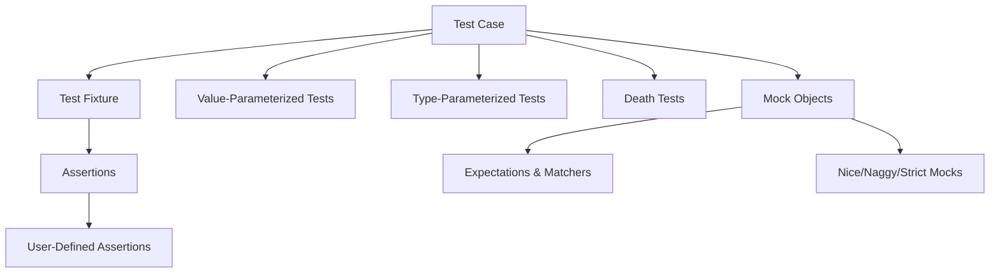

# Core Concepts & Terminology

Master the fundamental ideas that power GoogleTest. This guide covers the core elements such as test cases, fixtures, assertions (including custom ones), value- and type-parameterized tests, death tests, and mock objects. Understanding these terms is essential to effectively navigate and maximize your use of GoogleTest.

---

## Test Cases

At the heart of GoogleTest is the concept of a *test case* (also known as a *test* or *test function*). A test case is a single function that verifies some intent or correctness criterion of your code under test.

- Each test case is declared using the `TEST` macro as:

  ```cpp
  TEST(TestSuiteName, TestName) {
    // Test code here
    EXPECT_EQ(foo(), 42);
  }
  ```

- `TestSuiteName` and `TestName` uniquely identify the test.
- Tests should be **independent** from each other.

**Example:**

```cpp
TEST(MathTest, Addition) {
  EXPECT_EQ(Add(2, 3), 5);
}

TEST(MathTest, Subtraction) {
  EXPECT_EQ(Subtract(2, 3), -1);
}
```


## Test Fixtures

When you have a group of tests that share common setup or cleanup code, GoogleTest lets you define a *test fixture*.

- A test fixture is a C++ class derived from `testing::Test`.
- Contains common members and `SetUp()`/`TearDown()` methods.
- Use the `TEST_F` macro to write tests that use the fixture.

**Example:**

```cpp
class StackTest : public testing::Test {
 protected:
  void SetUp() override {
    stack_.Push(1);
  }
  Stack<int> stack_;
};

TEST_F(StackTest, InitiallyHasOneElement) {
  EXPECT_EQ(stack_.Size(), 1);
}

TEST_F(StackTest, PopRemovesElement) {
  stack_.Pop();
  EXPECT_TRUE(stack_.IsEmpty());
}
```

The fixture creates an environment common to all tests in the suite.


## Assertions

Assertions are the core building blocks for verifying test expectations.

- GoogleTest provides a rich set of **assertions** such as `EXPECT_EQ`, `ASSERT_TRUE`, and many more.
- They come in two flavors:
  - **Non-fatal assertions (`EXPECT_*`)**: test continues even if assertion fails.
  - **Fatal assertions (`ASSERT_*`)**: aborts the current test if failed.

**Basic Assertion Example:**

```cpp
EXPECT_EQ(x, 5);  // Verifies that x is equal to 5 and continues on failure.
ASSERT_TRUE(ptr != nullptr);  // Aborts test if ptr is null.
```


## User-Defined Assertions

For complex checks, users may define custom assertions to produce more informative failure messages.

A typical pattern involves returning a `::testing::AssertionResult` from a function:

```cpp
::testing::AssertionResult IsEven(int n) {
  if (n % 2 == 0)
    return ::testing::AssertionSuccess();
  else
    return ::testing::AssertionFailure() << n << " is odd";
}

TEST(NumberTest, CheckEven) {
  EXPECT_TRUE(IsEven(value));
}
```

This results in detailed outputs on failure, showing why the test failed.


## Value-Parameterized Tests

These allow a single test logic to be run over multiple sets of input values.

- Use `testing::TestWithParam<T>` as a base fixture where `T` is the parameter type.
- Write the test using the `TEST_P` macro.
- Instantiate the parameter sets using `INSTANTIATE_TEST_SUITE_P`.

**Example:**

```cpp
class PrimeTest : public testing::TestWithParam<int> {};

TEST_P(PrimeTest, IsPrime) {
  int n = GetParam();
  EXPECT_TRUE(IsPrime(n));
}

INSTANTIATE_TEST_SUITE_P(PrimeTests, PrimeTest,
                         testing::Values(2, 3, 5, 7, 11));
```

This runs the same test for each value 2, 3, 5, 7, and 11.


## Type-Parameterized Tests

Used when you want to run the same test logic with different **types** instead of values.

- The fixture class is templated by the type to test.
- Define test cases with `TYPED_TEST` macros.
- Specify types using `TYPED_TEST_SUITE`.

**Example:**

```cpp
template <typename T>
class MyContainerTest : public testing::Test {
 public:
  T container_;
};

using MyTypes = testing::Types<std::vector<int>, std::list<int>>;
TYPED_TEST_SUITE(MyContainerTest, MyTypes);

TYPED_TEST(MyContainerTest, CanAddElements) {
  this->container_.push_back(1);
  EXPECT_FALSE(this->container_.empty());
}
```


## Death Tests

GoogleTest supports *death tests* to verify that your program fails (crashes or exits) as expected in error scenarios.

- Use assertion macros like `ASSERT_DEATH` and `EXPECT_DEATH`.
- These macros run the code in a sub-process and check for exit or crash conditions.

**Example:**

```cpp
TEST(MyDeathTest, DiesOnNullPointer) {
  ASSERT_DEATH(FunctionUnderTest(nullptr), "null pointer");
}
```


## Mock Objects (GoogleMock)

GoogleMock extends GoogleTest by enabling mock objects:

- Mock objects simulate interfaces and verify interactions with SUT (System Under Test).
- Expectations define what calls are expected and how mocks respond.
- Provide features like:
  - Matching arguments using rich matchers
  - Controlling call order, cardinalities, and actions
  - Nice/Naggy/Strict mock behaviors

**Basic Mock Class Example:**

```cpp
class Foo {
 public:
  virtual ~Foo() {}
  virtual int Bar(int n) = 0;
};

class MockFoo : public Foo {
 public:
  MOCK_METHOD(int, Bar, (int n), (override));
};

TEST(MyTest, UseMock) {
  MockFoo mock;
  EXPECT_CALL(mock, Bar(testing::_))
      .WillOnce(testing::Return(42));
  EXPECT_EQ(mock.Bar(5), 42);
}
```

**Using NiceMock, NaggyMock, and StrictMock:**

These modify how mocks treat calls with no explicit expectations:

- `NiceMock` suppresses warnings (default behavior will just silently accept calls).
- `NaggyMock` warns on unexpected calls (default mock behavior).
- `StrictMock` treats unexpected calls as failures.


## Summary Diagram of Concepts




## Practical Tips

- Write independent, atomic test cases.
- Use fixtures to reduce duplication and share setup.
- Write assertions that give clear and informative failure messages.
- Favor `EXPECT_*` to let tests continue and find multiple issues, `ASSERT_*` when failure should abort the test early.
- Use parameterized tests to reduce repetition.
- Employ death tests to verify failure modes safely.
- Use GoogleMock mocks to test interactions effectively, but avoid overusing expectations that over-constrain tests.


## Troubleshooting Common Pitfalls

- **Tests not running:** Check test discovery macros and registration.
- **Too many warnings from mocks:** Use `NiceMock` or add catch-all expectations for uninteresting calls.
- **Unexpected mock call failures:** Verify correct matcher usage and call order.
- **Overly brittle parameterized tests:** Limit value permutations to meaningful cases.


## Where to Go Next

- See [Using Assertions and Matchers Effectively](../guides/advanced-testing-and-best-practices/assertions-matchers.md) for deep dive into assertions.
- Learn how to write [Creating and Using Mocks](../guides/mocking-techniques-integration/creating-and-using-mocks.md).
- Explore [gMock Cookbook](docs/gmock_cook_book.md) for advanced mock usage.
- For details on parameterized tests, see [Test Fixtures and Parameterized Tests](../guides/advanced-testing-and-best-practices/test-fixtures-parameterized.md).


---

### References

- [GoogleTest Primer](overview/intro-product-essentials/what-is-googletest.md)
- [gMock Cheat Sheet](docs/gmock_cheat_sheet.md)
- [Mocking Reference](reference/mocking.md)
- [Advanced GoogleTest Topics](docs/advanced.md)

---