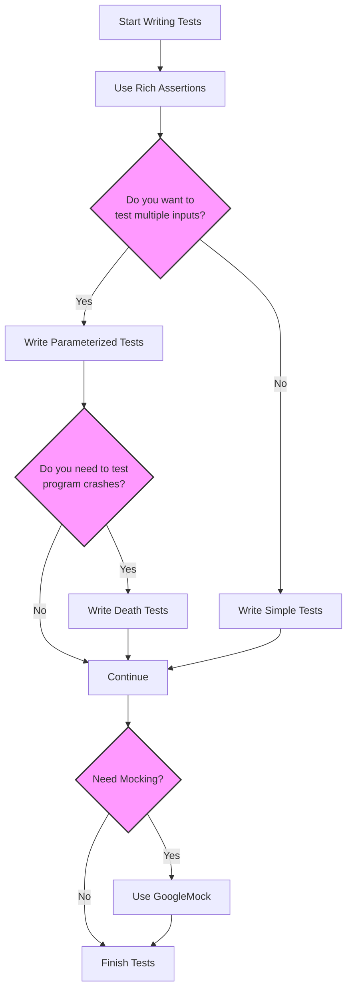

# GoogleTest Features at a Glance

Welcome to the quick snapshot of major features available in GoogleTest, Google’s industry-leading C++ testing framework. This guide helps you rapidly identify the broad spectrum of functionality at your fingertips — from expressive assertions and advanced parameterized tests, to comprehensive death tests, value/type parameterization, rich reporting, and React-like framework extensibility.

---

## Why This Page Matters

Imagine you're embarking on your testing journey with GoogleTest, eager to unlock its powerful capabilities—but unsure where to start or what it can do for your specific use cases. This overview offers a concise yet comprehensive map of the primary features, so you can understand the value GoogleTest delivers and decide how to adopt it most effectively.

This page complements other foundational documents that explain the core testing concepts, user guidance, and architectural insights. It focuses on *what* the features enable you to do and *why* they matter for your testing workflow.

---

## Feature Highlights Overview

GoogleTest features empower you to write robust, maintainable, and efficient tests for your C++ codebase. Here are the key areas summarized upfront:

- **Rich Assertions**
  - A wide variety of expressive assertion macros to capture test invariants clearly and concisely.
  - Enables precise verification of program behavior with detailed failure messages.

- **Parameterized Tests**
  - Support for writing tests that run the same logic over multiple inputs.
  - Includes both value-parameterized and type-parameterized tests, enhancing test coverage and reducing duplication.

- **Death Tests**
  - Specialized tests to verify that your program terminates under certain conditions.
  - Helps ensure correctness by validating behavior on fatal failure.

- **Value and Type Parameterization**
  - Enables combining different inputs and types systematically across tests.
  - Saves developer time and reduces human error by automating variations.

- **Rich Reporting**
  - Detailed output with stack traces, error messages, and summaries that help quickly diagnose failures.
  - Continuous integration friendly with informative logs.

- **Extensibility**
  - A flexible architecture allowing creation of custom assertions, matchers, actions, and parameter types.
  - Integrates with GoogleMock (gMock) for powerful mocking capabilities.

---

## How These Features Work Together

These features form an ecosystem that supports your end-to-end testing needs:

- You start by writing **expressive assertions** to validate expected outputs and states.
- Use **parameterized tests** to exercise your code with multiple inputs or types without rewriting tests.
- Employ **death tests** when you want to confirm program termination scenarios.
- Leverage **value/type parameterization** to combine inputs and types elegantly.
- Benefit from detailed **test reports** to rapidly identify issues.
- Extend and customize behavior with the advanced **extensibility** options.

Together, they ensure your tests are not only effective but also maintainable and scalable.

---

## Real-World Use Case Examples

- **Library Development:** Automatically verify API correctness across many input combinations using value-parameterized tests.
- **Embedded System Testing:** Use death tests to validate system safety behaviors on critical failures.
- **Large-Scale Enterprise Codebase:** Leverage rich assertions and extensibility to capture complex conditions and mock interactions.
- **Prototype Iterations:** Quickly adapt tests with type-parameterization to prototype new data structures.

---

## Practical Tips to Get Value Quickly

- Familiarize yourself with the rich *assertion macros* to make your test intentions clear.
- Start integrating *parameterized tests* early to avoid repetition and boost coverage.
- Use *death tests* cautiously, ensuring they isolate fatal scenarios reliably.
- Tap into *extensibility* if you need domain-specific validation logic or custom mocking.
- Always consult the logs from *rich reporting* to understand failures faster.

---

## Next Steps

Now that you have the high-level feature map, proceed to the following detailed documents to deepen your understanding and accelerate adoption:

- [What is GoogleTest?](../product-intro-core-value/what-is-googletest) — Explores the framework’s purpose and its core testing philosophy.
- [GoogleTest Core Concepts](../architecture-and-core-concepts/core-concepts-and-terminology) — Learn about tests, suites, assertions, and fixtures.
- [Mocking Workflow with GoogleMock](../../guides/mocking-best-practices/mocking-workflow) — Understand the mocking framework that complements GoogleTest.
- [Parameterized and Type-Parameterized Testing](../../guides/real-world-scenarios/parameterized-tests) — Dive into writing parameterized tests.

---

## Additional Resources

- **gMock Cookbook:** Recipes and best practices for the mocking framework.
- **Actions Reference:** Learn the actions that control mock behavior.
- **Mocking Reference:** Detailed mechanics of mocking.

By exploring these, you'll master testing interactions alongside unit logic.

---

*Ready to explore the power of GoogleTest? Let this feature overview be your launchpad!*

---

<AccordionGroup title="GoogleTest Feature Areas">
<Accordion title="Assertions">
GoogleTest provides a rich set of assertion macros that let you write precise and expressive test conditions. These assertions cover equality, inequality, exception handling, floating-point approximations, and many more, helping you clearly state what your tests verify.
</Accordion>
<Accordion title="Parameterized Tests">
Support for parameterized tests allows you to write a single test logic that runs with multiple data inputs or types. This dramatically reduces code duplication and increases coverage with minimal effort.
</Accordion>
<Accordion title="Death Tests">
Death tests help verify that your code crashes or terminates under specific conditions safely. They are essential for testing error-handling and fail-fast scenarios.
</Accordion>
<Accordion title="Value and Type Parameterization">
Combine various inputs or types conveniently across multiple tests to cover broad scenarios using value and type parameterization features.
</Accordion>
<Accordion title="Rich Reporting">
GoogleTest generates detailed test reports including which exact assertion failed, stack traces, and summaries to help you diagnose problems quickly and efficiently.
</Accordion>
<Accordion title="Extensibility">
GoogleTest’s architecture supports user extensibility by allowing you to define custom assertions, create new matcher types, extend actions in mocks, and integrate with Google's Mocking framework (gMock) for more sophisticated tests.
</Accordion>
</AccordionGroup>

---

## Visual Overview of Feature Flow

---