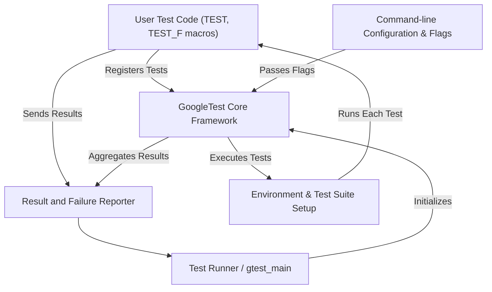

# How Does GoogleTest Work?

GoogleTest is a powerful C++ testing framework designed to help you write, organize, and execute tests efficiently and reliably. Understanding how GoogleTest works behind the scenes empowers you to leverage its features to the fullest for building robust tests.

---

## Overview of GoogleTest Architecture

At a high level, GoogleTest acts as the orchestrator between your test code and the test runner, handling discovery, execution, reporting, and lifecycle management of tests.

Here’s a simplified illustration of the major GoogleTest components and the data flow:

## Test Discovery

When you build your test executable, GoogleTest utilizes static registration mechanisms behind its `TEST` and `TEST_F` macros to register your tests in global internal registries. This means:

- Each test is automatically recorded at program startup.
- The framework knows all available tests without your intervention.

This auto-registration eliminates manual test suite maintenance, enabling seamless scaling as tests grow.

## Test Execution Flow

When running your test executable (often via `gtest_main`), GoogleTest:

1. **Parses Command-line Flags:** Flags such as `--gtest_filter` and verbosity levels customize which tests to run and logging detail.
2. **Initializes Environment:** Allocates resources and calls `SetUpTestSuite()` if defined.
3. **Runs Tests One by One:** For each test,
   - `SetUp()` is called.
   - The test body executes.
   - `TearDown()` is called.
4. **Records Results:** Captures test successes, failures, and any fatal or non-fatal assertion information.
5. **Tears Down Environment:** Calls `TearDownTestSuite()` and cleans up.
6. **Reports Summary:** Outputs detailed or summary test results, including failure messages and stack traces where applicable.

## Integration with Testing API

Your tests primarily use GoogleTest macros such as `TEST()`, `EXPECT_EQ()`, and fixtures (`TEST_F`) to:

- Define test cases.
- Issue assertions for verifying expected vs actual outcomes.

The seamless integration hides all internal orchestration, allowing you to focus purely on test logic.

## Controls and Customization

GoogleTest offers extensive customization through:

- **Command-line flags:** Control filters, verbosity, output format, and more.
- **Custom event listeners:** Allow custom reporting or integration with CI systems.
- **Test fixtures:** For reusable setup/teardown logic.
- **Parameterized tests:** Run a test multiple times with different data.

These capabilities allow GoogleTest to scale from simple unit tests to complex integration scenarios.

## Troubleshooting and Best Practices

- Always set expectations clearly in tests.
- Handle resource setup and cleanup via fixtures.
- Use the verbose mode to diagnose test failures.
- Leverage test filtering to focus on subsets of tests during development.

---

## Practical Example: Basic Control Flow

Here’s a concise step-by-step description of a typical test run via GoogleTest:

<Steps>
<Step title="Program Start">
GoogleTest initializes upon running your test executable, loading all registered tests.
</Step>
<Step title="Setup">
Global environment setup runs if defined.
</Step>
<Step title="Test Selection">
Based on filters, GoogleTest identifies which tests to execute.
</Step>
<Step title="Individual Test Execution">
For each test:
- Calls test fixture SetUp()
- Runs the test body
- Calls test fixture TearDown()
</Step>
<Step title="Result Collection">
Tracks assertion success/failure and aggregates results.
</Step>
<Step title="Summary Output">
Prints a summary with details on failures.
</Step>
<Step title="Program End">
Test executable exits with an appropriate status.
</Step>
</Steps>

---

## Additional Components

- **Assertion Macros:** GoogleTest provides powerful macros like `EXPECT_EQ` and `ASSERT_TRUE` to verify test conditions.
- **Test Fixtures:** Helps you share setup/teardown code across multiple tests.
- **Parameterized Tests:** Eases repetitive testing with varying input data.
- **Death Tests:** Allows testing crash scenarios in safe subprocesses.

## Learn More

Explore other documentation sections that complement this overview:

- [Core Concepts & Terminology](https://google.github.io/googletest/overview/architecture-and-core-concepts/core-concepts-terminology)
- [Writing and Running Tests](https://google.github.io/googletest/api/reference/core-testing-apis/writing-and-running-tests)
- [Assertions: Verifying Test Outcomes](https://google.github.io/googletest/guides/core-testing-workflows/using-assertions)
- [Mocking with GoogleMock](https://google.github.io/googletest/guides/core-testing-workflows/mocking-with-googlemock)
- [Getting Started Guide](https://google.github.io/googletest/guides/getting-started/installation-setup)

---

## Summary

Understanding how GoogleTest orchestrates test discovery, execution, and reporting provides a solid foundation for designing maintainable and effective tests. This knowledge also helps in customizing test runs and diagnosing failures more effectively.

Leverage GoogleTest’s robust command-line options and extensibility to tailor the testing experience to your project’s needs.

---

## Practical Tips

<Tip>
Run your tests with `--gtest_filter` to execute specific test cases.
</Tip>
<Tip>
Use `--gtest_output` to produce XML/JSON results for CI integration.
</Tip>
<Tip>
Consider defining test fixtures to manage repetitive setup and teardown.
</Tip>

---

<Info>
For a real-world understanding and hands-on examples, visit the [Getting Started at a Glance](https://google.github.io/googletest/overview/introduction-and-value/getting-started-glance) guide.
</Info>

---

## Source Code

Explore the GoogleTest source and how tests are managed internally in the [`googletest`](https://github.com/google/googletest/blob/main/googletest) repository.

---

