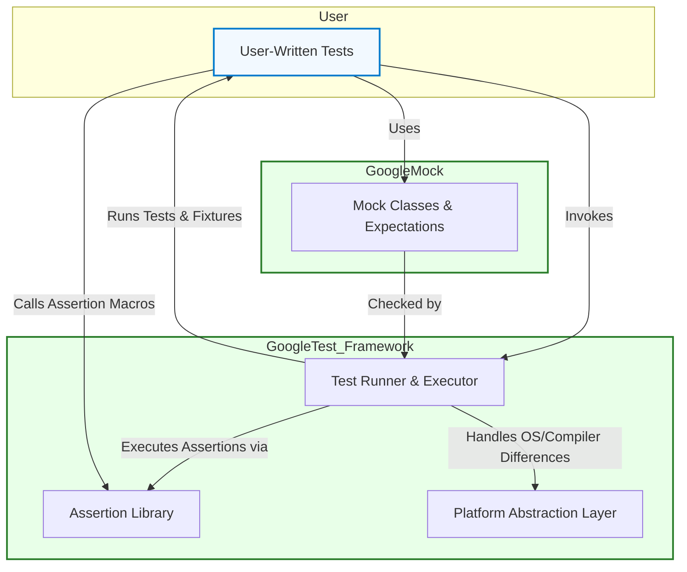

# System Architecture Overview

## Visualizing GoogleTest's High-Level Architecture

This page presents a clear, high-level view of how GoogleTest is architected, focusing on the essential components that make up the framework and how they interact. It illustrates the merger with GoogleMock, showcasing the integration that empowers users to write expressive and organized tests with built-in mocking capabilities.

By understanding this architecture, you gain insight into how your test code, GoogleTest's core libraries, mock objects, test runners, and platform abstractions collaborate seamlessly to simplify your testing workflow.

---

## Core Components and Their Roles

- **User-Written Tests:** Your test code forms the entry point. These are structured as test functions, test suites, and fixtures that organize what and how you verify in your C++ code.

- **Test Runner:** This component discovers all tests you wrote automatically, executes them, and aggregates the results. It manages the lifecycle of tests by creating fixtures, running tests, and managing setup and teardown.

- **Assertion Library:** Provides expressive macros (`EXPECT_`, `ASSERT_`) that generate detailed failure messages, helping you immediately locate and diagnose issues.

- **GoogleMock Integration:** With GoogleTest merged with GoogleMock, mock classes and expectations can be seamlessly created, verified, and integrated into your tests, facilitating interaction-based testing.

- **Platform Abstraction Layer:** GoogleTest abstracts differences across supported platforms, ensuring consistent behavior regardless of operating systems or compilers.

## How These Work Together: User Flow

A typical user scenario:

1. **Write Tests and Mocks:** You write tests using `TEST()` or `TEST_F()` macros, optionally creating mocks with GoogleMock's `MOCK_METHOD` macros.
2. **Automated Test Discovery:** The Test Runner automatically finds all defined tests without extra listing or registration.
3. **Run Tests:** Tests are executed one by one, each within its own fixture instance to guarantee isolation.
4. **Assertions Validate Behavior:** When assertions fail, detailed failure messages are produced, helping you identify the cause rapidly.
5. **Mocks Verify Interaction:** Mock expectations are automatically checked at the end of test execution.
6. **Result Reporting and Cleanup:** The Test Runner reports pass/fail status and cleans up resources.

This flow emphasizes test independence, clear diagnostics, and easy integration of mocks.

---

## Annotated Architecture Diagram

---

## Practical Insights

- **Automatic Test Discovery:** You never need to explicitly register tests to run them; GoogleTest finds them for you based on macros you use. This greatly reduces setup overhead and human error.

- **Isolation via Fixtures:** Each test runs in a fresh fixture object, ensuring tests are independent and free from shared state side-effects.

- **Unified Framework:** The merger of GoogleTest and GoogleMock means you can seamlessly define mocks alongside your tests without extra dependencies or separate tooling.

- **Cross-Platform Consistency:** The platform abstraction layer manages differences across Windows, Linux, and macOS, so tests behave consistently.

---

## Troubleshooting Tips

- If your tests are not discovered, ensure they are defined with valid `TEST()` or `TEST_F()` macros.

- Remember that assertions stop only the current test function upon fatal failure, allowing other tests to continue. Use nonfatal assertions to gather multiple failures in one run.

- Mock expectations are automatically verified; if unexpected mock function calls occur, check your `EXPECT_CALL` specifications match the code behavior.

- On platform-specific test failures, verify timing or OS-related dependencies are accounted for or waived.

---

## Next Steps

- Explore the [Core Concepts & Terminology](/overview/architecture-and-core-concepts/core-concepts-and-terminology) page for foundational understanding.

- Learn how to write effective tests in the [GoogleTest Primer](overview/intro-product-essentials/what-is-googletest#basic-concepts).

- Get started with mocks via the [gMock for Dummies](docs/gmock_for_dummies.md) guide.

- Understand platform prerequisites at [Supported Platforms & Target Audience](/overview/intro-product-essentials/supported-platforms-and-audience).

---