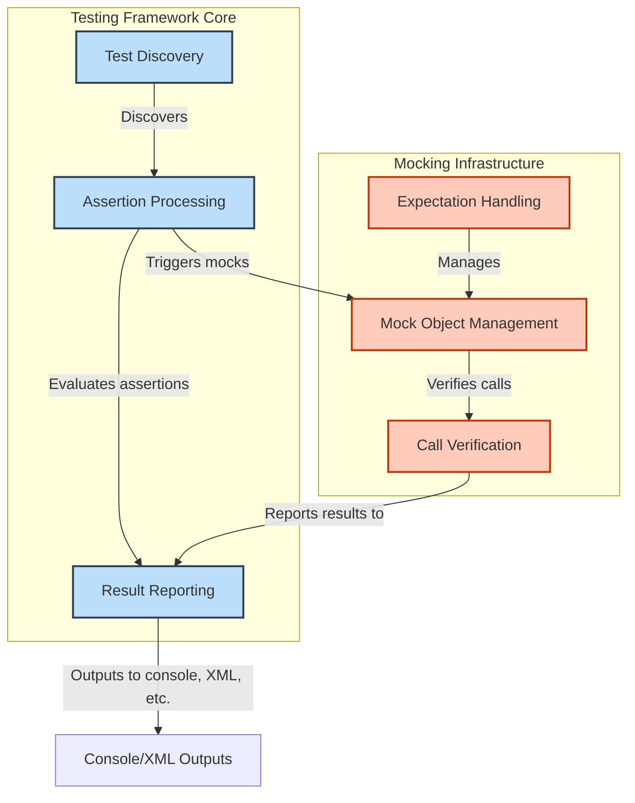

# System Architecture (with Diagram)

## High-Level View of GoogleTest and GoogleMock

The architecture of GoogleTest and GoogleMock is designed to provide a seamless, scalable, and modular testing experience for C++ developers. At its core, the system elegantly orchestrates components that handle **test discovery**, **assertion processing**, **mocking behavior**, and **result reporting** — all working together to enable robust and maintainable automated tests.

This page presents a high-level architecture diagram and explains how these components interact, giving you a clear understanding of the underlying mechanisms that power your tests.

---

## Architecture Diagram

---

## Core Components Description

### 1. Test Discovery

This component automatically finds all tests defined using GoogleTest macros such as `TEST()`, `TEST_F()`, and parameterized variants. It registers them internally so they can be executed without explicit enumeration.

**What you get:**
- No manual test registration required.
- Scalability as tests grow in number and complexity.

### 2. Assertion Processing

The heart of test evaluation, this module executes each test's body and evaluates assertions. It tracks successes, failures (both fatal and non-fatal), and skipped tests.

**What you get:**
- Detailed failure messages with source file and line numbers.
- Control over test abort behavior with fatal and non-fatal assertions.

### 3. Mocking Infrastructure

GoogleMock extends GoogleTest with powerful mocking capabilities to simulate and verify behavior in your system under test.

**Subcomponents:**
- **Mock Object Management:** Creates and manages lifetimes of mock objects and their method stubs.
- **Expectation Handling:** Sets and tracks expected calls and argument matchers on the mocks.
- **Call Verification:** Checks actual calls at runtime against expectations, reports mismatches.

**What you get:**
- Declarative syntax for defining mocks using `MOCK_METHOD`.
- Configurable call expectations and sequencing.
- Automatic verification post-test execution.

### 4. Result Reporting

This component collates results from test execution and mocking verification. It outputs results in various formats such as console output, XML reports, or custom listeners.

**What you get:**
- Human-readable and machine-readable test reports.
- Support for integration with continuous integration systems.

---

## How These Components Work Together

When you run your test program:

1. The **Test Discovery** component builds the list of all tests.
2. Each test is run by the **Assertion Processor**, which executes the test code.
3. If mocks are used, calls to mock methods invoke the **Mocking Infrastructure** to verify behavior dynamically.
4. All assertion results and mock verification outcomes are collected by the **Result Reporter**.
5. The **Result Reporter** then outputs the combined results for developers to review.

This modular design ensures each part can evolve or be customized independently, offering flexibility and scalability for projects of all sizes.

---

## Practical Example: Running a Test Suite

Imagine you have tests verifying a calculator class using both assertions and mocks:

- You write tests with `TEST_F(CalculatorTest, Addition)`.
- GoogleTest's **Test Discovery** detects your test automatically.
- During the test execution, **Assertion Processing** tracks `EXPECT_EQ` checks.
- If a calculator uses external services, you create mocks to simulate those interactions via **Mocking Infrastructure**.
- After all tests complete, **Result Reporting** outputs how many tests passed or failed, highlighting assertion failures or unmet mock expectations.

This flow happens behind the scenes, so you can focus on writing meaningful tests and mocks without worrying about registration, execution, or reporting intricacies.

---

## Tips and Best Practices

- **Always define your mocks with clear expectations** to ensure precise verification.
- **Use test fixtures to group related tests** for shared setup, which benefits the Test Discovery component.
- **Leverage custom listeners** if you need specialized reporting or integration.
- Depend on the framework's **automatic test registration** instead of manual enumeration.
- Regularly review test reports; they combine assertion and mocking outcomes for complete diagnostics.

---

## Troubleshooting Common Scenarios

<AccordionGroup title="Common Issues and Solutions">
<Accordion title="Tests Not Being Discovered">
Verify you're using GoogleTest macros correctly, such as `TEST()`, `TEST_F()`. Ensure all test files are compiled and linked into the test executable.
</Accordion>
<Accordion title="Mock Behavior Not Verified">
Check that expectations are set **before** exercising the mock objects. Make sure `EXPECT_CALL` is called prior to the test code invoking mocked methods.
</Accordion>
<Accordion title="Test Results Not Reported Correctly">
Confirm the test runner is properly configured, and `RUN_ALL_TESTS()` is called in your main function.
</Accordion>
</AccordionGroup>

---

## Next Steps

To start exploring these architectural elements in practice, proceed to:

- [Core Concepts & Terminology](/overview/architecture-and-core-concepts/core-terminology) to understand foundational testing constructs.
- [Feature Overview at a Glance](/overview/architecture-and-core-concepts/feature-summary) for high-level feature highlights.
- [Getting Started guides](/getting-started/configuration-validation/writing-first-test) to begin writing and running your first tests.

For deep dives into mocking, consult the [Mocking Reference](docs/reference/mocking.md) and [gMock Cookbook](https://google.github.io/googletest/gmock_cook_book.html).

---

## References

- [GoogleTest Official Repository](https://github.com/google/googletest)
- [GoogleMock Documentation](https://google.github.io/googletest/gmock_for_dummies.html)
- [Test Event Listeners Overview](docs/reference/testing.md#TestEventListener)

---

*Empowered with this system-level understanding, you can confidently build, organize, and debug tests and mocks, unlocking the full potential of GoogleTest and GoogleMock.*
