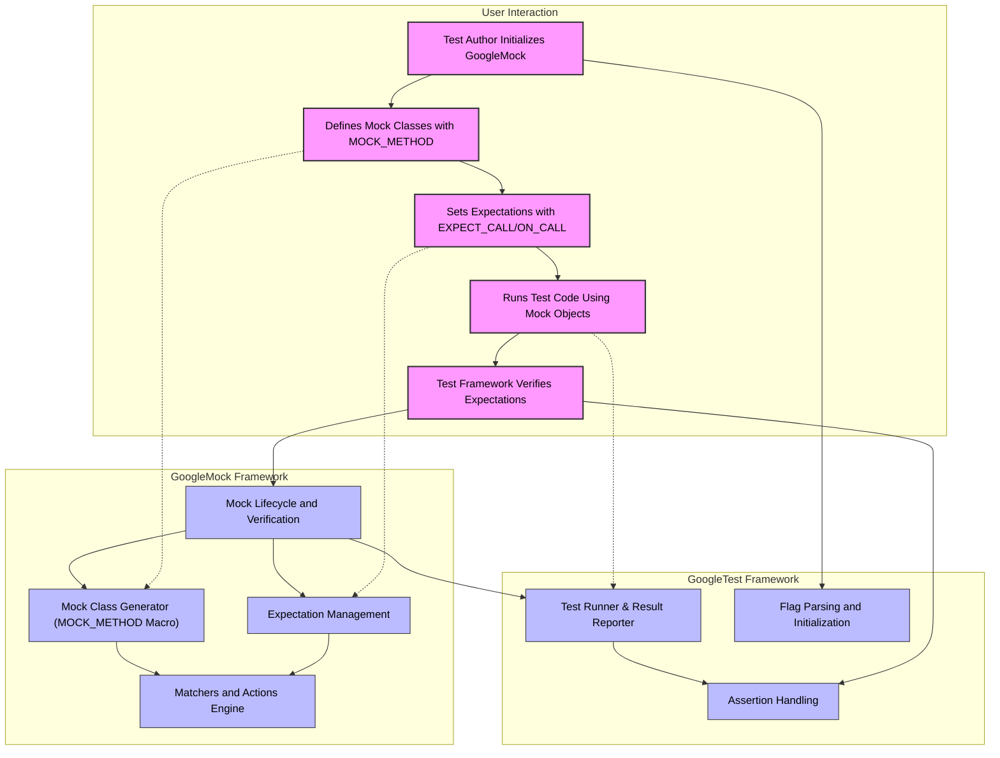

# System Architecture

GoogleMock (gMock) and GoogleTest (gTest) together form a robust C++ testing framework that streamlines the test lifecycle from writing mocks to verifying behavior. This page presents a clear, benefit-driven overview of the core system components and their interactions, providing a high-level understanding of how gMock integrates with GoogleTest, how the major modules are organized, and how users engage with the framework throughout their testing process.

---

## Why the System Architecture Matters

Understanding the system architecture equips you to better harness the power of GoogleMock and GoogleTest. Clear comprehension of the components involved and their relationships helps users rapidly onboard, debug test issues, and optimize their usage of the framework. Whether you’re writing your first mock or managing complex test suites, knowing the architectural flow promotes confidence and efficiency.

---

## Overview of the System Components

At the heart of the system lies GoogleMock, which is designed to create mock classes in C++, enabling detailed control and observation of component interactions during testing. GoogleTest complements this by providing the base testing infrastructure with unit test runners, assertions, and test reporting.

### Key Modules:

- **GoogleTest (gTest)**: The foundational unit test framework. It provides the test running logic, reporting, and assertion mechanisms that support all tests.

- **GoogleMock (gMock)**: Built on top of GoogleTest, gMock automates the creation of mock classes and sets expectations on their behavior. It introduces syntax for defining mock methods, specifying call expectations, argument matching, and controlling mock behavior.

- **Mock Class Generation**: Via macros like `MOCK_METHOD`, this module generates mock classes that override the virtual methods of your interfaces, allowing for easy substitution during tests.

- **Matchers and Actions**: Powerful utilities that define how mock methods interpret input arguments (`Matchers`) and what they return or do when called (`Actions`).

- **Expectation Infrastructure**: Manages the lifecycle of call expectations, validating calls, enforcing orders, cardinalities, and producing test failures on mismatches.

- **Test Lifecycle Interaction**: Interfaces for initializing mocks (`InitGoogleMock`), running test cases, and verifying expectations at teardown.

---

## How Users Interact with the Framework

Users typically follow a well-defined workflow:

1. **Initialize**: Call `InitGoogleMock()` before running any tests. This prepares both GoogleTest and GoogleMock, parsing flags and setting up internal state.

2. **Define Mocks**: Use the macros (`MOCK_METHOD`) within mock classes to define hooks that mimic the interfaces of real objects.

3. **Set Expectations**: Write `EXPECT_CALL` and `ON_CALL` statements to specify which methods you expect the test subject to invoke, with what arguments, how often, and what actions to perform.

4. **Run Tests**: Exercise the code under test that uses these mocks.

5. **Verify**: GoogleMock automatically verifies expectations during test teardown, alerting on any unsatisfied or incorrectly satisfied expectations.

6. **Adjust Strictness**: Use wrappers like `NiceMock`, `StrictMock`, or `NaggyMock` to tune the strictness of mocks regarding uninteresting calls.

---

## Key Integration Points

- **Header Inclusion**: The core user interaction point is including `gmock/gmock.h`, which internally includes all necessary components.

- **Flag Management**: Command line flags control verbosity and behavior of mocks and tests, parsed during initialization.

- **Inheritance Model**: Mocks derive from interfaces or base classes and override virtual methods, seamlessly integrating with existing code.

- **Test Framework Coupling**: GoogleMock relies on GoogleTest's test registration and execution framework, allowing mock verification to be part of test assertions and result reporting.

---

## System Architecture Mermaid Diagram

---

## Practical Tips

- **Start Tests by Calling `InitGoogleMock()`:** Always initialize GoogleMock before running tests to parse flags and set up the system.

- **Define Mock Methods Publicly:** Place `MOCK_METHOD` macros in the `public` section of your mock classes, even if original methods are protected or private.

- **Use `EXPECT_CALL` Sparingly:** Set expectations only where behavior needs verification to avoid brittle tests.

- **Leverage Strictness Controls:** Use `NiceMock` to suppress warnings about uninteresting calls, or `StrictMock` to treat unexpected calls as errors.

- **Structure Complex Call Sequences:** Use sequences (`InSequence`) or the `After` clause to define call ordering where necessary.

- **Remember Default Actions:** When no explicit actions are set, mocks return default-constructed values for return types, avoiding the need to always specify behavior.

- **Use Matchers for Complex Argument Checks:** Apply argument matchers to declare flexible yet precise call expectations.

---

## Troubleshooting Common Issues

- **Unexpected Calls:** If a mock method is called without an `EXPECT_CALL` or `ON_CALL` matching it, GoogleMock will print warnings or errors depending on strictness.

- **Incorrect Argument Matching:** Use `--gmock_verbose=info` to see detailed call traces and understand why arguments fail to match.

- **Expectations Not Verified:** Ensure your mock objects are destroyed or explicitly verified to trigger expectation checks.

- **Compilation Errors:** Wrapping return types or arguments containing commas in parentheses or defining type aliases will resolve macro parsing issues.

---

## Summary

GoogleMock and GoogleTest form a tightly integrated system where mock class generation, expectation setting, and test execution flow seamlessly to boost test quality and developer productivity. This architecture balances ease of use with granular control, enabling testing of complex C++ codebases with confidence.

---

For more details on writing mocks, defining expectations, and using matchers and actions, please consult:

- [gMock for Dummies](https://google.github.io/googletest/gmock_for_dummies.html)
- [Mocking Reference](https://google.github.io/googletest/reference/mocking.html)
- [gMock Cookbook](https://google.github.io/googletest/gmock_cook_book.html)

Navigate to other architecture-related pages for deeper insights:

- [Core Concepts and Terminology](/overview/architecture-and-core-concepts/core-concepts-and-terminology)
- [Integration and Ecosystem Connectivity](/overview/architecture-and-core-concepts/integration-and-dependencies)

---

For implementation details, samples, and verification of API behaviors, see the internal test files in the repository, e.g. `gmock-spec-builders_test.cc` and `gmock_output_test_.cc`.

<Source url="https://github.com/google/googletest" branch="main" paths={[{"path": "googlemock/include/gmock/gmock.h", "range": "1-96"}, {"path": "googlemock/include/gmock/gmock-nice-strict.h", "range": "1-174"}]} />
