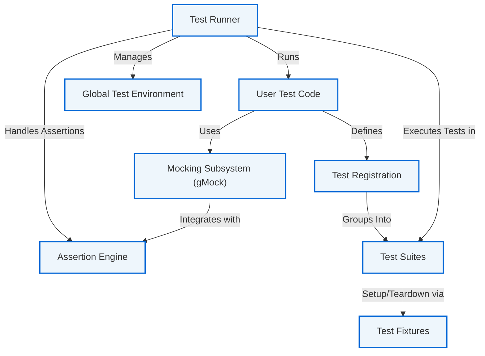

# System Overview & Architecture Diagram

## Visualizing GoogleTest's Core Components

Understanding GoogleTest begins with seeing how the main building blocks interconnect to deliver a seamless, powerful testing experience for C++ developers. This page introduces a high-level architecture diagram, illustrating how essential components—test runners, assertion systems, and mocking subsystems—work together. Before diving into detailed usage or feature guides, this overview gives you the big picture needed to appreciate GoogleTest’s design and flow.

---

## What Does This Diagram Show?

At its core, GoogleTest orchestrates the lifecycle of tests you write—from discovery and execution to reporting results. The architecture includes:

- **Test Runner:** Coordinates the execution of all registered tests, including setup and teardown.
- **Assertion Engine:** Evaluates your test assertions (`EXPECT_` and `ASSERT_` macros), reporting success or failure.
- **Mocking Subsystem (Googletest Mocking/gMock):** Supports creating mock objects for isolation and verification in unit testing.

The diagram also outlines the flow of data and control among these components and their interaction with your test code.

---

## High-Level Architecture Diagram

---

## Why This Matters to You

Visualizing how GoogleTest's core components fit together lets you:

- **Grasp the workflow:** Understanding the flow from test registration through test execution and failure reporting clarifies how your tests get executed behind the scenes.
- **Appreciate modularity:** Recognizing separate subsystems for assertions and mocking helps you write better structured tests.
- **Prepare for advanced features:** Seeing the interaction of test fixtures and suites fosters best practices in grouping and reusing test data.

This knowledge empowers you to harness GoogleTest effectively, avoid common pitfalls, and scale your testing efforts confidently.

---

## Understanding Key Components

### Test Runner

The Test Runner is the engine that discovers all your tests via registration mechanisms and runs them. Its responsibilities include:

- Managing test lifecycle (setup, teardown)
- Executing tests one by one
- Orchestrating test suites and fixtures
- Invoking the assertion engine to evaluate test results
- Reporting pass/fail statuses

### Assertion Engine

Assertions are the heart of verifying code behavior. The engine:

- Provides macros that check conditions (`EXPECT_`, `ASSERT_`)
- Distinguishes between fatal and non-fatal failures to control test flow
- Reports detailed failure information (file, line, message)
- Integrates tightly with both test execution and mocking verification

### Mocking Subsystem (gMock)

GoogleTest includes gMock for creating and managing mock objects. It:

- Allows declarative mock class definitions
- Checks function call expectations
- Provides rich matchers to validate arguments
- Supports partial mocks and ordering constraints
- Works in concert with assertions to confirm behaviors

### Test Registration & Suites

Your tests register themselves automatically with GoogleTest’s framework. Tests are logically grouped into test suites reflecting your code's structure. Grouping enables reuse of fixtures, simplifies reporting, and improves test organization.

### Test Fixtures

Fixtures let multiple tests share common setup and teardown code to avoid duplication and improve maintainability. GoogleTest ensures fresh fixture instances run for each test to guarantee isolation.

### Global Test Environment

This manages global setup/teardown that spans multiple test suites — useful for initializing shared resources or external dependencies.

---

## Practical Tips to Use the Architecture

- **Leverage test suites and fixtures to organize tests around components or features.**
- **Use assertions thoughtfully: prefer non-fatal `EXPECT_` macros to report multiple failures in one run.**
- **Employ mocking for complex dependencies and external interfaces to isolate unit behavior.**
- **Understand that each test runs independently with a fresh fixture, avoiding side effects.**
- **Use the global environment for shared expensive setup but minimize shared mutable state.**

---

## Troubleshooting Common Architecture Pitfalls

<Accordion title="Test Not Running or Being Discovered">
Sometimes tests fail to run because they are not registered correctly. Ensure you use `TEST()` or `TEST_F()` macros properly so tests auto-register.
</Accordion>

<Accordion title="Mixing Fixtures and Test Macros" >
Avoid mixing `TEST()` and `TEST_F()` macros in the same test suite. This causes fixture inconsistencies and errors during execution.
</Accordion>

<Accordion title="Assertion Failures but Tests Continue Unexpectedly">
Remember `EXPECT_` assertions generate non-fatal failures and allow tests to continue. Use `ASSERT_` when you want to abort the current test function immediately upon failure.
</Accordion>

<Accordion title="Mock Expectations Failing in Unpredictable Ways">
Make sure mocks are set up correctly before invocation and that expectations are clear and verified only after calls happen.
</Accordion>

---

## Getting Started Preview

To see this architecture in action, start with writing simple tests in the [GoogleTest Primer](primer.md). Once comfortable, explore creating test fixtures and leverage mocks for comprehensive test coverage.

Next logical reading steps:

- [GoogleTest Primer](primer.md): Learn to write basic tests.
- [Core Concepts & Terminology](core-concepts-and-terminology.html): Deepen your understanding of testing terms.
- [Mocking for Dummies](gmock_for_dummies.html): Start using mocks effectively.

---

Harness the power of GoogleTest's thoughtfully designed architecture to build robust, reliable C++ tests that help you deliver confident, maintainable software.