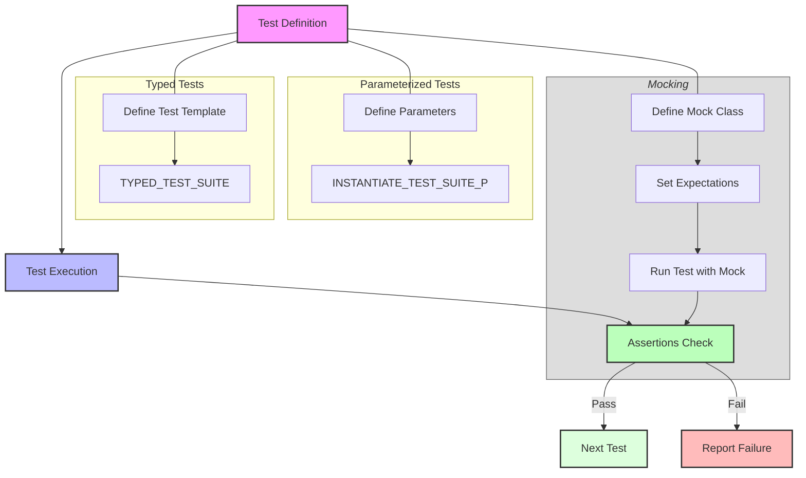

# Feature Summary

## Overview
This page provides a rapid orientation to the main features offered by GoogleTest and GoogleMock. It is designed as a practical checklist for users to get acquainted with core capabilities enabling effective test development, robust assertions, advanced parameterization, and powerful mocking. Whether you're starting with basic unit tests or exploring sophisticated test patterns, this summary provides actionable insights into the framework's essential tools.

## xUnit-Style Test Structure
- GoogleTest uses familiar xUnit test constructs: *Test Suites* grouped by logical areas, containing individual *Tests*.
- Uses macros such as `TEST()`, `TEST_F()`, and `TEST_P()` to define tests with and without fixtures and parameterization.
- Supports per-test and per-test-suite setup/teardown via `SetUp()`, `TearDown()`, `SetUpTestSuite()`, and `TearDownTestSuite()` for robust lifecycle management.

## Rich Assertions
- Offers an extensive set of assertion macros, including `EXPECT_*` and `ASSERT_*` variants for non-fatal and fatal failures.
- Supports value comparisons (equality, inequality), floating-point approximations, boolean conditions, exceptions, and death tests.
- Enables custom predicates and improved failure messages through integration with gMock matchers.

## Parameterized and Typed Tests
- **Value-Parameterized Tests (`TEST_P`)** allow running the same test code with different input values to cover varied scenarios efficiently.
- Instantiate parameterized tests with `INSTANTIATE_TEST_SUITE_P()` using flexible parameter generators like `Values()`, `Range()`, and `Combine()`.
- **Typed Tests (`TYPED_TEST`)** run the same test logic across multiple C++ types, facilitating interface conformance checks and generic programming validations.
- **Type-Parameterized Tests (`TYPED_TEST_P`)** support defining test templates independent of the type list, which can be instantiated multiple times separately.

## Death Test Support
- Built-in macros like `ASSERT_DEATH()` and `EXPECT_DEATH()` verify that code terminates as expected.
- Handles safe testing in multithreaded applications with configurable death test styles.
- Supports detailed matching on exit codes and error messages.

## User-Defined Assertions and Matchers
- Custom assertions can be created using the `AssertionResult` type, enhancing error reporting.
- gMock provides extensive matcher capabilities to express complex argument expectations with composability and rich diagnostics.
- Supports creation of polymorphic, parameterized, and composite matchers allowing highly flexible test conditions.

## Test Discovery and Execution Control
- Tests are automatically registered and can be filtered using command line flags or environment variables.
- Supports running subsets of tests, sharding (distributing tests across machines), repeating, and shuffling for reliability.
- Facilitates skipping tests at runtime with `GTEST_SKIP()`.

## GoogleMock APIs and Advanced Mocking
- Enables declaration of mock classes with methods instrumented to verify call expectations and argument constraints.
- Allows fine-grained control over call cardinalities, ordering, and sequences.
- Supports mock actions such as returning values, invoking callbacks, setting output parameters, and delegating to real or fake objects.
- Facilitates mocking of overloaded and template methods, move-only types, and non-virtual functions.

## Additional Features
- Global environment setup and teardown via `testing::Environment`.
- Event listener API for hooking into test progress and customizing output or behavior.
- Facilities for logging extra test metadata with `RecordProperty()`.
- Support for compiling and running tests in multiple environments including various platforms and build systems.

---

## Practical Example
Defining and using a mock method with expectations:
```cpp
#include <gmock/gmock.h>

class MockTurtle {
 public:
   MOCK_METHOD(void, PenDown, (), ());
   MOCK_METHOD(void, Forward, (int distance), ());
};

TEST(DrawingTest, DrawsLine) {
  MockTurtle turtle;
  EXPECT_CALL(turtle, PenDown()).Times(1);
  EXPECT_CALL(turtle, Forward(100)).Times(1);

  // Code exercising turtle goes here.
}
```

---

## Tips and Best Practices
- Use value-parameterized tests to avoid duplication when testing multiple input cases.
- Prefer typed tests when verifying behavior across different C++ types implementing a concept.
- Keep assertions focused and descriptive to aid in quick failure diagnosis.
- Limit expectations in mocks to those that verify meaningful behavioral contracts to reduce brittle tests.
- Use `SCOPED_TRACE` to attach informative trace messages in nested assertion contexts.

<Note>
Remember to keep test suite and test names free from underscores to avoid internal conflicts, and ensure test fixture classes have accessible default constructors for proper instantiation.
</Note>

---

## Next Steps
- Get started writing tests with [Create Your First Test](/getting-started/first-test-validation/create-your-first-test).
- Learn core concepts and terminology in the [Core Concepts and Terminology](/overview/product-introduction-and-core-concepts/core-concepts-and-terminology) page.
- Explore mocking patterns further in the [gMock Cookbook](docs/gmock_cook_book.md).


---

## Related Documentation
- [What is GoogleTest?](/overview/product-introduction-and-core-concepts/what-is-googletest)
- [Testing Reference: TEST macros, parameterized tests](/docs/reference/testing.md)
- [gMock for Dummies](/docs/gmock_for_dummies.md) - Introduction to mocking
- [GoogleTest Advanced Topics](/docs/advanced.md) - Deep dive into assertions, death tests, and typed tests
- [GoogleTest FAQ](/docs/faq.md) - Troubleshooting and best practices

---

## Visual Diagram

