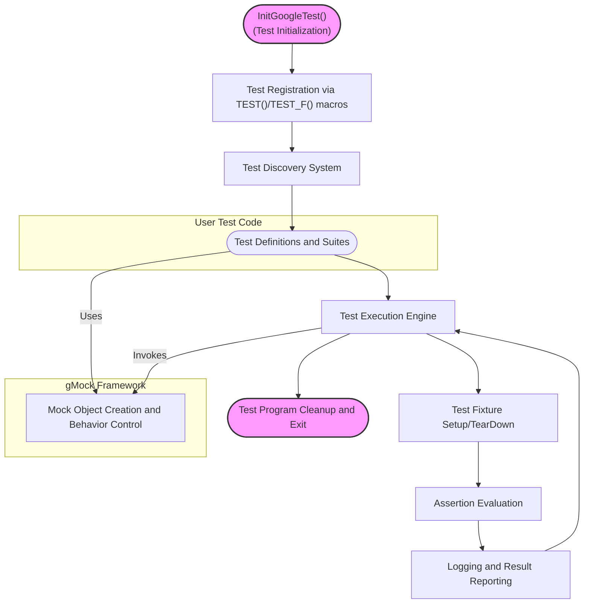

# System Architecture Overview

## Introduction

Understanding the architecture of GoogleTest provides invaluable insights into how it delivers reliable, portable, and efficient C++ testing across different platforms. This overview reveals GoogleTest’s core modules, illustrates the flow of control during test execution, highlights the main entry points, and explains how your test code interacts seamlessly with the test runner.

Whether you are a new user eager to comprehend the building blocks of GoogleTest or an advanced user delving into integration and customization, this guide clarifies the framework’s internal operation with a user-focused perspective.

---

## High-Level Architecture

GoogleTest is designed following the xUnit testing pattern while ensuring portability and extensibility. Its architecture comprises several core modules that work together to discover, execute, and report on tests.

### Core Components

- **Test Fixtures and Suites:** Organize tests logically and manage shared setup/teardown code.
- **Assertion Mechanism:** Provides a rich set of assertions that validate expected outcomes and report informative failures.
- **Test Runner:** Orchestrates test execution, manages command-line flags, and controls test lifecycle.
- **Mocking Framework (GoogleMock):** Integrated library for creating and using mock objects to isolate and verify interactions.
- **Platform Portability Layer:** Abstracts system-specific details to ensure smooth operation across OSes.

### Control Flow During Test Execution

When you invoke your test binary, GoogleTest initializes and coordinates the entire testing lifecycle:

1. **Initialization:** Parses command-line options, initializes internal structures, and registers all discovered test cases.
2. **Test Discovery:** Collects metadata about all tests and test suites registered via macros like `TEST()` and `TEST_F()`.
3. **Test Execution:** Runs each test independently, using fresh fixtures and capturing assertion outcomes.
4. **Result Reporting:** Aggregates test results, outputs detailed logs and summaries.
5. **Cleanup:** Releases resources and exits with the appropriate status code.

## Architecture Diagram



This flowchart outlines the main stages of test processing, highlighting the user’s test code registration and the role of the mocking framework during execution.

## Main Entry Points

- **`testing::InitGoogleTest(&argc, argv)`**
  - Responsible for parsing flags, initializing subsystems, and preparing the framework to run tests.
  - Must be called before any other GoogleTest invocation.

- **`RUN_ALL_TESTS()`**
  - Executes all registered tests sequentially.
  - Returns an exit code indicating success or failure.

## Interaction Between Test Code and Test Runner

Tests are primarily defined using macros like `TEST()` and `TEST_F()`. These macros:

- Declare test cases and suites.
- Register themselves during static initialization.

Once execution begins, the test runner:

- Invokes each test within a fresh fixture instance.
- Collects assertion results and failures immediately.
- Reports detailed failure messages including source file, line number, and user-specified error context.

This design enables isolated, reliable, and repeatable test executions, even in large codebases.

## Key Attributes of the Architecture

- **Portability:** Runs consistently across Linux, Windows, and Mac environments through platform abstraction layers.
- **Extensibility:** Supports parameterized tests, death tests, and can integrate with mocking frameworks such as GoogleMock.
- **Isolation:** Each test runs independently to prevent side-effects between tests.
- **Informative Reporting:** Rich output on failures to accelerate debugging.

## Practical Example: Test Lifecycle

Consider a user-defined `FactorialTest` suite:

```cpp
TEST(FactorialTest, HandlesZeroInput) {
  EXPECT_EQ(Factorial(0), 1);
}

TEST(FactorialTest, HandlesPositiveInput) {
  EXPECT_EQ(Factorial(3), 6);
}
```

Execution proceeds as:

1. Tests registered during static initialization.
2. `RUN_ALL_TESTS()` invokes `HandlesZeroInput`.
3. A fixture instance for `FactorialTest` is created.
4. The assertion `EXPECT_EQ(Factorial(0), 1);` is evaluated.
5. Result reported immediately upon failure or success.
6. Fixture is torn down.
7. Repeat for `HandlesPositiveInput`.
8. Final summary output.

## Summary

This architecture overview captures the critical components and their interactions within GoogleTest. Its modular yet integrated design streamlines testing workflows, making it straightforward to create, manage, and validate tests efficiently and reliably across platforms.

For developers and testers seeking to master GoogleTest, understanding this architecture is foundational to optimal use and deeper customizations.

---

## Additional Resources

- [GoogleTest Primer](https://google.github.io/googletest/primer.html): A comprehensive tutorial to get started writing tests.
- [Mocking with GoogleMock](https://google.github.io/googletest/gmock_for_dummies.html): Learn about mocking dependencies and expectations.
- [Core Features At a Glance](overview/introduction-and-value/core-features-at-a-glance): Quick summary of what GoogleTest offers.
- [API Reference - Mocking Framework](docs/reference/mocking.md): Detailed reference on mocking APIs.
- [Test Discovery and Execution Model](concepts/testing-foundations/test-discovery-execution): In-depth architecture of test execution.

---

## Tips and Best Practices

- Always call `testing::InitGoogleTest()` before running tests to ensure proper initialization.
- Structure tests into meaningful suites to take full advantage of fixtures.
- Use the integrated GoogleMock framework for efficient mocking and strictness control.
- Leverage command-line flags for detailed logging and controlling test execution.

This architectural foundation empowers you to fully harness GoogleTest’s capabilities and write robust, maintainable C++ tests.
