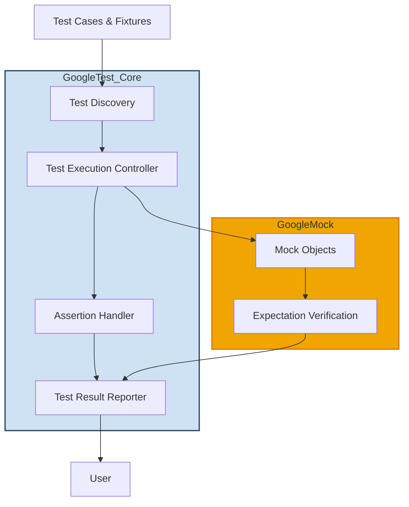

# Architecture Overview

Explore the unified architecture behind GoogleTest and GoogleMock — two powerful C++ testing and mocking frameworks designed for seamless integration within a single system. This page guides you through the core components and their interactions, illustrating how test discovery, assertion handling, reporting, and mocking fit together to provide a streamlined developer experience.

---

## Why Understanding the Architecture Matters

Picture this: you’re writing your first complex test case with both real implementations and mocks. You hit unexpected behavior or a limitation. Knowing how the different pieces of GoogleTest and GoogleMock connect helps you quickly diagnose issues and tailor your tests for maximum effectiveness.

This overview reveals the flow from your test code to test execution and results reporting, ensuring that you grasp what happens "under the hood" without diving into internal implementation details.

---

## High-Level Architecture

At a glance, GoogleTest and GoogleMock collaborate closely within the test program runtime. GoogleTest handles test discovery, execution flow, assertion checking, and result reporting, while GoogleMock enhances this ecosystem with powerful mocking capabilities that intercept and validate interactions.

This flow reflects the key stages:

- **Test Discovery:** Automatically finds tests defined via `TEST()`, `TEST_F()`, and related macros.
- **Test Execution:** Runs tests in isolation, manages test lifecycle including fixture setup and teardown.
- **Assertions Handling:** Captures and processes assertion outcomes (`EXPECT_` and `ASSERT_` macros).
- **Mocking Layer:** Constructs and operates mock objects, monitors calls, and verifies expectations.
- **Reporting:** Compiles test results, detailing passed/failed tests and assertion failures.

---

## Component Details

### Test Discovery

GoogleTest internally registers tests as they are defined using macros like `TEST()` and `TEST_F()`. At runtime, the discovery component enumerates these tests without requiring manual registration, enabling quick iteration and reducing maintenance burden.

### Test Execution Controller

This component orchestrates running each test independently. It instantiates fresh test fixtures, calls `SetUp()`, executes test body, and runs `TearDown()`. It isolates tests to ensure failures don’t cascade and supports various test types including parameterized and typed tests.

### Assertion Handler

Assertions are the backbone of verifying correct behavior. GoogleTest delivers clear diagnostics by reporting file locations, failure messages, and continues running tests on non-fatal failures to maximize feedback per test run.

### Mock Objects and Expectation Verification

GoogleMock introduces mock objects that mimic interfaces or classes. Users define expected interactions via `EXPECT_CALL()` and default behaviors via `ON_CALL()`. The framework checks in real-time whether calls match expectations and whether call order and count constraints hold, providing immediate, detailed feedback.

### Reporting

Test results are gathered and presented on the console or in XML formats. Reporting includes summaries of passed, failed, and skipped tests, as well as detailed error messages that link back to code. Integration with IDEs and continuous integration (CI) systems is supported.

---

## Example Workflow: From Test to Result

Let's walk through a typical user scenario to demonstrate how components interoperate:

1. **Define Tests and Mocks:** The user writes test cases using `TEST_F()` and declares mocks with `MOCK_METHOD()`.
2. **Run Test Program:** The executable initializes GoogleTest and GoogleMock, triggering test discovery.
3. **Test Iteration:** Each test runs individually; test fixtures set up state.
4. **Mock Invocation:** When the code under test calls a mocked method, GoogleMock intercepts and checks against expectations.
5. **Assertions Evaluated:** GoogleTest assertions validate test logic, marking failures or successes.
6. **Expectation Verification:** GoogleMock automatically verifies if all mock expectations were met when mocks are destroyed.
7. **Result Reporting:** GoogleTest summarizes and reports test outcomes.

---

## Practical Tips

- **Order Your EXPECT_CALLs Carefully:** GoogleMock checks expectations in reverse order; putting specific expectations last ensures correct matching.
- **Isolate Tests:** Each test runs with a fresh fixture to avoid cross-test side effects.
- **Use Mock Verification for Interaction Testing:** To catch incorrect call counts, orders, or arguments, leverage mock expectations.
- **Leverage Reporting for Debugging:** GoogleTest's detailed messages and stack traces pinpoint exact test failures.

---

## Summary

Understanding this architecture empowers you to:

- Write tests that interact smoothly with mock objects.
- Debug faster by knowing where to look when assertions or mocks fail.
- Use test lifecycle hooks effectively to manage setup and teardown.
- Leverage reporting formats to integrate with automated workflows.

For hands-on examples and deeper conceptual explanations, visit the [GoogleTest Primer](../introduction-key-features/what-is-googletest.md), [Effective Mocking with GoogleMock](../../guides/advanced-features-and-patterns/effective-mocking.md), and other detailed sections listed in the navigation.

---

*Next Step:* Proceed to the [Core Concepts and Terminology](../architecture-and-key-concepts/core-terminology.md) page to build on this architectural foundation.

<Source url="https://github.com/google/googletest" />