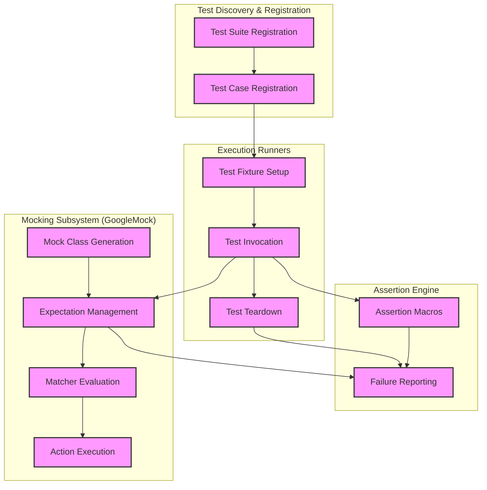

# System Architecture

Understand the high-level design of GoogleTest and how its core components collaborate to deliver a comprehensive C++ testing framework. This architecture visualization surfaces the main modules that enable efficient test discovery, expressive assertions, powerful mocking via GoogleMock, and controlled test execution.

---

## Overview

GoogleTest's architecture orchestrates several key subsystems working together harmoniously:

- **Test Discovery & Registration:** Automatically discovers and registers all test cases and fixtures you define, ensuring seamless detection without manual listing.
- **Assertion Engine:** Manages assertions within tests, handling success and failure states with rich diagnostics.
- **Mocking Subsystem (GoogleMock):** Provides facilities to define, use, and verify mock objects critical for interaction-based testing.
- **Execution Runners:** Manage test lifecycles, controlling execution flow, parallel test runs, setup/teardown, and result aggregation.

Each component plays a vital role in supporting scalable, maintainable, and robust test development.

---

## High-Level Component Interaction

---

## Component Descriptions

### Test Discovery & Registration
GoogleTest automatically registers tests and their test suites at program initialization. This eliminates the need to list tests manually, allowing easy scaling and modular test organization.

### Assertion Engine
The assertion engine provides macros such as `EXPECT_EQ` and `ASSERT_TRUE` that check conditions in your test code. When an assertion fails, it reports detailed information including locations, expected versus actual values, and call stacks to greatly simplify debugging.

### Mocking Subsystem (GoogleMock)
GoogleMock extends GoogleTest with a robust mocking framework for C++. It lets you generate mock classes quickly, set clear expectations, define argument matching via matchers, and specify return behaviors through actions. This allows you to test code interactions precisely.

### Execution Runners
Execution runners manage the entire lifecycle of tests—from constructing test fixtures, invoking the actual test methods, to tearing down and cleaning up. Test runners handle running tests sequentially or in parallel and collate the results for reporting.

---

## Why This Architecture Matters

- **Automatic Test Registration:** Frees you from boilerplate setup and ensures your entire test suite is discovered consistently.
- **Separation of Concerns:** Clear modular design lets users use only what they need — just assertions, or assertions plus mocking.
- **Enhanced Debugging:** Detailed failure reporting combined with mock verification helps catch issues early and precisely.
- **Extensible Mocking:** GoogleMock’s composable matchers, behaviors, and sequencing give you fine control over complex interactions.

---

## Getting Started with Architecture in Mind

To leverage GoogleTest effectively:

1. Define test suites and tests using the `TEST` and `TEST_F` macros.
2. Write assertions to verify expected behavior; use rich macros that give detailed failures.
3. When simulating dependencies, create mock classes via GoogleMock using `MOCK_METHOD`.
4. Set up mock expectations before exercising your code, leveraging matchers to specify argument constraints.
5. Run tests using `RUN_ALL_TESTS()`, which triggers the execution lifecycle via the test runners.

---

## Further Exploration

Explore the following guides to deepen your understanding and mastery of GoogleTest’s system:

- [What is GoogleTest?](https://github.com/google/googletest/blob/main/overview/product-introduction-core-concepts/what-is-googletest.mdx)
- [Feature Overview](https://github.com/google/googletest/blob/main/overview/product-introduction-core-concepts/feature-overview.mdx)
- [Mocking Basics](https://github.com/google/googletest/blob/main/gmock/README.md)
- [gMock Cookbook](https://github.com/google/googletest/blob/main/docs/gmock_cook_book.md)

---

## Quick Recap

GoogleTest’s architecture integrates test discovery, assertions, mocking, and execution into a seamless framework. This enables you to confidently write, organize, and maintain scalable C++ tests with a powerful developer experience.

---
