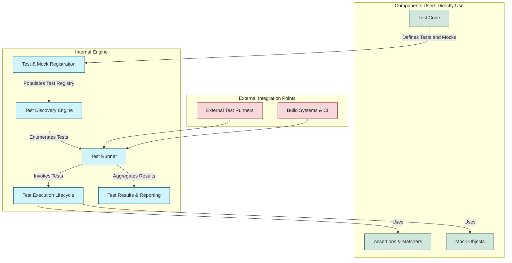

# System Architecture Overview

## Understanding the Core of GoogleTest and GoogleMock

This page offers a bird's-eye view of how GoogleTest and GoogleMock components work together to power C++ test automation. It demystifies the relationships and data flows between test definitions, discovery mechanisms, assertions, matchers, mocks, and the test runner—illuminating where users interact and where extensibility is supported.

---

## What is the System Architecture?

At its heart, GoogleTest and GoogleMock form a tightly integrated framework designed to help you write, run, and verify C++ tests efficiently. The architecture orchestrates multiple subsystems:

- **Test Discovery:** Automatically finds all your test cases and suites through registration.
- **Test Execution:** Runs tests with setup, teardown, and lifecycle management.
- **Assertions & Matchers:** Provide powerful mechanisms to verify conditions and compare values.
- **Mocks:** Facilitate dependable interaction-based testing by simulating dependencies.
- **Test Runner:** Coordinates running tests, tracking results, handling failures, and producing reports.

This architecture emphasizes extensibility, letting you hook in your own components or integrate with external tools such as build systems or continuous integration servers.

---

## High-Level Architecture Flow

---

## Component Details

### Test Code

You write your tests and mocks as C++ classes and functions. These include:

- **Test Cases and Test Suites:** Groupings of individual test functions.
- **Mock Classes:** Substitute implementations generated or written using gMock.
- **Assertions & Matchers:** Expressions that validate expected behaviors and values.

This is where your direct interaction begins, shaping the behavior and coverage of your tests.

### Test & Mock Registration

GoogleTest automatically registers all test and mock classes you define through macros when your program starts. This registration populates the internal test registry, an in-memory catalog representing all test cases available to run.

### Test Discovery Engine

This component walks the registry to discover and enumerate all tests matching any active filters or selection criteria. This supports workflows where tests can be selectively run or listed via command-line flags.

### Test Runner

The test runner is the operational core that:

- Executes test cases, respecting suites and dependencies
- Controls test lifecycle including setup and teardown phases
- Maintains the order and handles shuffling or repetition modes
- Collects detailed test outcomes and forwards event notifications

It integrates directly with your test code and reports results to various listeners.

### Test Execution Lifecycle

During test execution, several internal subsystems engage sequentially:

- Running test fixtures and setup/teardown hooks
- Executing actual test functions
- Evaluating assertions and matchers
- Invoking mocks for interaction verification

This workflow ensures tests are executed efficiently and consistently with real-time validation.

### Assertions & Matchers

Assertions check conditions within tests, while matchers provide rich expressive power for expectations on values and arguments passed to mocks. Together, they:

- Allow precise validation of test outcomes
- Support custom and built-in matchers
- Enable expressive failure messages and diagnostics

### Mock Objects

Mocks simulate the behavior of complex or external objects:

- Declaratively specify expected calls, parameters, and return values
- Automatically verify interactions and call order
- Support partial or hybrid mocking with real implementations

This enables unit testing isolated from external dependencies and complex states.

### Test Results & Reporting

The framework collects detailed information on each test's success, failure, or skip status. It generates logs, console output, XML or JSON reports, and can integrate with IDEs or continuous integration pipelines for comprehensive feedback.

---

## Integration and Extension Points

GoogleTest and GoogleMock are designed to fit many different build and test automation ecosystems. Key integration points include:

- **External Test Runners:** Tools can trigger GoogleTest runs and consume result outputs.
- **Build Systems & CI Pipelines:** Seamless incorporation into Bazel, CMake, or other build workflows with automated test triggering.
- **Custom Listeners and Event Hooks:** Extend the framework by hooking into test lifecycle events for custom logging, profiling, or tooling.

This architecture reduces friction and supports diverse team workflows.

---

## Why This Matters

Understanding this architecture guides you in leveraging GoogleTest and GoogleMock effectively to maximize test coverage, productivity, and maintainability. You know where your code fits, where to extend, and consider how tests are discovered, executed, and reported.

This holistic view helps both beginners make sense of the system and experienced users design sophisticated testing workflows.

---

## Getting Started

To see this architecture in action, start with the following steps:

<Steps>
<Step title="Write Your First Test">
Create simple tests using TEST or TEST_F macros.
</Step>
<Step title="Define Mocks and Expectations">
Use GoogleMock macros to build mock classes and set expectations.
</Step>
<Step title="Run Tests with Test Runner">
Run `RUN_ALL_TESTS()` to execute tests and observe console reports.
</Step>
<Step title="Explore Advanced Features">
Experiment with matchers, actions, sequences, and custom listeners.
</Step>
</Steps>

For concrete examples, see [Getting Started with GoogleMock](https://google.github.io/googletest/gmock_for_dummies.html).

---

## Related Documentation

- [Introduction & Value Proposition](https://google.github.io/googletest/overview/introduction-value/product-purpose)
- [Core Concepts & Terminology](https://google.github.io/googletest/overview/architecture-concepts/core-concepts-terminology)
- [GoogleMock for Dummies](https://google.github.io/googletest/gmock_for_dummies.html)
- [Quickstart: Setting Up with CMake or Bazel](https://google.github.io/googletest/guides/getting-started/quickstart-cmake-bazel.html)

Explore these to deepen your understanding and accelerate your testing mastery.

---

## Troubleshooting Tips

- Ensure tests are properly registered via provided macros
- Verify your mocks' expectations are set before invocation
- Use verbose flags (`--gmock_verbose=info`) for debug insights
- Leverage test filters to isolate failing tests

Stay engaged with community resources if you encounter issues.

---

_Last updated: main branch_

---