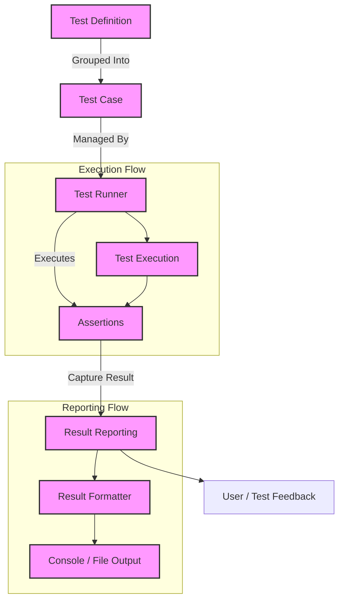

# Architecture Overview

GoogleTest is designed around a modular and extensible architecture that enables efficient definition, discovery, execution, and reporting of C++ tests. This page presents a visual and narrative exploration of its core architectural components, providing users with a clear mental model of the testing flow—from writing test cases to viewing results.

---

## Understanding GoogleTest Architecture

At its core, GoogleTest organizes tests in a hierarchical manner and facilitates streamlined test execution and results reporting. It leverages components such as test cases, test runners, assertions, and report generators to deliver a comprehensive testing experience.

### Core Components Explained

- **Test Cases**: Encapsulate a collection of related tests, usually grouped by functionality or feature.
- **Test Definitions**: The individual test functions written by users which exercise specific functionality.
- **Assertions**: The core elements within tests that validate expected behaviors and outcomes.
- **Test Runners**: Orchestrate discovery and execution of tests based on user commands or configurations.
- **Result Reporting**: Collects and formats the outcomes of executed tests to provide users with clear diagnostics.

By understanding how these pieces interact, users can grasp how GoogleTest executes their tests and why it produces the outputs they see.

### Why This Matters to You

Knowing GoogleTest's architecture helps you:

- Quickly diagnose why tests behave a certain way.
- Design your tests to integrate smoothly with the framework.
- Interpret test results effectively.
- Build upon or extend the framework with confidence.

---

## Visualizing the Architecture

The following diagram illustrates the flow from test definition through execution and reporting, highlighting critical components and their interactions.

---

## From Test Definition to User Feedback: Step-by-Step

1. **Write Test Definitions**: You author specific tests which include assertions to confirm expected behavior.

2. **Organize into Test Cases**: Related tests are grouped logically to enable modular execution.

3. **Initiate Test Runner**: GoogleTest's runner discovers all defined test cases and prepares them for execution.

4. **Execute Tests**: The runner runs each test in sequence or as configured, evaluating all assertions.

5. **Capture Results**: Each assertion's pass/fail state is recorded.

6. **Format and Report Results**: Summaries and detailed diagnostics are presented to you, facilitating rapid debugging.

---

## Practical Tips to Leverage GoogleTest Architecture

- **Group Related Tests Using Test Cases**: This helps manage large test suites and improves run-time filtering.

- **Use the Test Runner Options**: Customize which tests run and how output is reported (e.g., filtering, XML output).

- **Leverage Assertions for Clear Diagnostics**: Use GoogleTest's rich assertion macros to generate detailed failure messages helping you pinpoint issues.

- **Understand Test Execution Ordering**: Some features rely on predictable ordering.

- **Consult Architecture When Extending**: If integrating GoogleTest into custom environments or tooling, understanding these components facilitates smoother integration.

---

## Common Pitfalls and How to Avoid Them

- **Misplaced Test Cases**: Avoid scattering tests arbitrarily; group meaningfully for clearer test scopes.

- **Ignoring Test Runner Capabilities**: Using filters and runner flags can prevent slow or irrelevant test execution.

- **Overlooking Detailed Reports**: Utilize verbose modes and XML output for deeper insight when tests fail.

- **Assuming Internal Implementation Details**: Focus on the user-oriented flow and results. Internal changes may happen without affecting the overall test experience.

---

## Getting Started with This Architecture

To put this understanding into practice:

<Steps>
<Step title="Write Your First Test">
Start by writing a simple test within a test case using GoogleTest's macros.
</Step>

<Step title="Run Tests Using the Test Runner">
Use `RUN_ALL_TESTS()` or command line filters to control test execution.
</Step>

<Step title="Interpret Results">
Analyze console output or XML reports to understand test outcomes.
</Step>

<Step title="Explore Further">
Dive deeper into guides on writing assertions, test fixtures, and parameterized tests to expand your mastery.
</Step>
</Steps>

---

## Additional Resources

For a broader understanding of GoogleTest and how this architecture fits:

- [What is GoogleTest?](../../product-intro-value/what-is-googletest)
- [Core Features at a Glance](../../product-intro-value/core-features-at-a-glance)
- [Target Audience & Use Cases](../../product-intro-value/target-audience-and-use-cases)

These will provide context and practical examples complementing the architecture overview presented here.

---

## Summary

GoogleTest’s modular architecture, visualized and explained here, guides how test cases, runners, assertions, and reports work together to deliver a powerful testing experience. This foundation lets you write effective tests, understand their execution, and extend your testing strategy with confidence.

---

*This documentation page is part of the Architecture & Core Concepts section and connects foundational product introductions with practical test writing and execution insights.*

<Callout title="Note to Users">
This page focuses solely on the architectural flow of GoogleTest tests from definition through execution to results reporting. For mock object details and mocking specifics, see the Mocking & Behavior Verification guides and API references.
</Callout>
