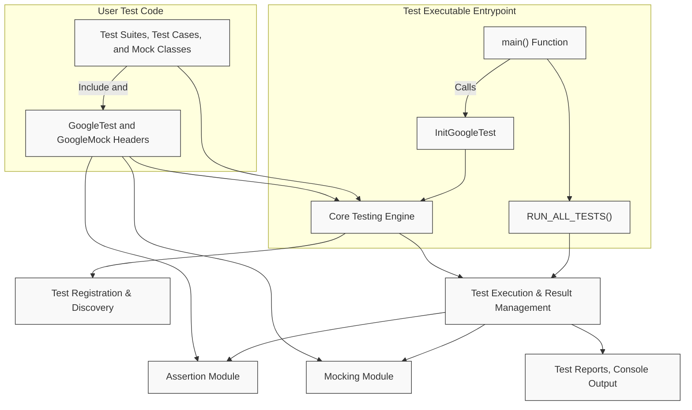

# System Architecture Overview

## Introduction

Understanding the architecture of the GoogleTest and GoogleMock frameworks is essential for effectively integrating and utilizing their powerful testing capabilities. This page provides a comprehensive, high-level view of their core components, how they interact, and the typical flow from writing test code to executing tests.

By focusing on the roles and relationships of major modules, this overview will help you visualize how GoogleTest and GoogleMock fit together and where your test code plugs in. No deep internal implementation details are covered here; rather, expect a clear conceptual guide crafted to align with typical user needs.

---

## Architecture at a Glance

GoogleTest and GoogleMock are designed to provide a seamless, extensible framework for C++ testing. Their architecture supports declarative test definition, rich assertions, mock object creation, and easy test execution.

At a high level, the structure looks like this:

- **User Test Code:** Your C++ test cases using GoogleTest macros and optionally GoogleMock mocks.
- **Core Testing Engine:** The engine that manages test registration, execution, and result reporting.
- **Assertion and Mocking Modules:** Provide assertion macros and mocking capabilities, respectively.
- **Main Entrypoint:** `RUN_ALL_TESTS()` invoked from a `main()` function, often provided by linking with `gtest_main` or `gmock_main`.





## Component Descriptions

### User Test Code

You write tests using GoogleTest macros (`TEST()`, `TEST_F()`) and optionally create mock classes and set expectations using GoogleMock macros (`MOCK_METHOD()`, `EXPECT_CALL()`). Your test code includes the GoogleTest and GoogleMock headers to access the framework's APIs.

### Core Testing Engine

The central engine performs test registration, manages test fixtures and suites, runs tests, aggregates results, and coordinates with assertion and mocking modules to verify test expectations and behaviors.

### Assertion Module

Contains assertion macros (`EXPECT_EQ()`, `ASSERT_TRUE()`, etc.) that verify conditions within your tests and report failures with detailed information, including file names and line numbers.

### Mocking Module

Offers functionality to define mock objects, specify expected calls and behaviors, verify interactions, and control mock function actions.

### Main Entrypoint

Typically, your test executable contains a `main()` function that calls `testing::InitGoogleTest(&argc, argv)` or `testing::InitGoogleMock(&argc, argv)`. This initializes the framework, parses command-line flags, and invokes `RUN_ALL_TESTS()` to execute all registered tests.

Google provides pre-built main implementations:

- **gtest_main:** Provides a `main()` that initializes and runs GoogleTest-only tests.
- **gmock_main:** Provides a `main()` that initializes GoogleMock (and GoogleTest) and runs all tests.

Linking with either library lets you start running tests with minimal boilerplate.

---

## Typical User Flow

1.  **Include Headers:** Add `#include <gtest/gtest.h>` for GoogleTest and `#include <gmock/gmock.h>` if using GoogleMock.

2.  **Write Test Cases:** Use `TEST()` or `TEST_F()` macros to define tests and optionally implement mock classes using `MOCK_METHOD()`.

3.  **Set Expectations (mocks):** Use `EXPECT_CALL()` and `ON_CALL()` to specify expected interactions with mock objects.

4.  **Build Executable:** Link your tests with `gtest` or `gmock` libraries, optionally with `gtest_main` or `gmock_main` to get main entrypoint.

5.  **Run Tests:** Execute the compiled binary. The main launcher initializes the framework and runs all tests.

6.  **Review Results:** Test results and assertion failures print to console or custom reporters.

---

## Practical Tips

- Link with `gmock_main` if using mocking features. It automatically initializes both GoogleMock and GoogleTest.

- Use `RUN_ALL_TESTS()` exactly once in your executable.

- For custom test executables, provide your own `main()` that calls `InitGoogleTest` or `InitGoogleMock`.

- Assertions and mock expectations seamlessly integrate; assertion failures bubble up through the test execution flow.

- Manage test suites and fixtures by grouping related tests in classes and leveraging `TEST_F()`.


## Troubleshooting Common Issues

- **Tests not running:** Ensure your test executable calls `RUN_ALL_TESTS()`.

- **Mock expectations not verified:** Verify that mock objects are properly destroyed or explicitly verify expectations for heap-allocated mocks.

- **Link errors on missing `main()` function:** Link with `gtest_main` or `gmock_main` or provide your own `main()`.

- **Command-line flags not recognized:** Always call `InitGoogleTest(&argc, argv)` before running tests to allow proper flag processing.

---

## Additional Resources

- [Getting Started: Setting Up GoogleTest and GoogleMock](https://github.com/google/googletest/blob/main/docs/guides/getting_started/project_setup.md)

- [Writing Tests with GoogleTest Primer](https://github.com/google/googletest/blob/main/docs/primer.md)

- [GoogleMock Documentation and Cookbook](https://google.github.io/googletest/gmock_cook_book.html)

---

## Summary

This page has introduced the big-picture architecture of GoogleTest and GoogleMock, clarifying the roles of user test code, core engine, mocking and assertion modules, and typical test executable setup. Armed with this understanding, you will better grasp where your code integrates and how test execution proceeds from initialization to reporting.

---

{/* Source link to the googlemock/src/gmock_main.cc for main launcher example */}
### Example main() Function (from `gmock_main.cc`)

```cpp
#include <iostream>
#include "gmock/gmock.h"
#include "gtest/gtest.h"

int main(int argc, char** argv) {
  std::cout << "Running main() from gmock_main.cc\n";
  // InitGoogleMock also initializes GoogleTest.
  testing::InitGoogleMock(&argc, argv);
  return RUN_ALL_TESTS();
}
```

---

### Response Diagram

The Mermaid diagram above visually encodes this architecture to anchor your conceptual understanding.

---