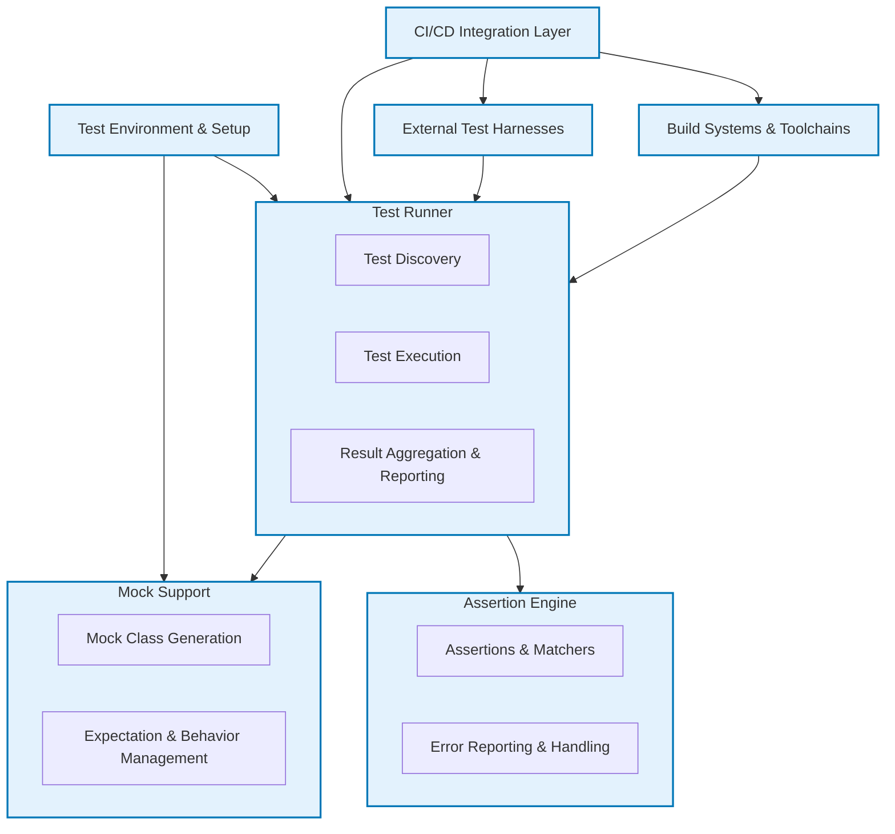

# System Architecture Overview

## Understanding GoogleTest's Modular Architecture

GoogleTest is designed with a modular architecture that seamlessly integrates various components essential for efficient C++ testing. This architecture allows the framework to deliver robust assertion capabilities, flexible mock support via GoogleMock, and a powerful test runner, all while ensuring extensibility and smooth integration with continuous integration and deployment (CI/CD) pipelines.

### Key Components Diagram

### How It Works

- **Assertion Engine:** Provides expressive assertions and matchers to verify test expectations precisely. It takes care of error reporting and failure handling with detailed, context-rich messages that include stack traces and argument values.

- **Mock Support:** Facilitated by GoogleMock, this module enables the creation of mock classes, setting of expectations, and behavior modeling. It tracks call sequences, argument matching, and verifies interactions, making tests declarative and interaction-focused.

- **Test Runner:** Discovers tests automatically, runs them, and aggregates the results. It coordinates the lifecycle of tests with the assertion engine and mocking framework to provide a seamless testing experience.

- **Test Environment:** Manages setup and teardown procedures, allowing for customization and isolation of test fixtures and environments.

- **CI/CD Integration Layer:** Designed for continuous integration scenarios, this layer interfaces with build systems and external test harnesses, so GoogleTest can fit effortlessly into various development pipelines.

- **Build Systems & Toolchains:** GoogleTest embraces standard build systems, enabling scalable and portable builds across platforms.

- **External Test Harnesses:** The framework supports integration with third-party test runners and harnesses, allowing flexible test orchestration beyond standalone execution.

## Benefits of the Modular Architecture

- **Extensibility:** Each component is designed to be extended or substituted. Users can customize assertions, add new matchers, or integrate with other testing tools as needed.

- **Scalability:** Modular design means components can evolve independently, maintaining performance and scalability critical for large codebases.

- **Maintainability:** Decoupled components make debugging, updating, or improving one area easier without unintended side effects.

- **Easy Integration:** Simplified integration with CI/CD processes and build tools accelerates automated testing workflows.

## Real-World Usage Scenario

Imagine a complex software project:

1. Developers write tests using GoogleTest and GoogleMock to verify both state and interaction-based behaviors.
2. The Test Runner automatically discovers all tests in the project at build time.
3. Mock Support verifies complex inter-module calls, ensuring components interact as expected.
4. Assertions validate output, ensuring correctness.
5. The CI/CD Integration Layer reports test outcomes back to the build pipeline, triggering alerts or further actions.

This flow illustrates how GoogleTest’s architecture promotes efficient and reliable testing from development through deployment.

## Integration Tips & Best Practices

- **Set Up Mock Expectations Early:** Define mock behaviors before exercising tests to leverage GoogleMock's verification.

- **Leverage ON_CALL for Default Behaviors:** Use `ON_CALL` to define default mock actions without strict call count expectations.

- **Organize Tests and Mocks Clearly:** Keep mock definitions close to their use; use sequences and partial orders to specify call order precisely.

- **Customize Assertions:** Extend the assertion engine with custom matchers suited to your domain to improve expressiveness.

- **Optimize CI Usage:** Use GoogleTest's filters and timestamps for selective test runs, integrating cleanly with CI tools.

## Next Steps

To get started with GoogleTest's modular components:

- Visit the [What Is GoogleTest?](../introduction-core-value/what-is-googletest) page to understand the foundation.
- Explore [Defining and Using Mock Classes](../../guides/mocking-in-action/defining-mocks) to learn how the mocking component works in practice.
- Consult [Setting Expectations and Verifying Interactions](../../guides/mocking-in-action/setting-expectations) for deep dives into mocking usage.
- Review [Installation and Setup](../../guides/getting-started/install-and-setup) to configure your environment.

By mastering these areas, you'll harness the full power of GoogleTest's modular architecture for your C++ testing needs.

---

<Note>
This overview focuses only on the system’s architecture as a whole. For detailed usage of individual components, please refer to their dedicated sections in the documentation.
</Note>