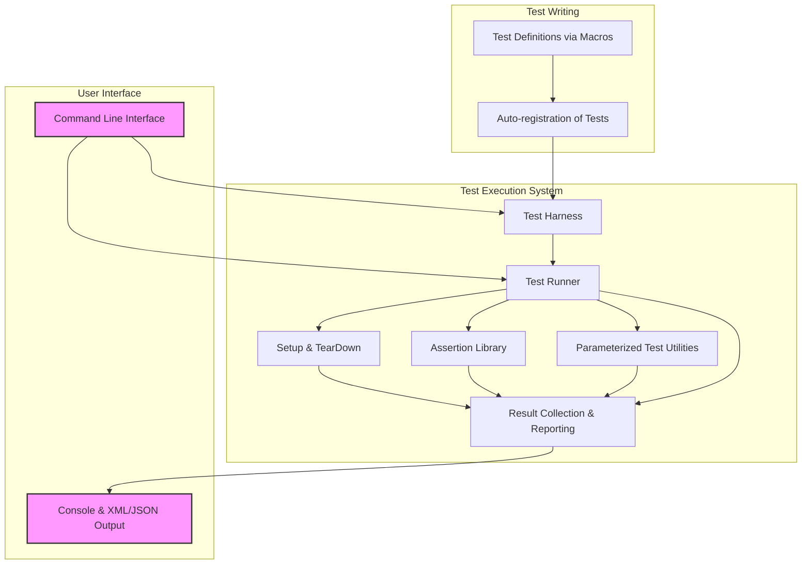

# GoogleTest System Architecture

Explore a high-level view of the GoogleTest ecosystem through an intuitive system architecture overview. This documentation page reveals how the core modules of GoogleTest—such as test harnesses, test runners, assertion libraries, and parameterized test utilities—work together to enable developers to write reliable, scalable, and maintainable C++ tests.

---

## Understanding the GoogleTest Ecosystem

GoogleTest is designed as a cohesive yet modular testing framework that streamlines the process of discovering, running, and validating C++ tests. Its architecture elegantly balances simplicity with extensibility, creating a developer-friendly environment that adapts to projects of any scale.

At its core, GoogleTest is composed of several essential components working in concert:

- **Test Harness**: The main driver that manages running tests, collecting results, and reporting outcomes.
- **Test Suites and Test Cases**: Organizational structures that group and isolate tests, keeping them focused and manageable.
- **Assertion System**: A comprehensive library providing expressive and robust assertions that facilitate precise verification of expected behaviors.
- **Parameterized Test Utilities**: Support for running tests with varying parameters to enable broad coverage with minimal boilerplate.

This architecture fosters the creation of independent, repeatable tests that can be executed in isolation or in bulk, resulting in efficient development cycles and quality assurance.

## High-Level Workflow

The experience of using GoogleTest follows a clear user-centric flow:

1. **Define Tests:** Developers write test cases and suites using macros like `TEST()`, `TEST_F()`, and `TEST_P()`.
2. **Register Tests:** GoogleTest's system automatically registers tests as part of program initialization.
3. **Initialize Framework:** The test harness initializes with `InitGoogleTest()`, parsing CLI arguments for filtering and configuration.
4. **Run Tests:** `RUN_ALL_TESTS()` executes all registered tests, managing setup and teardown.
5. **Collect Results:** Each test outcome is captured with detailed results including assertions.
6. **Report:** Final results are presented on the console or via XML/JSON outputs.

This flow ensures that users stay focused on writing tests while GoogleTest manages lifecycle complexities.

## System Architecture Diagram

## Key Architectural Components Explained

### 1. Test Harness
The central engine that manages the overall test lifecycle. It initializes the framework, parses command-line options including filters and flags, invokes the test runner, and collates results from test runs.

**User Benefit:** You get a seamless experience where you only call `InitGoogleTest()` and `RUN_ALL_TESTS()` without worrying about the underlying complexity.

### 2. Test Suites and Test Cases
Tests are organized into suites which correspond to logical modules or classes. Suites consist of multiple individual tests, each running independently to ensure isolation and repeatability.

**User Benefit:** Organizing tests logically increases clarity and maintainability. Running individual suites or tests can speed debugging.

### 3. Assertion Library
GoogleTest offers a rich set of assertion macros such as `EXPECT_EQ`, `ASSERT_TRUE`, and `EXPECT_THROW`. These allow precise verification of expected states and behaviors.

**User Benefit:** Clear, readable assertions with detailed error messages empower you to quickly pinpoint failures.

### 4. Parameterized Test Utilities
Support for parameterized tests allows you to run the same test logic with different inputs by simply defining a test fixture and parameter generator.

**User Benefit:** You maximize test coverage with minimal duplicated code.

### 5. Reporting and Output
The result collector gathers detailed success/failure states, supporting output formats like console output and XML for integration with CI systems.

**User Benefit:** Easily understand test results and integrate with tools for continuous quality.

## Why This Architecture Matters

- **Modularity:** Each component can evolve independently, enabling feature enhancement without disrupting existing workflows.
- **Extensibility:** Custom assertions, new test formats, and integrations slot in naturally.
- **Robustness:** Isolation and repeatability minimize flaky tests.
- **User Focus:** Developers write expressive tests, while GoogleTest orchestrates test execution and results.

## Getting Started Preview

To experience the power of GoogleTest's system architecture, begin with the following steps:

<Steps>
<Step title="Initialize GoogleTest">
Call `testing::InitGoogleTest(&argc, argv);` in your program's `main()` function.
</Step>
<Step title="Write Tests">
Use macros such as `TEST()`, `TEST_F()`, or `TEST_P()` to write your tests organized by suites or fixtures.
</Step>
<Step title="Run Tests">
Call `RUN_ALL_TESTS()` to execute all registered tests and collect results.
</Step>
</Steps>

Then, explore detailed concepts around writing assertions, organizing tests, and using parameterized utilities in the related documentation.

---

## Related Documentation

- [What is GoogleTest?](../introduction-core-value/what-is-googletest.md) – Conceptual introduction.
- [Product Value Proposition](../introduction-core-value/product-value-prop.md) – Benefits and features.
- [GoogleTest Primer](../../primer.md) – Quickstart guide to test writing.
- [Advanced Architecture Concepts](../architecture-concepts/core-concepts-glossary.md) – Deep dive into architecture.

For practical usage, consult the GoogleTest [User's Guide](../../index.md) and [Mocking Reference](../../reference/mocking.md) for testing doubles.

---

Explore this page as your gateway to understanding how GoogleTest combines modular subsystems into an elegant whole, making C++ testing both powerful and approachable.
