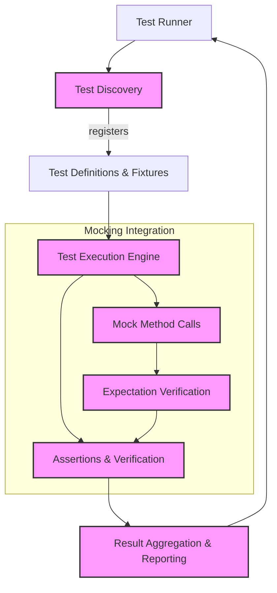

# Framework Architecture

Dive into a visual and narrative overview of GoogleTest's system architecture. This page explains how test discovery, execution, and assertions are managed in GoogleTest, and how GoogleMock seamlessly integrates to provide powerful mocking capabilities for C++ testing.

---

## Understanding GoogleTest's System Architecture

GoogleTest provides a robust, modular framework designed to streamline C++ testing. This architecture manages discovering tests in your codebase, executing them efficiently, and reporting their results accurately. It also offers a seamless integration point for GoogleMock to extend the framework with mocking capabilities.

At the heart of GoogleTest's design are the components responsible for:

- **Test Discovery:** Automatically detecting tests declared across files and modules.
- **Test Execution:** Running tests, managing lifecycle events, and handling setup/teardown.
- **Assertions and Reporting:** Capturing test outcomes, including success, failures, and detailed diagnostics.

## Core Components and Their Flow

The typical flow begins with the test runner launching the test executable. GoogleTest then:

1. **Discovers Registered Tests:** Using static registration, tests declared with `TEST()` and `TEST_F()` macros are collected during program startup.
2. **Executes Tests Sequentially:** The framework invokes each test, wrapping it with fixture setup and teardown if specified.
3. **Performs Assertions:** Assertions within tests evaluate conditions, and failures trigger detailed reports without stopping test execution.
4. **Aggregates Results:** Outcome summaries are presented for all tests run, helping users quickly identify issues.

This flow creates a consistent and efficient mechanism to validate C++ code correctness.

## How GoogleMock Integrates

GoogleMock extends GoogleTest to provide:

- Mock objects for interfaces and classes
- Expectation setting and verification
- Rich matchers and actions for fine-grained control

Behind the scenes, GoogleMock plugs into GoogleTest's execution cycle to intercept mocked method calls, verify interactions, and add mock-specific reports alongside normal test results.

The integration is designed such that users can write test cases mixing GoogleTest assertions with GoogleMock expectations naturally.

## Visual Overview of Component Interaction

## Component Details

### Test Discovery

- **Purpose:** Automatically identify all tests in the executable.
- **Mechanism:** During static initialization, test macros create descriptors registered in a global registry.
- **Benefit:** No manual test listing needed; new tests are picked up automatically.

### Test Execution

- **Purpose:** Runs individual tests, wrapping fixture setup and teardown.
- **Features:** Supports parameterized tests, death tests, and typed tests.
- **Benefit:** Provides a controlled and isolated environment for each test ensuring clean state.

### Assertions and Verification

- **Purpose:** Evaluate conditions and verify expectations (including from GoogleMock).
- **Mechanism:** Records failure info, including source location and messages, without terminating full test runs.
- **Benefit:** Enables detailed diagnostics while continuing test suite execution.

### Reporting

- **Purpose:** Summarizes, outputs, and, if needed, formats test results for various consumers.
- **Customization:** Support for XML output and integration with continuous integration systems.

### Mocking with GoogleMock

- **Mock Object Registry:** Tracks all mock objects and their associated methods.
- **Call Interception:** When a mock method is called, GoogleMock intercepts it to check expectations.
- **Thread Safety:** Internal global mutex protects state, enabling multithreaded test execution.

## Why This Architecture Matters

GoogleTest's architecture balances automated test management with flexibility and extensibility. Users benefit from:

- **Easy Test Integration:** Thanks to automatic discovery.
- **Robust Verification:** Clear separation between execution and verification
- **Extensibility:** Through GoogleMock and other add-ons without complexity.

Consequently, users can scale testing from simple to complex scenarios fluidly.

## Tips for Navigating This Architecture

- **Use the macros (`TEST`, `TEST_F`) as intended; your tests become auto-registered.**
- **Leverage GoogleMock's capabilities for dependency isolation by defining mocks in your tests.**
- **Understand test lifecycle: fixtures setup before running each test, teardown after.**
- **If you encounter issues, use verbose flags (`--gmock_verbose`) to trace execution flow and mock behavior.**

## Next Steps

- Explore the [GoogleTest Overview](overview/product-intro/what-is-googletest) to understand the product’s scope.
- Dive into [Writing Your First Test](getting-started/first-test/writing-basic-test) to see architecture in action.
- Learn about the [Mocking Basics](guides/mocking-and-mocking-patterns/mocking-basics) to harness GoogleMock’s power.

---

<Info>
This page focuses specifically on the overarching framework architecture behind GoogleTest, illustrating how major components interact. For more detailed information on mocking specifics and usage patterns, refer to the [gMock Cookbook](docs/gmock_cook_book.md) and [Mocking Reference](docs/reference/mocking.md).
</Info>

<Source url="https://github.com/google/googletest" paths={[{"path": "googlemock/src/gmock-spec-builders.cc", "range": "1-420"}]} />

