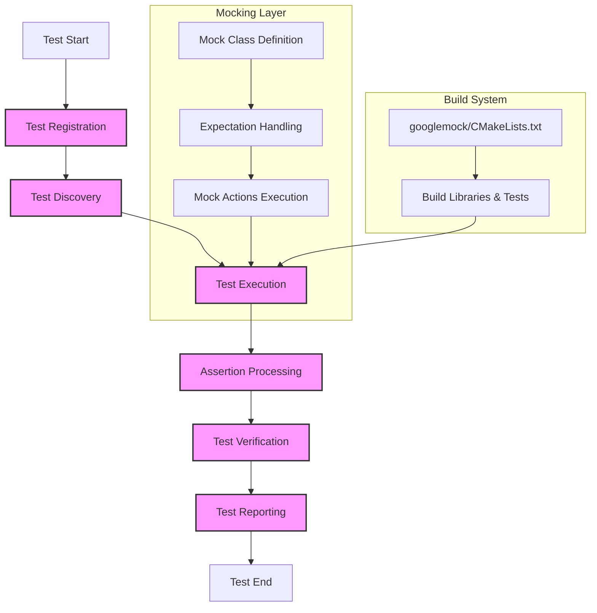

# Core Components & Key Files

Welcome to an essential guide on the primary files and modules that power **GoogleTest** and **GoogleMock (gMock)**. This page equips you with clear insight into the core codebase elements responsible for test registration, assertion processing, mock management, and execution orchestration. Understanding these components will empower you to navigate, extend, or debug the framework confidently.

---

## Introduction

GoogleTest and GoogleMock collectively deliver a robust C++ testing and mocking framework. To effectively utilize or enhance these tools, it’s important to recognize the foundational files and their roles. This guide walks you through the main source files and configurations that define how tests are discovered, executed, verified, and how mocks behave.

Whether you are:

- A contributor looking to extend the framework,
- An advanced user debugging test failures,
- Or someone aiming to customize the test infrastructure,

knowing where key logic resides is crucial.

---

## Key Source Files & Modules

### 1. Test Registration & Execution

Tests must be registered and later discovered during test runs. The following files facilitate these core flows:

- **Test Discovery and Registration:**
  - Implemented through centralized code that collects test cases and test methods, enabling automatic discovery without manual listing.

- **Test Execution:**
  - Logic to launch tests, capture results, and manage test lifecycles.

### 2. Assertion Handling

Assertions are the heart of validating test outcomes. Core files manage:

- Processing of assertion macros,
- Reporting failures with detailed messages and stack traces,
- Supporting rich assertion types essential for robust testing.

### 3. Mocking Infrastructure (GoogleMock)

GoogleMock integrates with GoogleTest providing sophisticated mocking capabilities:

- Mock class generation and code expansion,
- Management of expectations, matchers, and actions,
- Support for method call sequencing and verification,
- User-friendly macros and utilities to reduce boilerplate.

### 4. Test Entry Points

The framework provides main entry points and test runners:

- Customizable `main()` implementations,
- Integration hooks for various build and execution systems,
- Support for test filtering, sharding, and ordering.

---

## Build Configuration and Utilities

### CMake Build Script

The `googlemock/CMakeLists.txt` file orchestrates the community-supported CMake build system. While the maintainers do not internally rely on it, it provides:

- Definitions for building GoogleMock and GoogleTest libraries,
- Build options to enable or disable tests,
- Setup for hermetic and clean compilation,
- Rules for installing libraries and headers,
- Support for shared/static builds,
- Test targets with comprehensive options for test execution.

This script serves as the blueprint for building and integrating the framework into your projects using CMake.

---

## How This Fits Into Your Journey

This page acts as a foundational compass to GoogleTest and GoogleMock’s internal ecosystem. As you traverse the documentation landscape, use this knowledge to:

- Quickly locate source code relevant to your current task,
- Understand the separation of concerns within the framework,
- Dive into advanced topics like writing mocks, defining expectations, and controlling test flows with confidence.

Subsequently, you might find it beneficial to explore:

- [System Architecture Overview](/overview/architecture-concepts/system-architecture) — to grasp overall design principles,
- [gMock for Dummies](docs/gmock_for_dummies.md) — a tutorial simplifying mock usage,
- [Mocking Reference](/api-reference/mocking-framework/expectations-actions) — for deep technical understanding of mocking mechanisms,
- [Writing Your First Test](/guides/core-testing-workflows/writing-your-first-test) — to translate this infrastructure knowledge into practice.

---

## Practical Tips

- While this guide sketches the big picture, refer to specific files such as `googlemock/CMakeLists.txt` for concrete build and test execution configurations.
- Keep your test dependencies minimal to ensure build efficiency.
- Use the provided macros and best practices within mocking guides for effective mock class management.
- Remember that GoogleTest and GoogleMock share a tightly integrated environment; modification in core components can affect mock capabilities.

---

## Summary Diagram

To visualize how the core components interact,
consider the following architecture flow:


```

---

## Troubleshooting & Contributions

For extension or troubleshooting:

- Focus on `googlemock/CMakeLists.txt` for build issues.
- Use logging and verbose flags to inspect test discovery and mock behavior.
- Review how expectations and matchers are defined through public interfaces.
- Engage with community forums or refer to the developer guides for contribution standards.

---

## Next Steps

After mastering the core architecture and file roles:

- Proceed to in-depth mock usage tutorials ([gMock Cookbook](docs/gmock_cook_book.md)) to harness advanced mocking features.
- Explore test writing and assertions more deeply in [Writing Your First Test](/guides/core-testing-workflows/writing-your-first-test).
- Customize test builds using the CMake configuration example provided.

---

Happy testing and mocking with GoogleTest and GoogleMock!

---

## References

- [GoogleTest Official Repository](https://github.com/google/googletest)
- [gMock Cookbook](docs/gmock_cook_book.md)
- [Mocking Reference](docs/reference/mocking.md)
- [GoogleTest Core Architecture](https://github.com/google/googletest/tree/main/googletest)

---

<Info>
This page is part of the Core Architecture & Concepts group in the GoogleTest documentation.
It complements the System Architecture Overview and guides on writing tests and using mocks.
</Info>
