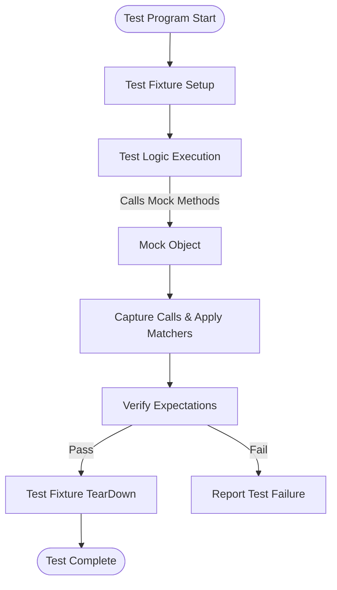

# Core Concepts & Terminology

Welcome to the foundational glossary of terms essential for mastering GoogleTest and GoogleMock. This page demystifies core domain-specific language — such as test fixtures, assertions, matchers, mocks, death tests, and parameterized tests — equipping you with fluent understanding and effective communication skills needed to navigate the broader testing ecosystem.

---

## Test Fixture

A **test fixture** is the shared setup and teardown context for a group of related tests, encapsulated in a class derived from `testing::Test`. It allows tests within the same suite to reuse common data structures and helper functions, reducing code duplication and making tests easier to maintain.

### Why fixtures matter?

- Isolates tests by providing fresh objects per test invocation.
- Enables setup (`SetUp()`) and cleanup (`TearDown()`) code to run automatically before and after each test.
- Groups logically related tests and fosters code reuse.

### Example
```cpp
class QueueTest : public testing::Test {
 protected:
  QueueTest() {  // Setup code
    q1_.Enqueue(1);
    q2_.Enqueue(2);
    q2_.Enqueue(3);
  }

  Queue<int> q0_;  // empty queue
  Queue<int> q1_;  // one element
  Queue<int> q2_;  // two elements
};

TEST_F(QueueTest, IsEmptyInitially) {
  EXPECT_EQ(q0_.size(), 0);
}

TEST_F(QueueTest, DequeueWorks) {
  int* val = q1_.Dequeue();
  ASSERT_NE(val, nullptr);
  EXPECT_EQ(*val, 1);
  delete val;
}
```


## Assertion

An **assertion** is a statement that checks a condition during a test. GoogleTest provides macros such as `EXPECT_*` and `ASSERT_*` to verify program behaviors.

- `EXPECT_*`: Fail the current test but continue execution to check further assertions.
- `ASSERT_*`: Fail and abort the current test function immediately to prevent undefined behavior.

Assertions report detailed error messages on failure, including file and line number.

### Example
```cpp
EXPECT_EQ(actual_value, expected_value) << "Custom failure message";
ASSERT_TRUE(pointer != nullptr);
```


## Matcher

A **matcher** specifies the criteria that arguments passed to mock methods must satisfy. They enable flexible validation beyond exact values — supporting patterns, predicates, and composite conditions.

### Key properties

- Matchers can be combined (e.g., `AllOf(...)`, `AnyOf(...)`).
- Matchers are typed and checked by the compiler.
- Wildcard matcher `_` matches any argument.

### Example
```cpp
EXPECT_CALL(mock_obj, Foo(Ge(5)));   // argument >= 5
EXPECT_CALL(mock_obj, Bar(_, NotNull()));  // second argument is not NULL
```


## Mock Object & Mock Method

A **mock object** is a user-defined class (usually derived from an interface or base class) that uses gMock's `MOCK_METHOD` macros to simulate behavior and record interactions during testing.

- **Mock method**: A method made mockable using `MOCK_METHOD` macro to intercept calls, specify behaviors, and verify calls.

Mock objects allow you to:

- Set precise expectations on method calls.
- Define default or conditional behavior via `ON_CALL` or `EXPECT_CALL`.
- Validate interactions in isolation without relying on real dependencies.

### Example
```cpp
class MockFoo : public Foo {
 public:
  MOCK_METHOD(int, Add, (int a, int b), (override));
};

MockFoo mock;
EXPECT_CALL(mock, Add(5, _))
    .WillOnce(Return(10));
int result = mock.Add(5, 3);  // Returns 10
```


## Death Test

**Death tests** are special tests in GoogleTest that verify your code crashes in expected ways under certain conditions.

- Useful for testing error handling and checking for fatal assertions.
- Runs the test body in a separate process and checks the output and exit status.

### Usage
```cpp
EXPECT_DEATH({ abort(); }, "Abort message");
```

### Notes
- Requires platform support for process forking or spawning.
- Should be used carefully to maintain test isolation and speed.


## Type-Parameterized Tests

These tests allow you to write a generic test template that runs against multiple types.

### Why use them?

- Promote code reuse among tests with similar logic but different types.
- Avoid code duplication for template or generic programming scenarios.

### Defining
```cpp
template <typename T>
class StackTest : public ::testing::Test {
  // shared test fixture and helpers
};

using MyTypes = ::testing::Types<int, double, std::string>;
TYPED_TEST_SUITE(StackTest, MyTypes);

TYPED_TEST(StackTest, IsEmptyInitially) {
  TypeParam stack;
  EXPECT_TRUE(stack.empty());
}
```


## Value-Parameterized Tests

Value-parameterized tests allow you to feed sets of values as parameters to a test, enabling running the same test logic for different inputs.

### Benefits

- Simplifies testing with multiple input variations.
- Integration with typed assertions on parameterized data.

### Defining
```cpp
class IsEvenTest : public ::testing::TestWithParam<int> {};

TEST_P(IsEvenTest, HandlesEvenNumbers) {
  int n = GetParam();
  EXPECT_EQ(n % 2, 0);
}

INSTANTIATE_TEST_SUITE_P(Evens, IsEvenTest, ::testing::Values(2, 4, 6, 8));
```


## Summary Diagram: Testing and Mocking Workflow



---

## Tips & Best Practices

- Use **TEST_F()** when your tests share common setup/teardown in the test fixture.
- Use **EXPECT_*** macros to allow multiple assertion failures to be reported per test.
- Use **MATCHER** macros and built-in matchers for expressive argument verification.
- Prefer **ON_CALL** for setting default mock behaviors and **EXPECT_CALL** only when verifying call expectations.
- Use **NiceMock** or **StrictMock** wrappers to control the level of strictness on uninteresting calls.
- Separate your tests clearly into suites that reflect code structure and behaviors.
- Use parameterized tests to avoid repetition for generic behaviors.


## Troubleshooting Common Misunderstandings

<AccordionGroup title="Common Confusions">
<Accordion title="Difference between EXPECT_CALL and ON_CALL">
`ON_CALL` defines what a mock method does, without expecting any calls. `EXPECT_CALL` sets expectations that a mock method will be called in a certain way.
</Accordion>
<Accordion title="What is an Uninteresting Call?">
A method call with no matching `EXPECT_CALL` is uninteresting. It does not cause test failure but may generate a warning. Use `NiceMock` to suppress warnings or add an explicit catch-all expectation.
</Accordion>
<Accordion title="When to use TEST vs TEST_F?">
Use `TEST` for simple tests with no fixture dependencies; use `TEST_F` when you want to reuse setup/teardown logic encapsulated in a fixture class.
</Accordion>
</AccordionGroup>


## Related Concepts

- **Matchers Reference:** Discover the wide array of built-in and custom matchers available.
- **Mocking Reference:** Detailed syntax and semantics of mock macros like `MOCK_METHOD`, `EXPECT_CALL`, and `ON_CALL`.
- **Assertions Reference:** Comprehensive guide on various assertion macros.

---

For a practical introduction, see the [GoogleTest Primer](https://github.com/google/googletest/blob/main/docs/primer.md). For mock creation and best practices, refer to the [Mocking Reference](https://github.com/google/googletest/blob/main/docs/reference/mocking.md) and the [gMock Cookbook](https://github.com/google/googletest/blob/main/docs/gmock_cook_book.md).


---

#### Source Code
For concrete examples and definitions, relevant code can be found in:

- `googlemock/include/gmock/gmock.h`
- `docs/primer.md` (for foundational concepts)

---

*Empowered with these definitions, you are ready to navigate the rest of the GoogleTest documentation with confidence.*