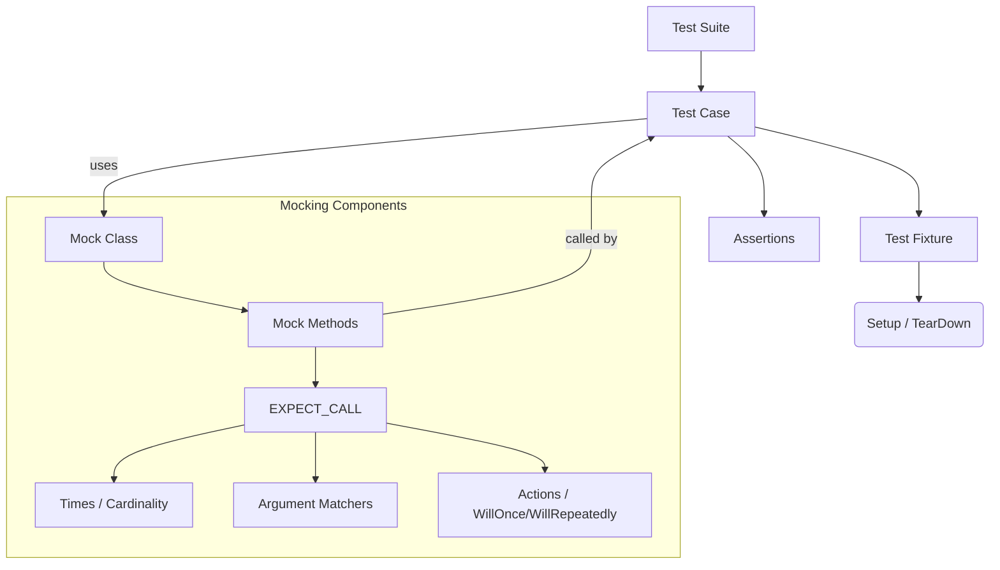

# Core Concepts and Terminology

Understanding the fundamental concepts and terminology is essential for effectively using GoogleTest and GoogleMock. This page defines the essential terms every user should know — including test cases, test suites, assertions, fixtures, mocks, expectations, actions, matchers, cardinalities, and parameterization — helping you flatten the learning curve and eliminate confusion. Each concept is tied to the underlying files and components to provide clarity and guidance.

---

## Test Cases and Test Suites

- **Test Case**: The smallest unit of test, a single function that contains assertions to verify the behavior of the code under test.
- **Test Suite**: A collection of related test cases grouped together logically.

Together, they organize tests and help you maintain structured and scalable test code.

## Assertions

Assertions are conditions checked within test cases to verify that the code behaves as expected. GoogleTest provides a rich set of assertions (e.g., `EXPECT_EQ`, `ASSERT_TRUE`) that stop test execution on failure or allow continuation.

## Fixtures

A test fixture provides a context for tests, including setup and teardown code that runs before and after each test. This helps avoid duplication and prepares consistent environments for tests.

## Mocks and Mock Objects

**Mocks** are specialized test doubles that simulate the behavior of real objects. GoogleMock helps you create mock classes based on interfaces or virtual classes, allowing you to:

- Specify which methods are expected to be called
- Define how many times methods should be called
- Control method behavior and outcomes

Mocks allow detailed interaction testing, verifying that your system calls collaborators correctly.

## Expectations

Expectations represent the rules and requirements set on mock methods, such as the number of times a method should be called, in what order, with what arguments, and what behavior it should exhibit. GoogleMock provides macros and syntax such as `EXPECT_CALL` to express these.

## Actions

Actions define what happens when a mocked method is invoked. They control the results your mock returns or side effects it performs, such as returning fixed values, invoking callbacks, or modifying arguments.

## Matchers

Matchers specify argument constraints on mock method calls. They let you define complex matching logic beyond exact equality, such as ranges, predicates, or even container contents. The underscore (`_`) matcher indicates a wildcard matching any value.

Some examples:

```cpp
EXPECT_CALL(mock, Method(42, _));  // Expect first argument 42, second any value
EXPECT_CALL(mock, Method(Gt(5), Le(10)));  // Arguments greater than 5 and less or equal 10
```

## Cardinalities

Cardinalities specify how many times a mock method should be invoked. GoogleMock supports:

- `AnyNumber()` — zero or more times
- `AtLeast(n)` — n or more times
- `AtMost(n)` — up to n times
- `Between(m, n)` — between m and n times, inclusive
- `Exactly(n)` or `n` — exactly n times

This flexibility helps match realistic usage patterns without over-specifying the tests.

## Parameterization

GoogleTest supports parameterized tests and typed tests, allowing you to run the same test logic with different inputs. This promotes test reuse and improves coverage.

## How These Concepts Fit Together



This flow captures the user intent: within a test suite, test cases organize assertions and fixtures. For interaction-based testing, mock classes enable detailed expectations and behavior control.

---

## Practical Tips and Best Practices

- **Define Virtual Interfaces** for components you want to mock. Avoid mocking concrete classes where possible.
- **Use `EXPECT_CALL` sparingly** to specify only behavior that tests care about.
- Apply **Matchers** flexibly – use wildcards `_` unless you need exact argument verification.
- Be mindful of **call order** using `InSequence` or `After` clauses where necessary.
- Use **`NiceMock`** to suppress warnings on uninteresting calls during development.
- Use **`StrictMock`** only when you want to detect unexpected calls immediately.
- Use **`RetiresOnSaturation()`** to retire expectations to avoid conflicts with repeated calls.

---

## Common Pitfalls

- Forgetting to make destructors virtual on interfaces to be mocked.
- Over-specifying expectations leading to brittle tests.
- Expectation declarations after the mock method is invoked cause undefined behavior.
- Ignoring default actions by not configuring `ON_CALL` for methods without expectations.

---

## Where to Learn More

- [gMock for Dummies](../docs/gmock_for_dummies.md) — beginner-friendly introduction
- [gMock Cookbook](../docs/gmock_cook_book.md) — practical recipes
- [Mocking Reference](../docs/reference/mocking.md) — detailed API
- [Matchers Reference](../docs/reference/matchers.md) — argument matching
- [Actions Reference](../docs/reference/actions-and-responses.md) — method behaviors

---

## Summary

This page defines core testing and mocking terms to help you understand and use GoogleTest and GoogleMock effectively. By mastering these concepts, you'll write clearer tests, leverage mocks efficiently, and diagnose test failures with confidence.

---

<Info>
For comprehensive navigation, visit the [Core Concepts and Terminology page](https://github.com/google/googletest/tree/main/docs/overview/architecture-concepts/core-concepts-terminology.md).
</Info>

<AccordionGroup title="Related Concepts">
<Accordion title="gMock Cheat Sheet">
A quick reference for common mocking macros, matchers, actions, and cardinalities: [gmock_cheat_sheet.md](../docs/gmock_cheat_sheet.md).
</Accordion>
<Accordion title="Mocking Basics">
Detailed explanations on defining mocks, setting expectations, and controlling mock behavior: [Mocking Reference](../docs/reference/mocking.md).
</Accordion>
<Accordion title="Using Mock Objects">
Step-by-step guides and examples for building and using mocks in your tests: [gMock for Dummies](../docs/gmock_for_dummies.md) and [gMock Cookbook](../docs/gmock_cook_book.md).
</Accordion>
</AccordionGroup>

---

## Getting Started Preview

To put these concepts into practice, start with creating a simple mock class and writing tests that set expectations:

<Steps>
<Step title="Create a Mock Class">
Define a subclass that mocks your interface by annotating virtual methods with `MOCK_METHOD`.
</Step>
<Step title="Set Expectations">
Use `EXPECT_CALL` to specify how your code is expected to call the mock.
</Step>
<Step title="Write Test Logic">
Run the code under test, exercising the mock, and verify assertions.
</Step>
<Step title="Run and Debug">
Use verbose flags like `--gmock_verbose=info` to debug failing expectations.
</Step>
</Steps>

Refer to the [Getting Started guides](../guides/getting-started/basic-test-workflow.md) to build your first tests.

---

<Check>
Ensure all interfaces to be mocked have virtual destructors.
Set expectations before invoking mock methods.
Use matchers thoughtfully to avoid brittle tests.
</Check>

<Warning>
Do not assume internal technical details; base your tests and expectations solely on observable user interactions described here.
</Warning>

---

<Source url="https://github.com/google/googletest" branch="main" paths={[{"path": "docs/gmock_for_dummies.md", "range": "1-200"},{"path": "docs/gmock_cook_book.md", "range": "1-300"},{"path": "docs/gmock_cheat_sheet.md", "range": "1-200"},{"path": "docs/reference/mocking.md", "range": "1-800"}]} />
