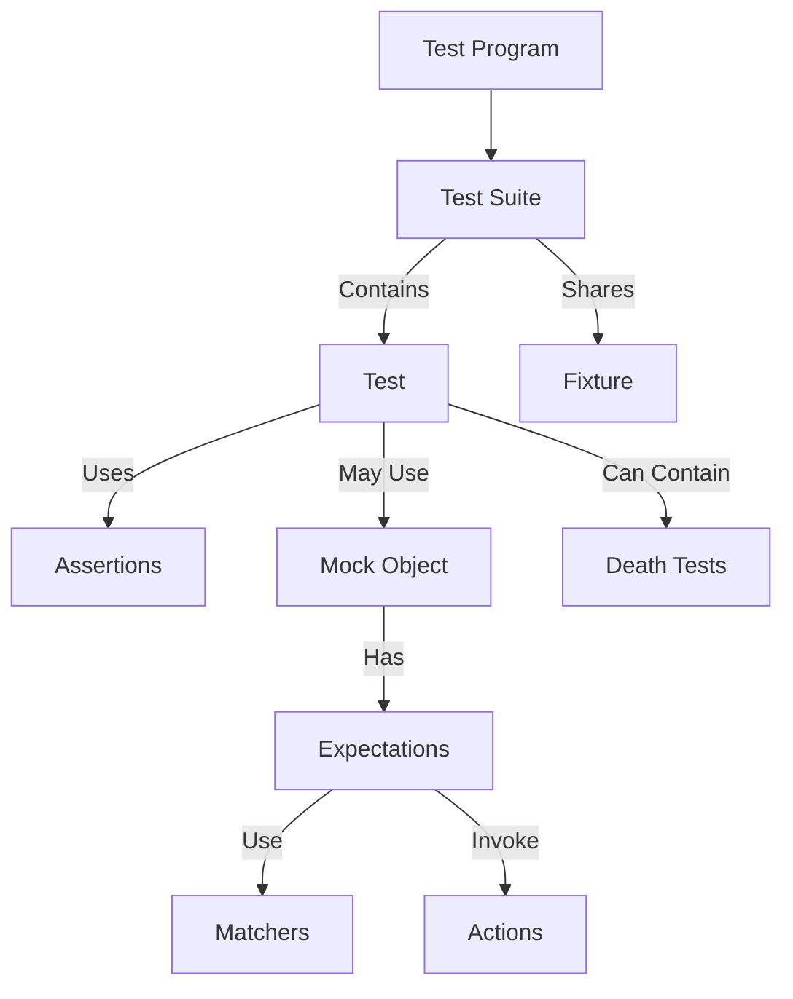

# Key Terminology & Mental Models

Understanding the foundational terminology of GoogleTest is essential to mastering its use and aligning your team on a common vocabulary. This page defines and contextualizes core terms such as **Test Case**, **Test Suite**, **Assertion**, **Mock**, **Expectation**, **Matcher**, **Death Test**, and **Fixture** — clarifying their roles and interplay to reduce the learning curve and avoid confusion.

---

## Core Testing Terminology

### Test
A **Test** is a single code unit that exercises a specific behavior or path in your program and verifies its correctness via assertions. Tests typically invoke components under controlled conditions and check outcomes. In GoogleTest, a test corresponds to the basic unit of verification.


### Test Suite (formerly Test Case)
A **Test Suite** groups related tests that share a common context or purpose. In earlier GoogleTest versions, the grouping term was **Test Case**; this is now replaced by **Test Suite** to conform with broader testing vocabularies.

- A test suite logically organizes tests
- Tests in a suite may share common setup or teardown logic via a **Fixture**

### Assertion
An **Assertion** is a statement that verifies a condition, such as equality, inequality, or state validity, inside a test. Assertions control test outcomes:

- **Fatal failures** abort the current test immediately
- **Non-fatal failures** mark the test as failed but continue execution

Example assertions:

```cpp
EXPECT_EQ(value, expected_value); // Non-fatal
ASSERT_TRUE(condition);           // Fatal
```

---

## Mocking & Interaction Verification Terms

### Mock Object
A **Mock** is a simulated object that mimics the behavior of a real object implementing the same interface. It lets you specify expected interactions like which methods are called, with what arguments, and how often. Mocks allow tests to isolate the system under test by replacing dependencies.

### Expectation
An **Expectation** defines an anticipated interaction with a mock method, specifying details such as the invocation count, argument patterns, and call order.

Example:

```cpp
EXPECT_CALL(mock_turtle, PenDown())
    .Times(AtLeast(1));
```

### Matcher
A **Matcher** is a predicate used within expectations to flexibly specify argument values. Matchers can check for exact values or predicates like "any value", "greater than", or custom conditions.

Examples:

- `_` matches any argument
- `Eq(5)` matches argument equal to 5
- `Ge(10)` matches argument greater than or equal to 10

### Action
An **Action** describes what a mock method should do when called (e.g., return a specific value, invoke a function). Actions enable tests to simulate behavior.

### Cardinality
**Cardinality** specifies how many times a mock function call is expected, such as `Exactly(n)`, `AtLeast(n)`, or `AnyNumber()`.

---

## Specialized Testing Concepts

### Death Test
A **Death Test** verifies that a piece of code causes the program to terminate abnormally (e.g., by crashing or calling `abort`). GoogleTest runs death tests in a separate process to isolate the effect.

### Fixture (Test Fixture)
A **Fixture** is a class that groups data and setup/teardown logic shared by multiple tests in the same test suite. Using fixtures avoids repetition and provides consistent test environments.

Example excerpt of a fixture class:

```cpp
class QueueTest : public testing::Test {
 protected:
  void SetUp() override {
    // Initialize resources
  }

  Queue<int> queue_;
};
```

Tests using this fixture share setup but run independently.

---

## Relationships & Mental Models

To visualize how these concepts relate, consider the following flow for testing with GoogleTest:



In this model:
- The **Test Program** consists of one or more **Test Suites**
- Each **Test Suite** contains multiple **Tests** that perform verification via **Assertions**
- **Fixtures** provide setup shared across tests in the same suite
- Tests may use **Mocks** to replace dependencies
- Mocks have **Expectations** which specify expected interactions using **Matchers** and **Actions**
- Some tests verify termination with **Death Tests**

---

## Practical Tips for New Users

- **Terminology Consistency**: GoogleTest uses "Test Suite" instead of the older "Test Case" to avoid confusion. Adopt this language to stay current.
- **Use Fixtures to Share Common Setup**: They save duplication and keep tests maintainable.
- **Set Expectations Early**: Use `EXPECT_CALL` before exercising mock objects to get immediate feedback if expectations are violated.
- **Be Precise but Flexible with Matchers**: Prefer specifying only necessary argument conditions to avoid brittle tests.
- **Understand Assertion Types**: Use `ASSERT_*` where continuing test after failure doesn’t make sense; prefer `EXPECT_*` to capture multiple issues.

---

For further learning, explore sections on advanced mocking features, assertion writing, and test organization found throughout the GoogleTest documentation.

---

## Additional Resources

- [GoogleTest Primer](https://google.github.io/googletest/primer.html) — Learn basics of writing tests.
- [gMock for Dummies](https://google.github.io/googletest/gmock_for_dummies.html) — Introduction to mocking and expectations.
- [Assertions Reference](reference/assertions.md) — Comprehensive list of assertions.
- [Matchers Reference](matchers.md) — Detailed matcher utilities.
- [Mocking Reference](docs/reference/mocking.md) — API guide for mocks and expectations.

---

## Summary
This page establishes the key terminology and mental models central to using GoogleTest effectively. By clearly defining terms such as Test, Test Suite, Assertion, Mock, and Expectation, and illustrating their relationships, it aligns users on fundamental concepts that underpin writing reliable, maintainable tests with GoogleTest.

---

## Linkage to Documentation Navigation Map
- This page fits within the **Overview** tab, under the **Architecture & Core Concepts** group.
- It complements introductory content found in the [What is GoogleTest?](overview/introduction-core-value/what-is-googletest) and [Core Features at a Glance](overview/introduction-core-value/core-features-overview) pages.
- Users will find this terminology helpful when proceeding to guides on mocking, writing assertions, and organizing test suites.

---

<Info>
This terminology is consistent with definitions used in standard software testing literature and adapted to GoogleTest’s API and tooling.
</Info>
