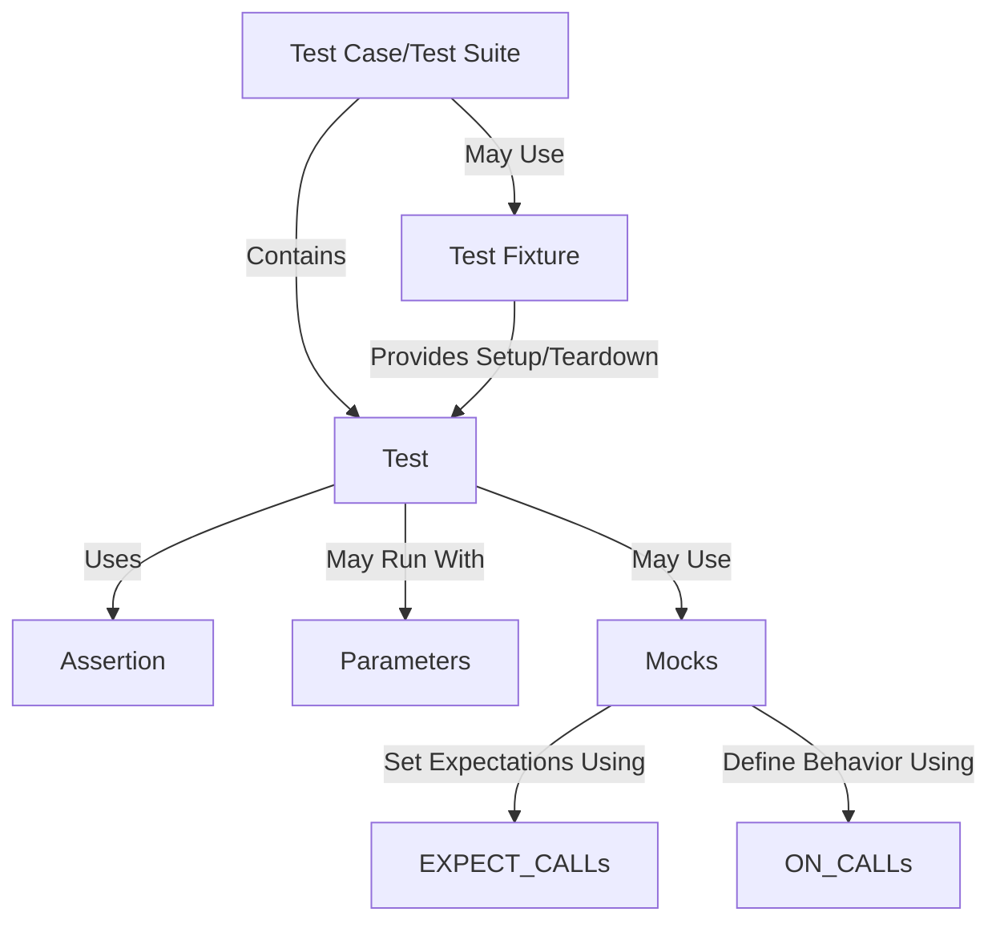

# Core Concepts & Terminology

## Building a Shared Vocabulary for Effective Testing

Getting started with GoogleTest and GoogleMock is straightforward once you understand the fundamental terms and concepts that shape the testing and mocking workflow. This page introduces and clarifies essential domain-specific terms such as **assertions**, **test cases**, **fixtures**, **parameterized tests**, and **mocks**. By mastering these concepts, you'll quickly gain confidence navigating the framework, write more effective tests, and keep your team aligned on best practices.

---

## What Are These Core Concepts?

### Assertions
Assertions are statements within tests that check if a specific condition holds true. They represent the core of validation in GoogleTest and indicate whether a test passes or fails.

- For example, `EXPECT_EQ(expected, actual);` verifies that two values are equal.
- Assertions can be fatal (`ASSERT_*`) - which abort test execution on failure, or non-fatal (`EXPECT_*`) - which continue running.

### Test Cases and Test Suites
- A **Test Case** groups together related tests. In GoogleTest, these are now commonly referred to as **Test Suites**.
- Each test within a case/suite exercises a specific behavior or scenario.

### Test Fixtures
- A **Test Fixture** is a class that provides a common environment for one or more tests.
- It handles setup and teardown tasks, such as initializing data, opening resources, or resetting states.
- Using fixtures promotes DRY (Don’t Repeat Yourself) by sharing configuration across tests.

### Parameterized Tests
- Parameterized tests allow running the same test logic with different inputs.
- This reduces redundant test code while increasing coverage for diverse scenarios.

### Mocks
- **Mocks** are special test doubles that emulate real objects' behavior.
- Unlike fakes, mocks let you specify expectations on method calls (e.g., how many times a method should be called, with what arguments).
- GoogleMock provides rich facilities to declare mock classes and set these behavioral expectations precisely.

---

## Why Does Understanding These Concepts Matter?

When you know exactly what a term means and how it fits into your testing workflow, you can:

- Write tests that are clear, focused, and maintainable.
- Identify where to place setup and teardown code efficiently.
- Compose robust mocks that verify interactions without over-specifying tests.
- Leverage parameterized tests thoughtfully to maximize coverage.
- Communicate effectively with teammates by using a shared vocabulary.

---

## Practical Illustrations of Core Terms

### Assertions Example
```cpp
TEST(CalculatorTest, AddsNumbers) {
  Calculator calc;
  EXPECT_EQ(calc.Add(2, 3), 5);  // Assert addition works correctly.
}
```

### Test Fixture Example
```cpp
class DatabaseTest : public ::testing::Test {
 protected:
  void SetUp() override {
    db.Connect();
    db.Clear();
  }
  void TearDown() override {
    db.Disconnect();
  }

  Database db;
};

TEST_F(DatabaseTest, CanInsertRecord) {
  EXPECT_TRUE(db.Insert("record1"));
}

TEST_F(DatabaseTest, CanRetrieveRecord) {
  db.Insert("record2");
  EXPECT_EQ(db.Get("record2"), "record2");
}
```

### Parameterized Test Example
```cpp
class FactorialTest : public ::testing::TestWithParam<int> {};

TEST_P(FactorialTest, ComputesFactorialCorrectly) {
  int n = GetParam();
  EXPECT_EQ(Factorial(n), /* expected value */);
}

INSTANTIATE_TEST_SUITE_P(
    FactorialTests,
    FactorialTest,
    ::testing::Values(0, 1, 2, 3, 4, 5));
```

### Mock Example
```cpp
class MockDatabase : public Database {
 public:
  MOCK_METHOD(bool, Insert, (const std::string& record), (override));
  MOCK_METHOD(std::string, Get, (const std::string& key), (override));
};

TEST(UserServiceTest, AddsUser) {
  MockDatabase mock_db;
  EXPECT_CALL(mock_db, Insert("Alice")).Times(1).WillOnce(Return(true));

  UserService service(&mock_db);
  EXPECT_TRUE(service.AddUser("Alice"));
}
```

---

## Best Practices and Tips

- **Use Assertions to verify behavior** but avoid over-testing by asserting only what matters.
- **Build Test Fixtures** to manage shared setup/teardown; keep fixtures lean and focused.
- **Embrace Parameterized Tests** to systematically cover variations without duplicating code.
- **Mock Thoughtfully**: apply mocks only when you need to verify interaction patterns rather than state.
- **Use Clear Naming** throughout your tests and fixtures to express intent explicitly.

---

## Common Pitfalls to Avoid

- Over-specifying expectations in mocks can make tests fragile.
- Neglecting setup/teardown in fixtures causes flaky or redundant tests.
- Confusing uninteresting calls and unexpected calls when dealing with mocks (see the concept distinction in the Mocking Reference).
- Forgetting to use `override` with mocked methods may hide subtle bugs.

---

## How This Page Fits Into the Documentation

This page grounds new users in the vocabulary that will be used throughout other sections, such as:

- [Key Features at a Glance](/overview/introduction-core-features/feature-overview) — where concepts like parameterized tests and mocks appear prominently.
- [Mocking Reference](/api-reference/mocking-apis) — which builds on the mock concept.
- [Quickstart & Typical Workflow](/overview/getting-started-integration/quickstart-workflow) — where these terms become part of everyday use.

Understanding this terminology enables a smoother and more confident learning curve.

---

## Next Steps

Ready to take the plunge?

- Explore the [Quickstart & Typical Workflow](/overview/getting-started-integration/quickstart-workflow) to see concepts in action.
- Delve into the [Mocking Reference](/api-reference/mocking-apis/mock-methods) to master mock behaviors.
- Consult the [gMock For Dummies](https://google.github.io/googletest/gmock_for_dummies.html) for beginner-friendly tutorials.

For any questions along the way, the [Legacy gMock FAQ](https://google.github.io/googletest/gmock_faq.html) might have the answers you need.

---

### Summary Diagram: How These Concepts Interact



This illustrates how test cases/suites are structured, how tests are composed of assertions, may leverage fixtures for setup, parameterized runs, and mocks for simulating dependencies.

---

<Tip>
Mastering these definitions will make the rest of your test writing journey significantly smoother and more productive.
</Tip>

<Note>
For practical examples of these concepts, see the [gMock Cookbook](https://google.github.io/googletest/gmock_cook_book.html).
</Note>

<Check>
Keep this page handy as you progress; refer back whenever you encounter unfamiliar terms.
</Check>
