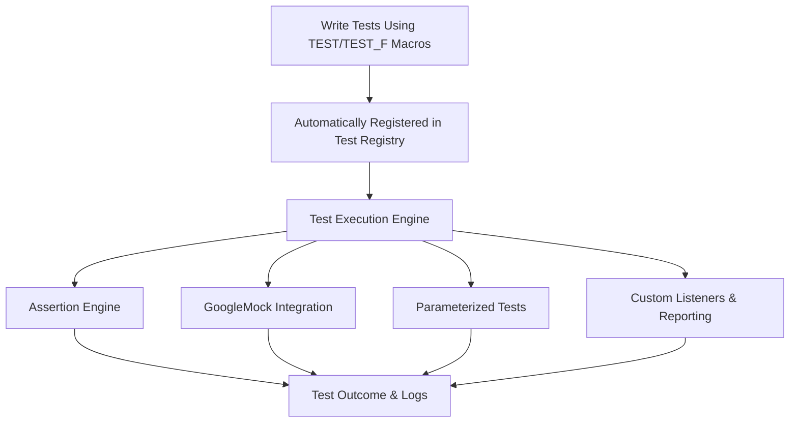

# Feature Overview

Explore the key features that make GoogleTest the preferred framework for C++ testing at any scale. From automated test registration and execution to expressive assertions and powerful mocking capabilities, GoogleTest equips developers with robust tools to write reliable, maintainable tests with ease.

---

## Automated Test Registration

GoogleTest revolutionizes test management by automatically discovering and registering all tests in your codebase. This eliminates manual test registration and oversight, allowing you to focus solely on writing tests.

- **Auto-registration:** Simply using `TEST`/`TEST_F` macros will register the tests during static initialization.
- **Seamless discovery:** Tests are found and organized into test suites without extra configuration.

*Example:* Writing a test with the `TEST` macro instantly adds it to the global test registry, ready to be executed when you run your test binary.

```cpp
TEST(MathTest, Addition) {
  EXPECT_EQ(2 + 2, 4);
}
```

## Robust Assertions

GoogleTest provides a rich and expressive assertion framework that helps identify failures precisely and clearly.

- **Variety of assertions:** From simple `EXPECT_EQ` / `ASSERT_TRUE` to complex predicates.
- **Fatal vs Nonfatal:** Control whether a failure aborts the current test or continues.
- **Custom assertions:** Easily define your own assertion macros or predicates.

*Example:*

```cpp
EXPECT_TRUE(IsPrime(13));
ASSERT_NE(foo.size(), 0);
```

## Flexible Mocking with GoogleMock

Integrated mocking capabilities offer unprecedented control in testing behavior by simulating complex dependencies.

- **Declarative mocks:** Define mock classes with `MOCK_METHOD` macros mirroring your interfaces.
- **Rich matchers:** Validate function call arguments with flexible matchers.
- **Expectations and actions:** Control call counts, sequences, and specify return behaviors.

*Example:*

```cpp
class MockDatabase : public Database {
 public:
  MOCK_METHOD(bool, Connect, (), (override));
  MOCK_METHOD(int, Write, (const std::string& data), (override));
};

MockDatabase mock_db;
EXPECT_CALL(mock_db, Connect())
    .Times(1)
    .WillOnce(Return(true));
```

## Value and Type Parameterized Tests

GoogleTest supports parameterized tests, letting you run the same test logic across multiple input values or types.

- **Value-Parameterized Tests:** Use `TEST_P` and `INSTANTIATE_TEST_SUITE_P` to run tests against different data values.
- **Typed Tests:** Use `TYPED_TEST_SUITE` and `TYPED_TEST` to run tests for different types.

*Example Value-Parameterized Test:* 

```cpp
class MyTest : public ::testing::TestWithParam<int> {};

TEST_P(MyTest, IsEven) {
  int n = GetParam();
  EXPECT_EQ(n % 2, 0);
}

INSTANTIATE_TEST_SUITE_P(EvenNumbers, MyTest, ::testing::Values(2, 4, 6));
```

## Test Customization

Tailor GoogleTest execution and reporting to your needs:

- **Test filters:** Run subsets of tests with command-line filters (`--gtest_filter=`).
- **Test sharding:** Distribute tests across multiple machines or processes.
- **Custom listeners:** Create event listeners to integrate with external tools or modify output.
- **Properties and tags:** Record additional metadata within tests.

## Flexible Test Execution

GoogleTest empowers you to run tests exactly how you want:

- **Repeat tests:** Run tests multiple times with `--gtest_repeat=`.
- **Shuffle test order:** Randomize order to detect order dependencies with `--gtest_shuffle`.
- **Control failures:** Decide whether to stop on first failure using `--gtest_fail_fast`.
- **Output formats:** Generate XML reports for CI tools using `--gtest_output=xml`.

---

## Why GoogleTest Features Matter

By leveraging these features together, you can write tests that are concise yet expressive, maintainable, and scalable across large codebases. Automated registration and flexible execution means less boilerplate and greater focus on test logic. Powerful mocking and rich assertions allow precise control over dependencies and validation. Parameterized tests reduce duplication and cover more cases effortlessly.

Together, these capabilities make GoogleTest a backbone for sustained C++ quality.

---

## Getting Started Preview

To begin your GoogleTest journey, start with the [GoogleTest Primer](primer.md) to learn simple test writing. If interested in mocking, visit [Mocking for Dummies](gmock_for_dummies.md).

Before writing tests, make sure your environment meets the prerequisites as explained in the [System Requirements](/getting-started/prerequisites-installation/system-requirements).

Next, dive into writing your first test with the [Writing and Running Your First Test](/getting-started/project-setup-validation/first-test) guide.

From there, explore mocking, parameterized tests, and advanced assertion techniques to unlock GoogleTest's full potential.

---

<Info>
For more detailed examples and in-depth guidance on mocking, refer to the [gMock Cookbook](gmock_cook_book.md). To master test parametrization, see [Parameterized and Typed Tests](../api-reference/core-testing-apis/parameterized-tests).
</Info>

---

### Diagram: High-Level Feature Interaction


---

### Code Example: Mocking and Expectation Setup

```cpp
#include <gtest/gtest.h>
#include <gmock/gmock.h>

class Database {
 public:
  virtual ~Database() {}
  virtual bool Connect() = 0;
  virtual int Write(const std::string& data) = 0;
};

class MockDatabase : public Database {
 public:
  MOCK_METHOD(bool, Connect, (), (override));
  MOCK_METHOD(int, Write, (const std::string& data), (override));
};

TEST(DatabaseTest, ConnectAndWrite) {
  MockDatabase mock_db;

  EXPECT_CALL(mock_db, Connect())
    .Times(1)
    .WillOnce(::testing::Return(true));

  EXPECT_CALL(mock_db, Write(::testing::_))
    .Times(::testing::AtLeast(1))
    .WillRepeatedly(::testing::Return(1));

  ASSERT_TRUE(mock_db.Connect());
  EXPECT_EQ(mock_db.Write("record1"), 1);
  EXPECT_EQ(mock_db.Write("record2"), 1);
}
```

---

### Practical Tips

- Use `EXPECT_CALL` for methods you want to verify are called, and `ON_CALL` for default behaviors.
- Prefer `NiceMock` when uninteresting calls are expected and can be ignored to reduce noise.
- Use sequences (`Sequence` and `InSequence`) to enforce call order only when necessary.
- Use value-parameterized tests to remove duplicated test logic across data sets.
- Keep test names clear and avoid underscores to prevent naming conflicts.

### Common Pitfalls

- Over-specifying expectations can cause brittle tests.
- Forgetting to return correct types or use `ReturnRef` for reference returns in mocks.
- Misunderstanding difference between uninteresting (no `EXPECT_CALL`) and unexpected calls (no match among expectations).
- Not using parameterized tests where repeated test logic applies.

---

Harness GoogleTest’s powerful features to accelerate writing thorough, clear, and maintainable tests that fit perfectly into your C++ development workflows.


<Note>
This documentation focuses on the overview of GoogleTest's key features. For detailed examples, usage, and API references, consult the linked guides and references within the documentation set.
</Note>
