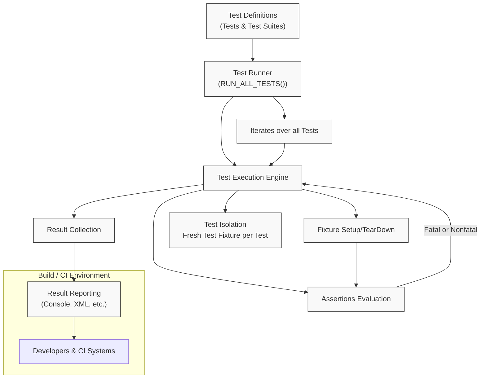

# GoogleTest Architecture Overview

Understand the key components of GoogleTest and how they interact to deliver a seamless, robust testing experience within your build or continuous integration (CI) workflows. This overview provides a mental model that clarifies how test definitions flow through execution, assertion evaluation, and result reporting.

---

## At a Glance: How GoogleTest Works Together

GoogleTest is designed to run your C++ tests efficiently and effectively by orchestrating several core components. These work in unison to ensure tests are discovered, executed in isolation, results are gathered, and insights are reported clearly.

<Accordion title="View GoogleTest Architecture Diagram">

</Accordion>

---

## What Is Covered on This Page

This page focuses strictly on how the primary components of GoogleTest interrelate to deliver a smooth testing lifecycle:

- How test definitions feed into the test runner.
- How the test runner manages execution including fixture setup, assertion evaluation, and test isolation.
- How results are collected and reported to users and CI systems.

By grasping this flow, you gain confidence in integrating GoogleTest effectively into your development and CI pipelines.

---

## Key Components Explained

### 1. Test Definitions
These are the `TEST()`, `TEST_F()`, and other macros where your test logic lives, grouped into test suites. GoogleTest automatically registers these tests at runtime so you don't need a manual test catalog.

### 2. Test Runner
The central controller, typically invoked via `RUN_ALL_TESTS()`, which initializes GoogleTest, iterates over all registered tests, and manages execution.

### 3. Test Execution Engine
Responsible for running each test independently. It performs fixture setup and teardown (via special class methods if using test fixtures), ensuring each test runs isolated from others to maintain repeatability and avoid inter-test dependencies.

### 4. Assertions Evaluation
Within each test, assertions check conditions, returning success, nonfatal failure, or fatal failure. The execution engine handles how failures affect test continuation.

### 5. Result Collection
As tests run, their outcomes are gathered in internal structures that track successes, failures, and related metadata.

### 6. Result Reporting
At the end of the run, results are reported to the developer console and can optionally be output in XML or other formats for CI ingestion.

### 7. User & CI Interaction
Developers use the results during debugging and development, while CI systems leverage the exit codes and reports to gate releases and ensure quality.

---

## Why This Architecture Matters

- **Isolation Guarantees**: By running each test with a fresh fixture and preventing shared state bleed, GoogleTest ensures tests are reliable and reproducible.
- **Rich Feedback**: Separating assertion evaluation and result reporting enables detailed failure diagnostics without stopping subsequent tests.
- **Integration-Friendly**: The architecture supports running tests in diverse environments (local builds, CI systems) with standardized reporting.

---

## Frequently Asked Questions

<AccordionGroup title="FAQ">
<Accordion title="What happens if a fatal assertion fails?">
A fatal failure immediately aborts the current test function but does not stop other tests from running. GoogleTest continues to the next test, ensuring maximum feedback.
</Accordion>
<Accordion title="How does GoogleTest isolate tests?">
Each test gets its own test fixture instance. Setup and teardown functions prepare the test-specific environment and clean up after, preventing state leakage.
</Accordion>
<Accordion title="Can I run a single test independently?">
Yes, GoogleTest supports running individual tests by name. This is helpful for debugging or iterative development.
</Accordion>
</AccordionGroup>

---

## Best Practices for Working with GoogleTest Architecture

- Structure your tests logically into test suites reflecting your code modules.
- Use test fixtures (`TEST_F()`) when multiple tests share setup or teardown logic.
- Prefer nonfatal assertions (`EXPECT_*`) if you want tests to continue but use fatal assertions (`ASSERT_*`) when subsequent code depends on the assertion.
- Leverage GoogleTest's built-in test filtering and reporting options to enhance CI workflows.

---

## Next Steps

Ready to dive deeper?

- Explore the [GoogleTest Primer](primer.md) to learn concrete examples of writing tests.
- Check out [Core Concepts & Terminology](/overview/architecture-concepts/core-concepts-terminology) for an in-depth vocabulary.
- Visit the [Feature Quick Tour](/overview/architecture-concepts/feature-quick-tour) to see major capabilities in action.

---

By understanding this architecture overview, you build a solid foundation for writing efficient, reliable, and maintainable tests with GoogleTest.

---