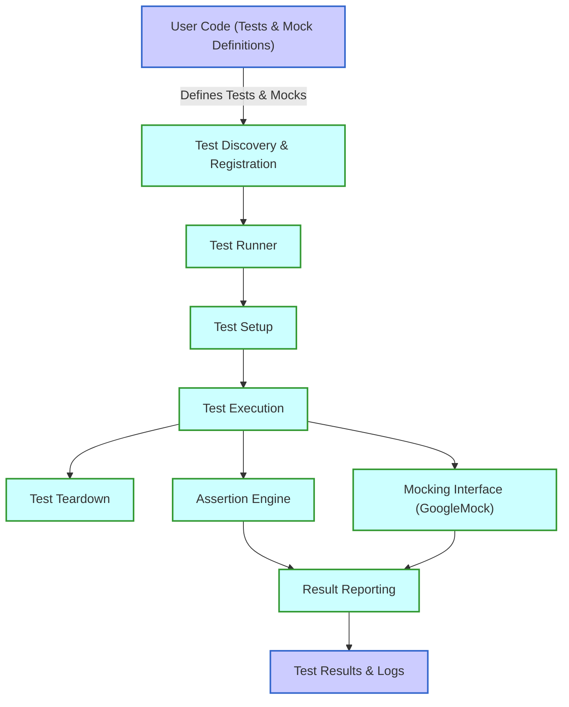

# High-Level Architecture of GoogleTest

GoogleTest provides a comprehensive and adaptable framework for writing, discovering, and running C++ tests. Its architecture smoothly guides user code from test definitions through execution and result reporting. This diagram and explanation map out the critical components and their interactions, offering clarity on how GoogleTest operates internally and interacts with your code.

---

## Architecture Overview

At the core, GoogleTest's architecture consists of several key components working in harmony:

- **Test Discovery:** Automatically finds and registers all tests defined in the user's code.
- **Test Runner:** Manages the execution flow of tests, handling setup, invocation, and teardown.
- **Assertion Engine:** Processes assertions within tests to verify expected correctness.
- **Mocking Interface (GoogleMock):** Provides mock object creation and interaction verification to support advanced unit tests.
- **Result Reporting:** Aggregates test results and generates detailed feedback.

The user writes tests following the GoogleTest framework, which then takes care of the lifecycle and verification.

### Mermaid Diagram

---

## Component Descriptions

### Test Discovery & Registration
GoogleTest automatically discovers tests and mock definitions at runtime through macros (e.g., `TEST()`, `TEST_F()`). This process registers each test with the framework, enabling seamless management without manual listing.

### Test Runner
The test runner orchestrates the testing lifecycle including calling setup and teardown methods. It ensures tests are invoked in isolation, maintaining independence and repeatability.

### Assertion Engine
Assertions express expected conditions within tests. GoogleTest provides rich assertion macros to verify conditions, and this engine captures failures and successes, offering detailed diagnostics in case of failure.

### Mocking Interface (GoogleMock)
GoogleMock integrates tightly with the GoogleTest framework. It facilitates defining mock classes, setting expectations on method calls, and verifying interactions. This aids testing interactions in code dependent on external components.

### Result Reporting
After execution, GoogleTest compiles results including successes, failures, and detailed error messages. It can output in various formats (console, XML, etc.) to fit diverse CI and developer workflows.

---

## User Interaction Flow
The typical user flow begins with writing test cases and (optionally) mocks. When the tests are run, GoogleTest discovers these, executes them through the runner, evaluates assertions, verifies mocks, and reports outcomes. This flow abstracts complexity from the user, allowing focus on test logic and correctness.

---

## Practical Implications
- Developers can write tests without worrying about registration.
- Mocking capabilities allow precise control over dependencies and interactions.
- Ordered and unordered test execution is supported.
- Detailed reports facilitate fast debugging and high confidence.

For a deep dive on writing test cases, creating mocks, and running tests, explore the [GoogleTest Primer](primer.md) and [gMock for Dummies](gmock_for_dummies.md).

---

## Getting Started
To get started with GoogleTest: write simple `TEST()` or `TEST_F()` functions, use assertions to verify behavior, and optionally create mocks with GoogleMock macros. GoogleTest will discover and run your tests automatically.

See [Setting Up and Running Your First Test](/guides/getting-started/setup-quickstart) for a practical guide.

---