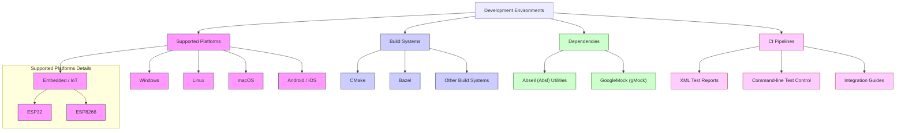

# Integrations & Supported Platforms

GoogleTest is designed as a versatile, industry-standard C++ testing framework with broad ecosystem support. This page highlights the environments where GoogleTest thrives, the build systems it integrates with, major dependencies it leverages, and options for incorporating GoogleTest testing into continuous integration (CI) workflows.

---

## Platforms Supported

GoogleTest runs reliably across a comprehensive array of platforms, ensuring that developers can adopt it regardless of their target environment:

- **Desktop Operating Systems:** Windows, Linux, macOS
- **Embedded and IoT Systems:** ESP8266, ESP32, Zephyr RTOS
- **Mobile Platforms:** Android, iOS
- **Unix-Like OSes:** FreeBSD, OpenBSD, NetBSD, Solaris, AIX

This extensive platform coverage lets projects ranging from desktop applications to embedded devices use GoogleTest consistently.

## Build Systems Integration

GoogleTest supports seamless integration with popular build systems commonly used in C++ projects:

### CMake

- GoogleTest provides official CMake support with targets for easy inclusion.
- Enables straightforward configuration to add GoogleTest as a dependency, link libraries, and configure build options.

### Bazel

- GoogleTest natively supports Bazel, the build tool favored by several large-scale projects, including many Google internal projects.
- The Bazel integration allows for efficient dependency management and scalable test execution.

### Other Build Systems

- While CMake and Bazel are primary focus areas, GoogleTest can be manually integrated into other build environments with relative ease due to its header/source structure.

## Major Dependencies

GoogleTest relies on a small set of dependencies to provide robust testing features and maintain portability:

### Abseil (Absl)

- Provides various utility APIs such as synchronization primitives, container classes, and string utilities.
- Ensures GoogleTest can work efficiently and portably across multiple platforms.

### GoogleMock (gMock)

- An integral part of the GoogleTest ecosystem, facilitating mock object creation and interaction testing.

These dependencies are either bundled with or recommended alongside GoogleTest to maximize compatibility and feature support.

## Continuous Integration Pipeline Support

To facilitate automated testing in modern development workflows, GoogleTest offers:

- **Test Results Reporting:** Compatible with common test result formats and can output XML, enabling integration with CI tools like Jenkins, GitHub Actions, Travis CI, and others.

- **Command-line Interface:** Offers flexible options to run specific test suites or filter tests, allowing fine-grained control in CI scripts.

- **Framework Initialization:** APIs designed to integrate smoothly into complex build and deployment pipelines.

- **Integration Examples:** See the [Integrating into CMake and Bazel Builds](../guides/integration-examples-and-best-practices/integrating-into-cmake-bazel-builds) guide for practical examples.

## Compatibility with Large-Scale C++ Projects

GoogleTest is battle-tested in massive projects like Chromium and LLVM, demonstrating its suitability for enterprise-grade and performance-sensitive environments. It supports:

- Parameterized and type-parameterized tests for scalable coverage.
- Death tests for validating process termination and fault handling.
- Comprehensive mocking capabilities via GoogleMock, including expectations, actions, and argument matchers tailored for C++ specifics.

## Summary Diagram of Integration Landscape

---

## Best Practices for Integration

- **Keep dependencies up-to-date:** Regularly update GoogleTest and Abseil to benefit from bug fixes and new features.
- **Use official CMake/Bazel targets:** Rely on officially provided build targets for stable build integration.
- **Separate mocks and tests:** Define mock classes in test-only or dedicated directories to avoid polluting production code.
- **Leverage CI features:** Use GoogleTest's XML output for better reporting and integrate GoogleMock into tests for better interaction coverage.

## Troubleshooting Common Integration Issues

<AccordionGroup title="Integration Challenges and Solutions">
<Accordion title="Build Failure on Unsupported Platforms">
If your platform is not directly supported, consider:

- Building GoogleTest from source manually.
- Cross-compiling if targeting embedded platforms.
- Reviewing platform-specific compilation flags.

Consult the GoogleTest [prerequisites and system requirements](../../getting-started/setup-requirements-installation/prerequisites) for details.
</Accordion>
<Accordion title="CI Test Discovery Problems">
Ensure your test binaries are linked properly and built with GoogleTest's test registration macros.

Check the test filter flags and confirm XML report generation if needed by your CI.
</Accordion>
<Accordion title="Mocking C++ Features Issues">
For advanced mocking of templates, overloaded methods, or move-only types, refer to the [gMock Cookbook](../../docs/gmock_cook_book) and [Mocking Reference](../../docs/reference/mocking.md).

Be aware of C++ standard compatibility and compiler-specific issues.
</Accordion>
</AccordionGroup>

## Additional Resources

- [Integration into CMake and Bazel Builds](../guides/integration-examples-and-best-practices/integrating-into-cmake-bazel-builds)
- [Getting Started: Prerequisites & System Requirements](../../getting-started/setup-requirements-installation/prerequisites)
- [GoogleMock (gMock) Overview](../../googlemock/README.md)
- [Continuous Integration with GoogleTest](../../faq/advanced-support/ci-integration)

---

Use this page as a reference to understand how GoogleTest integrates with your development ecosystem, ensuring your tests are both highly portable and easily automated across the platforms and environments you target.
