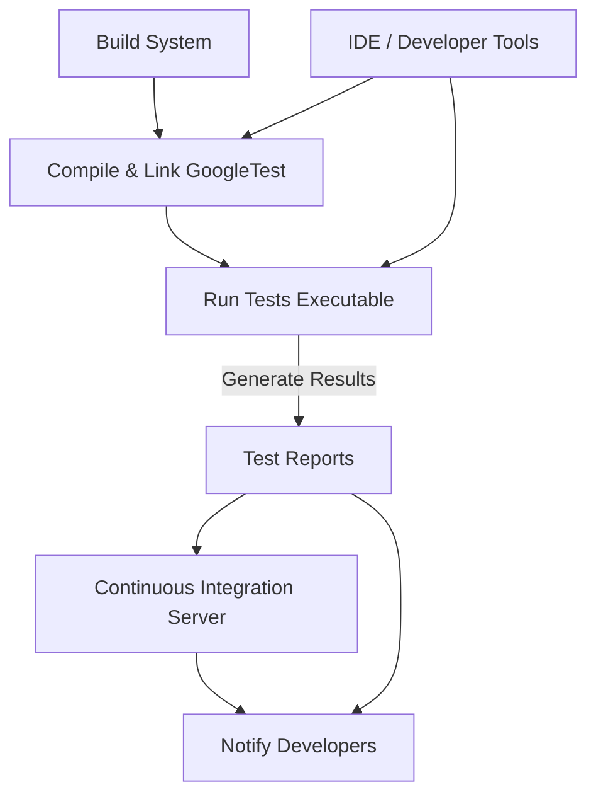

# Integration & Ecosystem

GoogleTest is designed to integrate smoothly into diverse C++ build environments and development ecosystems, enhancing your testing workflows with minimal friction. This page summarizes the key integration options with build systems, continuous integration (CI) pipelines, IDEs, and open-source tool extensions commonly used alongside GoogleTest.

---

## Build System Integration

GoogleTest can be efficiently incorporated into many popular C++ build systems. These integrations typically provide:

- Automatic compilation and linking of GoogleTest and GoogleMock libraries
- Convenient macros or commands to discover and run tests
- Support for parallel test execution and test filtering

### Bazel

- GoogleTest is well-supported in Bazel with dedicated rules.
- Use the [`cc_test`](https://docs.bazel.build/versions/main/be/c-cpp.html#cc_test) rule specifying `gtest` as a dependency for seamless test invocation.

### CMake

- CMake provides [FindGTest](https://cmake.org/cmake/help/latest/module/FindGTest.html) that locates installed GoogleTest libraries.
- You can add GoogleTest as a submodule and build it directly.
- The standard [CTest](https://cmake.org/cmake/help/latest/manual/ctest.1.html) orchestrates test runs.

### Other Build Systems

- Support exists or can be custom integrated for Makefiles, Ninja, SCons, and more.
- Most require building GoogleTest as an external or vendor library.

<Tip>
Ensure to keep the GoogleTest dependency updated alongside your build system integration to leverage the latest features and fixes.
</Tip>

## Continuous Integration (CI) Integration

GoogleTest excels in CI environments to automate reliable and repeatable C++ testing workflows.

- Supported by all major CI systems including Jenkins, GitHub Actions, GitLab CI, Travis CI, Azure Pipelines, and CircleCI.
- Works with test reporting standards such as JUnit XML, enabling rich results visualization.
- Can be integrated with coverage tools (e.g., gcov, lcov) for test coverage reports.

<Info>
Most CI setups invoke tests via command line with optional flags (e.g., `--gtest_filter`, `--gtest_color`) to customize the test execution.
</Info>

## Related Extensions and Tools

While GoogleTest itself focuses on providing a robust, cross-platform C++ testing and mocking solution, the community and ecosystem have evolved with complementary tools enhancing productivity:

- **Test Runners and Adapters:** Plugins for popular IDEs and test frameworks that allow running and debugging GoogleTest tests inside GUI environments.
- **IDE Plugins:** Support in Visual Studio, CLion, Eclipse CDT, and others that provide syntax highlighting, test discovery, and inline results.
- **Mocking Utilities:** GoogleMock as a part of GoogleTest brings flexible mocking capabilities, with extensive documentation and best practice guides.

See the [Integration & Ecosystem Overview](https://github.com/google/googletest) for third-party tools.

## Entrypoint and Configuration

Two files typically mark your first touchpoints in GoogleTest integration:

- **`gmock_main.cc`:** Contains a default main function that initializes both GoogleTest and GoogleMock frameworks and runs all registered tests.

```cpp
int main(int argc, char** argv) {
  testing::InitGoogleMock(&argc, argv);
  return RUN_ALL_TESTS();
}
```

- **`gmock/gmock.h`:** Primary public header for GoogleMock that includes GoogleTest headers and exposes mocks, actions, and matchers.

These files simplify project setup by providing a standard entrypoint and configuration boilerplate.

## Best Practices for Integration

1. **Modularize Tests:** Keep tests in dedicated directories and build targets for ease of integration and parallelism.
2. **Use Test Filters:** Drive test execution with filters based on test suite names or patterns, enabling selective test runs in CI.
3. **Employ Verbosity Flags:** Customize test output verbosity for CI logs using `--gtest_verbose` and related flags.
4. **Monitor Warnings and Failures:** Configure CI to catch leaks, uninteresting calls in mocks, and other common pitfalls.

<Warning>
Avoid mocking static or global functions directly; prefer interface-based designs to improve testability and maintainability.
</Warning>

## Sample Workflow Example

```bash
cmake -S . -B build
cmake --build build --target all
cd build
./my_tests --gtest_output=xml:report.xml
# Upload report.xml to CI server for visualization
```

---

## For More Information

- [Setting Up GoogleTest and GoogleMock](../guides/getting_started/project_setup.md)
- [GoogleMock Cookbook](../docs/gmock_cook_book.md)
- [Mocking Reference](../api-reference/mocking-framework/mock-methods.md)
- [GoogleTest Primer](../overview/about-googletest/what-is-googletest.md)

---

### Diagram: GoogleTest Integration Flow



This illustrates the typical lifecycle where your build system compiles tests including GoogleTest, runs them, reports results to CI, and finally communicates status back to developers through IDEs or notifications.
