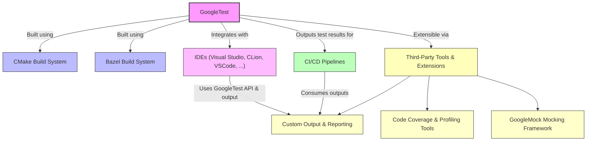

# Integration with Development Ecosystem

GoogleTest fits seamlessly into modern C++ development workflows, supporting integration with popular build systems, continuous integration pipelines, major IDEs, and a variety of third-party tools and extensions. This page guides you through these key integration points, helping you leverage GoogleTest effectively in your development environment.

---

## Build System Compatibility

GoogleTest is designed to integrate easily with major C++ build systems like CMake and Bazel, enabling straightforward setup and maintenance within your projects.

### Building with CMake

GoogleTest provides an out-of-the-box `CMakeLists.txt` script, compatible across platforms, that simplifies compiling GoogleTest and your own test binaries.

- **Standalone Project:** Clone the repository at the specific version, create a build directory, and use CMake to generate native build files:

  ```bash
  git clone https://github.com/google/googletest.git -b v1.17.0
  cd googletest
  mkdir build && cd build
  cmake ..  # For building GoogleTest and GoogleMock
  # or
  cmake .. -DBUILD_GMOCK=OFF  # To build only GoogleTest
  make        # On Unix-like systems
  sudo make install  # Optional system-wide installation
  ```

- **Existing Project Integration:** Easily incorporate GoogleTest into your CMake project using `find_package(GTest CONFIG REQUIRED)` to link prebuilt binaries, or download and build GoogleTest as part of your project's build step utilizing CMake's `FetchContent` system:

  ```cmake
  include(FetchContent)
  FetchContent_Declare(
    googletest
    URL https://github.com/google/googletest/archive/5376968f6948923e2411081fd9372e71a59d8e77.zip
  )
  set(gtest_force_shared_crt ON CACHE BOOL "" FORCE)  # On Windows, to match runtime linkage
  FetchContent_MakeAvailable(googletest)

  add_executable(example example.cpp)
  target_link_libraries(example gtest_main)
  add_test(NAME example_test COMMAND example)
  ```

- **C++17 Requirement:** GoogleTest requires a C++17 compatible environment. Add the following in your `CMakeLists.txt` if needed:

  ```cmake
  set(CMAKE_CXX_STANDARD 17)
  set(CMAKE_CXX_STANDARD_REQUIRED ON)
  ```

- **Build Options:** Customize runtime linkage on Windows with `gtest_force_shared_crt` to avoid linker conflicts between static and dynamic runtimes.


### Working with Bazel

GoogleTest supports building with Bazel, Google's own build tool. The Bazel rules handle fetching dependencies, compiling test binaries, and running tests efficiently in distributed build environments. Consult the Bazel documentation for details on integration.

---

## Continuous Integration and Testing Pipelines

GoogleTest is well suited for automated CI/CD workflows and provides the necessary hooks and output formats to integrate smoothly with build servers and test reporting tools.

- **XML and JSON Output:** GoogleTest can generate test results in JUnit-compatible XML or JSON formats using the `--gtest_output` flag. This facilitates straightforward ingestion into CI dashboards, enabling visibility into test successes, failures, skips, and durations.

  ```bash
  ./your_test_binary --gtest_output=xml:results.xml
  # or
  ./your_test_binary --gtest_output=json:results.json
  ```

- **Filtering and Sharding:** Advanced command-line options enable test filtering (`--gtest_filter`) and test sharding via environment variables (`GTEST_TOTAL_SHARDS` and `GTEST_SHARD_INDEX`), helping distribute test execution across multiple machines or build agents.

- **Repeat and Shuffle:** Flags for repeating tests and shuffling test order help pinpoint flaky tests and hidden dependencies.

- **Failures and Debugging:** Options like `--gtest_break_on_failure` allow CI agents to stop on the first failure for faster feedback.

- **Pre-built Binaries:** Many CI environments will leverage installed or cached GoogleTest binaries to speed up builds.

---

## IDE Support

GoogleTest enjoys broad support in popular IDEs, offering enhanced developer experience through built-in test discovery, execution, and visualization.

- **Visual Studio:** Supports creating, running, and debugging GoogleTest tests with native test adapters. When building with CMake, Visual Studio generates `.sln` and `.vcxproj` files.

- **CLion:** Integrated CMake support means GoogleTest tests are automatically picked up and run from the test runner interface.

- **Eclipse and NetBeans:** Plugins and extensions exist to run GoogleTest test suites and visualize results.

- **VSCode:** Extensions support GoogleTest integration with test discovery, filtering, and gutter icons.

Using your IDE’s GoogleTest integration accelerates identifying test failures, navigating to source, and running focused tests.

---

## Third-Party Tools and Extensions

GoogleTest’s extensible design allows a rich ecosystem of tools to enhance testing capability.

- **Coverage and Profiling:** Integrate tools like gcov, lcov, and clang-profiler with GoogleTest to gather detailed coverage data.

- **Mocking with GoogleMock:** Bundled with GoogleTest, GoogleMock allows comprehensive mock object support seamlessly within tests.

- **Custom Event Listeners:** GoogleTest’s event listener API permits augmenting test output or hooking into test lifecycle events for specialized reporting or integration.

- **Test Discovery and Reporting Tools:** Many test runners and CI dashboards support GoogleTest-specific result parsers.

---

## Supported Platforms

GoogleTest runs on a wide range of platforms and compilers, including but not limited to:

- Linux (GCC, Clang)
- Windows (Visual Studio, MinGW)
- macOS
- Embedded systems (with some adjustments)

This broad platform support makes GoogleTest a versatile choice for diverse C++ projects.

---

## Summary Diagram of Integration Points



---

## Tips for a Smooth Integration

- Always ensure your build system compiles GoogleTest with the **same compiler and settings** as your project to avoid subtle incompatibilities.
- Utilize CMake’s `add_subdirectory()` or `FetchContent` rather than embedding GoogleTest source directly to keep your tests up to date.
- Leverage GoogleTest's ability to produce **JUnit XML** or **JSON reports** to plug into your CI pipelines and dashboards.
- Use GoogleTest filters and test sharding when dealing with large test suites for efficient parallel execution.
- For IDEs, configure automatic test discovery for efficient iteration and debugging.
- Extend GoogleTest with **custom event listeners** to integrate with specialized reporting or monitoring tools.

---

## Troubleshooting Common Integration Issues

<Tip>
If your tests fail to build or link, verify that GoogleTest headers and libraries are correctly referenced in your build system.
</Tip>

<Warning>
Mismatched runtime libraries (especially on Windows) between your project and GoogleTest can cause linker errors. Use `gtest_force_shared_crt` to align runtime linkage.
</Warning>

<Note>
Ensure you call `InitGoogleTest()` before running any tests to prevent errors and undefined behavior.
</Note>

---

## Where to Find More

Explore these related resources for a deeper dive into GoogleTest:

- [System Architecture Overview](/overview/architecture-concepts/system-architecture) explains GoogleTest’s modular design.
- [Core Concepts and Terminology](/overview/architecture-concepts/core-concepts) defines key testing terms.
- [Installation with CMake](/getting-started/prerequisites-installation/installation-cmake) offers in-depth build instructions.
- [Writing Your First Test](/guides/core_workflows/writing_first_test) helps you get started with test development.
- [API Reference - Build System Integration](/api-reference/integration-and-configuration/build-integration) details the API hooks related to integration.

External resources referenced:

- CMake official site: https://cmake.org/
- Bazel documentation: https://bazel.build/

---

By understanding and leveraging these integration points, you can maximize GoogleTest’s benefits within your development workflow, making automated testing more efficient, robust, and informative.