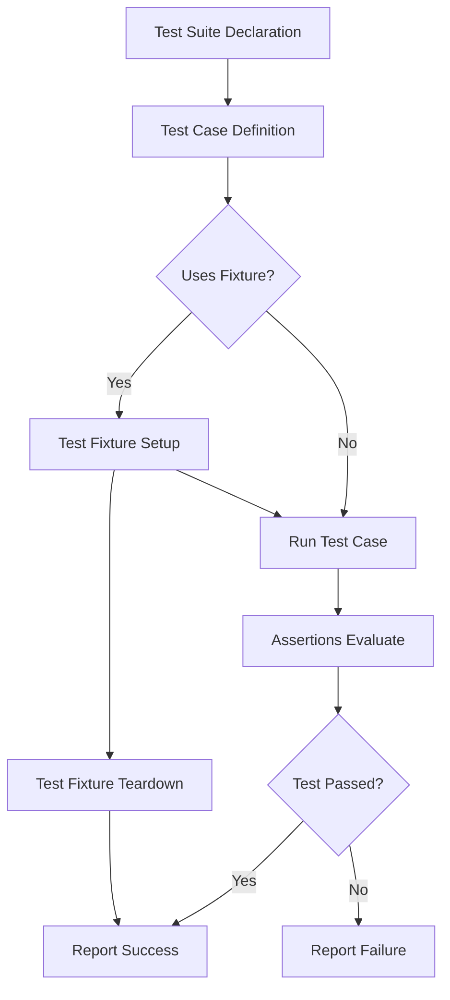

# Key Concepts & Terminology

Understanding the fundamental building blocks of GoogleTest and GoogleMock is essential for mastering the framework. This page introduces the key concepts and terminology that define how tests, test suites, fixtures, assertions, parameterized tests, and death tests work. Clear with context and concrete examples, this guide establishes a common vocabulary for all users.

---

## Test Suites and Test Cases

### What are Test Suites and Test Cases?

- **Test Suites** group related tests together to organize the testing process.
- **Test Cases** are individual tests that verify a specific behavior or functionality.

GoogleTest requires you to logically group your tests into test suites, which makes managing large-scale tests easier and more readable.

### Example:

```cpp
TEST(MathTest, Addition) {
  EXPECT_EQ(2 + 2, 4);
}

TEST(MathTest, Subtraction) {
  EXPECT_EQ(5 - 3, 2);
}
```

Here, `MathTest` is the test suite, and `Addition` and `Subtraction` are test cases.

---

## Test Fixtures

### What is a Fixture?

Test fixtures provide a way to share common setup and teardown logic for tests.

Instead of repeating code in multiple test cases, you define a fixture class and derive your tests from it.

### How to Use:

```cpp
class FooTest : public ::testing::Test {
 protected:
  void SetUp() override {
    // Common setup code.
  }

  void TearDown() override {
    // Cleanup code.
  }

  // Shared resources for tests.
  Foo foo_;
};

TEST_F(FooTest, DoesThis) {
  EXPECT_TRUE(foo_.DoThis());
}

TEST_F(FooTest, DoesThat) {
  EXPECT_FALSE(foo_.DoesThat());
}
```

- `TEST_F` declares tests that use the fixture.
- The `SetUp()` and `TearDown()` methods run before and after each test case.

---

## Assertions

### Defining Expectations

Assertions are the statements that verify conditions. GoogleTest provides a rich set of assertions:

- `EXPECT_*` macros: non-fatal failures, test continues
- `ASSERT_*` macros: fatal failures, test aborts immediately

### Common Assertions Examples:

```cpp
EXPECT_EQ(expected, actual);   // Checks equality
EXPECT_TRUE(condition);        // Checks that condition is true
ASSERT_NE(nullptr, pointer);   // Checks that pointer is not null
```

### Best Practices:

- Use `ASSERT_*` when the test cannot proceed without the condition.
- Use `EXPECT_*` when you want to report failure but continue with other checks.

---

## Parameterized Tests

Parameterized tests let you run the same test logic with different parameters.

This is invaluable for checking behavior across a range of values without code duplication.

### Defining Parameterized Tests:

```cpp
class MyTest : public ::testing::TestWithParam<int> {};

TEST_P(MyTest, HandlesValues) {
  int param = GetParam();
  EXPECT_TRUE(param >= 0);
}

INSTANTIATE_TEST_SUITE_P(
  MyGroup,
  MyTest,
  ::testing::Values(1, 2, 3, 4)
);
```

- Tests will run once for each provided parameter.

### User Benefit:

- Simplifies exhaustive, varied input testing.
- Makes tests more maintainable and less redundant.

---

## Death Tests

Death tests verify that your code exits or crashes under expected failure conditions.

They run the tested code in a separate process and check for abnormal termination.

### Example Usage:

```cpp
TEST(FooDeathTest, DiesOnBadInput) {
  EXPECT_DEATH(Foo(-1), "negative value");
}
```

- Checks that `Foo(-1)` kills the test process with an error message containing "negative value".

### Why Use Death Tests?

- To ensure robustness by verifying expected fatal failures.
- To protect against undefined or unsafe inputs.

---

## Common Terminology Summary

| Term              | Description                                                              |
|-------------------|--------------------------------------------------------------------------|
| Test Suite        | A collection of related tests                                            |
| Test Case         | An individual test                                                       |
| Test Fixture      | Setup and teardown context shared by multiple tests                      |
| Assertion         | Check or verification made inside tests (EXPECT, ASSERT, etc.)          |
| Parameterized Test| Tests that run multiple times with varying input parameters              |
| Death Test        | Tests that expect program termination under certain conditions           |

---

## Practical Tips

- Always use test fixtures for shared context instead of duplicating setup.
- Choose `ASSERT_*` vs `EXPECT_*` based on whether continuing the test after failure is safe.
- Use parameterized tests for coverage over many input sets.
- Configure death tests carefully; they are more resource-intensive but critical for safety.

---

## Why Master These Concepts?

Understanding these concepts ensures you can:

- Organize your tests clearly and logically.
- Write tests that are maintainable and scalable.
- Leverage gMock’s full power when combined with mocking in complex scenarios.

These concepts form the foundation on which advanced topics, including mocking and expectations, are built.

---

## Related Documentation

- [What is GoogleTest?](/overview/product-intro-value/what-is-googletest)
- [Core Features at a Glance](/overview/product-intro-value/core-features-at-a-glance)
- [Target Audience & Use Cases](/overview/product-intro-value/target-audience-and-use-cases)
- [Specifying Expectations and Actions](/guides/mocking-and-behavior-verification/specifying-expectations-and-actions)

---

## Summary Diagram: Test Execution Flow

